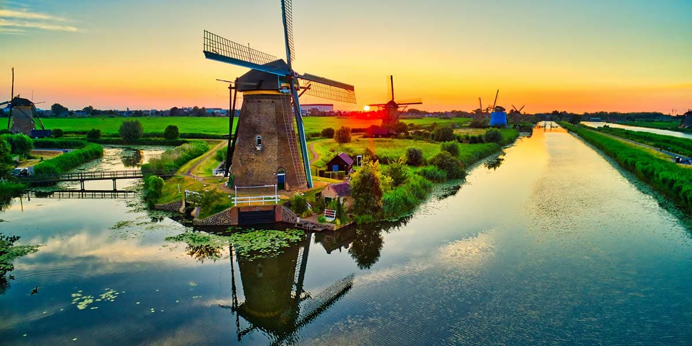

# Drinks of the Netherlands

The Netherlands' winter drink tradition is shaped by the Sinterklaas (5 December) and Christmas seasons: anijsmelk (hot milk infused with star anise and sweetened) is the traditional Dutch winter children's drink, drunk at the end of Sinterklaas evenings and at every Dutch oma's kitchen table from November to February. Slemp (a richer cousin, hot milk steeped with saffron, spices and tea) is the older Dutch winter warming drink, classically associated with Sinterklaas. Bisschopswijn ("bishop's wine") is the Dutch mulled wine, named for the Sinterklaas bishop figure, made with red wine + spices + orange + brown sugar, the Dutch counterpart to German Glühwein, drunk at every December market stall and Dutch Christmas Eve. The Dutch also share with Belgium the genever spirit tradition, and modern Dutch coffee culture is European-strong with hagelslag-sprinkled bread on the side. The famous Dutch chocolate sprinkle culture, the Dutch raw-herring stalls, and the Amsterdam canal-house tea-and-coffee traditions complete the daily-drinks picture.
