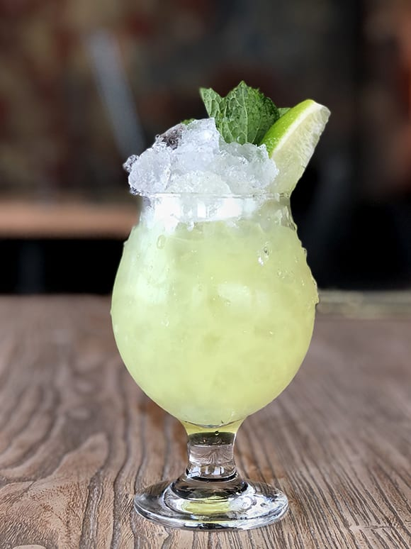

# Absinthe Frappé

*Cathedral Avenue's old absinthe service: absinthe louched over crushed ice with anisette and mint, shaken until the glass clouds and the herbal aromatics open up. The Old Absinthe House cocktail, 1874.*

**Serves:** 1

**Prep Time:** 5 minutes

## Overview
The Absinthe Frappé was invented in 1874 at Aleix's Coffee House on Bourbon Street, which later became the Old Absinthe House (still there, on the corner of Bourbon and Bienville). It is a simple drink: absinthe combined with anisette (a sweeter, lower-proof anise liqueur), poured over crushed ice with a sprig of mint, shaken hard until the absinthe louches (turns milky-white as the herbal oils emulsify on contact with water and dilution), and served in a tall glass with the crushed ice still floating.

The drink is less an everyday session cocktail and more a singular New Orleans curiosity, the kind of thing you have once at the bar where it was invented because you should. The Old Absinthe House continues to serve them under the same recipe.

A note: absinthe in the USA was banned in 1912 and not relegalised until 2007. During that century, "absinthe frappé" in New Orleans was made with Herbsaint, the local Louisiana-distilled absinthe substitute, and many bars continue to use Herbsaint for tradition. Either works.

## Ingredients
- 30 ml absinthe (or Herbsaint)
- 15 ml anisette (or 1 tsp simple syrup if anisette is unavailable)
- 60 ml chilled soda water
- 4-5 fresh mint leaves
- Crushed ice
- 1 sprig fresh mint, to garnish

## Method

### Stage 1 - Bruise the mint
1. Place the mint leaves in the bottom of a tall highball or Collins glass. Gently press with a muddler or the back of a spoon to release the oils, but do not pulverise.

### Stage 2 - Build
1. Fill the glass two-thirds with crushed ice.
1. Pour the absinthe over the ice. Watch as the green liquid louches into a milky-white cloud as it hits the cold and the small amount of water on the ice.
1. Add the anisette.
1. Top up with chilled soda water.

### Stage 3 - Shake (optional but traditional)
1. For the Old Absinthe House version: transfer the contents to a cocktail shaker with another small handful of crushed ice. Shake hard for 5 seconds (enough to mingle the layers, not enough to melt the ice).
1. Pour back into the same glass.

### Stage 4 - Garnish and serve
1. Tuck a fresh mint sprig into the ice. Serve with a straw.

## Notes
- **The louche is the show.** A real absinthe louches dramatically when water hits it; that cloudy-green-to-milky-white transformation is the drink's signature visual. If your absinthe doesn't louche, it's probably a poor-quality fake.
- **Crushed ice, not cubes.** Crushed ice melts faster and provides more surface area for the louche; it also gives the drink the proper slushy texture as it sits.
- **Mint is structural, not garnish.** The bruised leaves at the bottom of the glass contribute as much aroma as the absinthe; do not skip them.
- **Herbsaint is the local substitute.** Created in 1934 in New Orleans during prohibition, Herbsaint is an absinthe-style aniseed liqueur that became the city's default for cocktails calling for absinthe. The two are interchangeable; Herbsaint is slightly sweeter.

## Variations
- **Absinthe drip:** the classic French service, not the NOLA version. Pour 30 ml absinthe into a glass. Place a sugar cube on a slotted spoon over the glass. Drip ice-cold water slowly over the sugar from a carafe; the sugar dissolves and the drink louches as the water enters. No mint, no anisette.
- **With Peychaud's:** add 2 dashes of Peychaud's bitters before topping up with soda. A modern bartender's tweak.

## Serving
A single glass, sipped slowly. The drink is mildly licorice-forward and refreshing on a warm New Orleans afternoon. Best ordered at the Old Absinthe House if you're in NOLA; otherwise on a warm evening at home.

## Storage
The drink does not keep; it is built to order. Absinthe and Herbsaint last indefinitely in the bottle. Anisette keeps a year refrigerated after opening; it can dry out and crystallise over longer storage.
