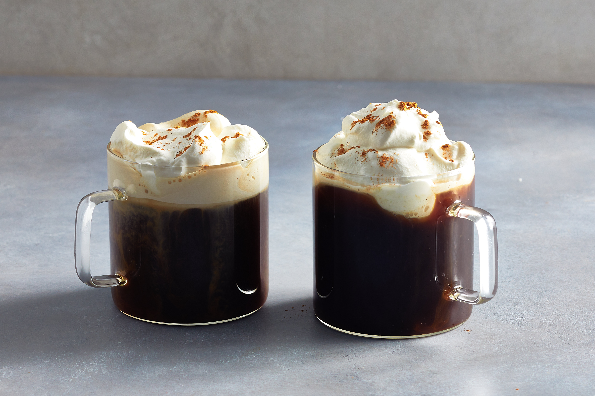

# Café Brûlot

*The flaming after-dinner coffee of New Orleans: hot dark coffee, brandy, orange liqueur, citrus peel, cinnamon and cloves, set alight tableside and ladled into demitasse cups. Antoine's, since the 1890s.*

**Serves:** 4

**Prep Time:** 5 minutes

**Cook Time:** 10 minutes

## Overview
Café brûlot (literally "burnt coffee") is the after-dinner ceremony of old New Orleans restaurants, performed at the table in a silver brûlot bowl, the lights of the dining room dimmed and the maître d' standing over a chafing dish. The drink dates from the 1890s, popularised at Antoine's, and uses a fixed set of ingredients (hot dark coffee, brandy, Cointreau or curaçao, citrus peels, cinnamon and cloves) heated together and set on fire just before serving. The flame burns off some of the alcohol and chars the citrus oils into the drink; the result is a perfumed, gently boozy coffee that smells of orange and clove. Ladled into demitasse cups, it ends a long Creole meal with theatre.

This recipe scales the drink down for a home stovetop. The traditional brûlot bowl is hard to find outside antique shops; a wide stainless or copper bowl works.

## Ingredients
- 500 ml strong hot black coffee (preferably French roast or chicory blend)
- 60 ml brandy (cognac is traditional)
- 30 ml Cointreau or orange curaçao
- 1 lemon (peeled in a long spiral, white pith removed)
- 1 orange (peeled in a long spiral, white pith removed)
- 4 sugar cubes
- 1 cinnamon stick (broken in two)
- 8 whole cloves

## Method

### Stage 1 - Brew the coffee
1. Brew 500 ml of strong hot coffee. Keep it hot while you prepare the brûlot.

### Stage 2 - Build the spice base
1. In a wide bowl or saucepan, combine the lemon peel, orange peel, sugar cubes, cinnamon stick and cloves.
1. Pour in the brandy and Cointreau. Stir gently with a long spoon.

### Stage 3 - Warm the brandy
1. Place the bowl over low heat (or use a chafing dish). Warm slowly until the spices are aromatic and you can smell the brandy clearly. Do not let it boil. This takes 2-3 minutes.

### Stage 4 - Flambé
1. Take a long match or a wand lighter. Carefully ignite the brandy mixture; the flame will rise gently and the citrus oils will catch and burn brilliantly along the peel.
1. Using a long-handled ladle, lift small spoonfuls of the flaming brandy and pour them slowly back into the bowl from a height of 20-30 cm. This builds a ribbon of flame between the ladle and the bowl. Continue for 30-45 seconds, until the flames are calming.

### Stage 5 - Add the coffee
1. Pour the hot coffee slowly into the bowl. The flames will gutter out as the coffee hits.
1. Stir once.
1. Ladle into 4 demitasse cups, leaving the peels and spices in the bowl. Serve immediately.

## Notes
- **Cognac is traditional.** A VS or VSOP cognac is sufficient; XO is wasted in the heat. Brandy of any kind works.
- **Sugar cubes, not granulated.** Cubes dissolve gradually in the warm spirit and disperse evenly; granulated sugar dissolves too fast and the drink can be cloyingly sweet at the bottom of the bowl.
- **Tableside theatre.** The whole point of café brûlot is the show. Dim the lights, perform the flambé and ladle ribbon at the table. The drink itself is good; the ceremony is the experience.
- **A long peel is better than chopped.** The long spirals of citrus peel are the structural element of the flambé; they catch the flame visually and release a great deal of oil. Use a vegetable peeler.

## Variations
- **Without flame:** warm the spirits with the spices and citrus for 5 minutes (no flame), then add the coffee. Less theatrical but more alcoholic; flame burns off some of the brandy.
- **Stronger:** double the brandy. A serious end-of-evening version.

## Serving
- A small demitasse cup per person, served at the end of a long dinner. The drink is rich and aromatic; a single cup is plenty. Goes well with a final small biscotti or a single praline.

## Storage
The drink does not store. The spices and peel can be refrigerated overnight in the residual brandy if you must, but the freshness of the flambé is the recipe.
