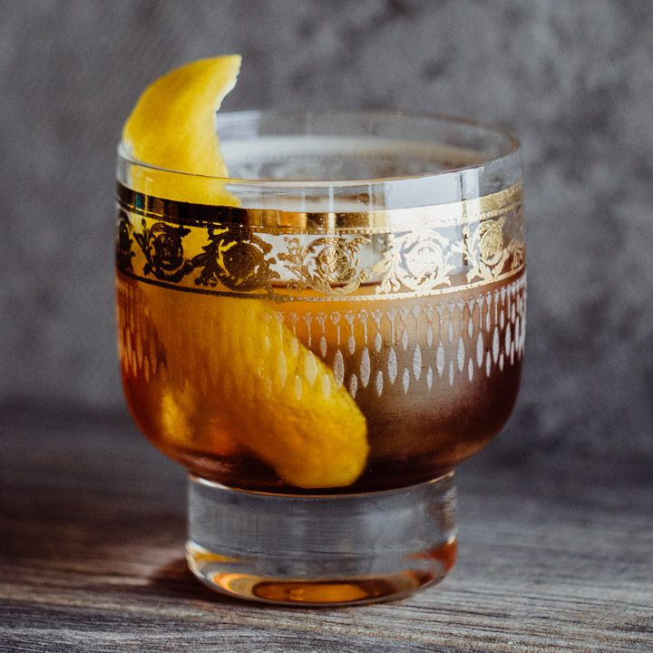

# Vieux Carré

*The Hotel Monteleone's stirred cocktail of rye, cognac, sweet vermouth, Bénédictine and bitters. Named for the French Quarter and invented in 1937 at the bar that revolves.*

**Serves:** 1

**Prep Time:** 5 minutes

## Overview
The Vieux Carré (literally "old square", the French name for the French Quarter) was invented in 1937 by head bartender Walter Bergeron at the Hotel Monteleone in New Orleans. Bergeron wanted a cocktail that honoured the cultural mix of the Quarter, and built one from spirits representing the major influences: American rye whiskey, French cognac, Italian sweet vermouth, and Bénédictine (the French Benedictine monastic liqueur), with both Peychaud's (New Orleans-made) and Angostura bitters as the finishing aromatics. The result is a stirred, brown, complex cocktail that sits somewhere between a Manhattan and a Sazerac, with a herbal-sweet undertone from the Bénédictine.

The drink is still served at the Monteleone's Carousel Bar, which is the literal centrepiece of the lobby: a rotating bar that completes one full revolution every fifteen minutes while you sit at it. If you order one in New Orleans, it should be served there.

## Ingredients
- 25 ml rye whiskey (Sazerac, Rittenhouse, or any good 100-proof rye)
- 25 ml cognac (VS or VSOP)
- 25 ml sweet (red) vermouth (Carpano Antica is excellent; Cinzano Rosso works)
- 5 ml Bénédictine
- 2 dashes Peychaud's bitters
- 1 dash Angostura bitters
- 1 large piece of orange peel (no pith)
- 1 maraschino cherry (optional, to garnish)
- Ice cubes (for stirring; a few additional for the serving glass)

## Method

### Stage 1 - Build
1. Add the rye, cognac, vermouth, Bénédictine, Peychaud's and Angostura to a mixing glass.
1. Fill the mixing glass with ice.

### Stage 2 - Stir
1. Stir with a bar spoon for 25-30 seconds. The mixture should be cold and well-diluted.

### Stage 3 - Serve
1. Strain into a chilled rocks glass over a large ice cube (or several smaller cubes).
1. Twist the orange peel firmly over the surface of the drink to release the citrus oils. Run the peel around the rim, then drop it in.
1. Add a cherry if you like. Serve.

## Notes
- **Equal parts rye, cognac, vermouth.** The 1:1:1 ratio is the recipe's distinctive feature. The Bénédictine is a small touch (5 ml is plenty); more and it dominates.
- **Two bitters, not one.** Peychaud's gives the New Orleans signature; Angostura adds bittersweet depth. Using only one or the other shifts the flavour profile significantly.
- **A large ice cube in the serving glass.** A single large cube dilutes more slowly than crushed ice; the cocktail should stay properly cold without becoming watery.
- **Sweet vermouth is the variable.** Carpano Antica gives an old-fashioned, slightly bitter-orange profile; Cinzano Rosso is fresher and brighter; Punt e Mes leans more herbaceous. All three work; pick by preference.
- **Cherry is optional.** A maraschino cherry is the traditional garnish at the Monteleone; modern bartenders often skip it. The orange twist is essential.

## Variations
- **Vieux Carré royale:** add a small amount of champagne or sparkling wine to lighten and effervesce. Not traditional.
- **Stronger:** double the rye to 50 ml; reduce cognac to 25 ml. A whiskey-forward version.

## Serving
- A pre-dinner or post-dinner cocktail. The drink is rich and contemplative; one before dinner sets the appetite, one after settles it. Two in succession is one too many; this is not a session cocktail.

## Storage
Build to order. The bottle ingredients keep indefinitely; the Bénédictine is the most volatile component (it can go slightly thin over a few years on the shelf) but for typical home use lasts a decade easily.
