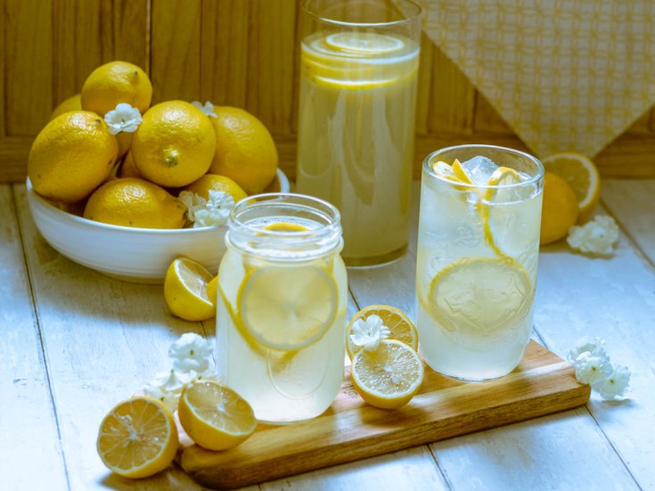

# L&P Style Lemonade

*A homemade tribute to Lemon & Paeroa, New Zealand's famous lemon-flavoured carbonated soft drink: lemon juice, mineral water and a touch of sugar, mixed and chilled. "World famous in New Zealand."*

**Serves:** 4 tall glasses

**Prep Time:** 10 minutes

**Cook Time:** 5 minutes (plus 30 minutes chill)

## Overview
Lemon & Paeroa - L&P - is a New Zealand soft drink invented in 1907 in the town of Paeroa, where the local mineral spring water is mixed with lemon juice and sugar to make a lightly fizzy lemony drink. The Coca-Cola company bought the brand decades ago and now most L&P is made with town water and synthetic flavouring; the original idea of mineral-water-and-lemon is what this recipe revives. Mineral water rather than tap water gives the drink its slightly mineral edge; the lemon should be fresh; the sugar should be light. The advertising slogan was "World famous in New Zealand" - self-aware Kiwi understatement that became the country's accidental national catchphrase.

## Ingredients
- Juice of 6 lemons (about 200 ml)
- Zest of 2 lemons (peeled in strips, no white pith)
- 150 g caster sugar
- 150 ml water (for the syrup)
- 1.2 L sparkling mineral water (San Pellegrino, Pellegrino, or any naturally sparkling mineral water), chilled
- Plenty of ice
- Lemon slices to garnish
- A few sprigs of fresh mint (optional)

## Method

### Stage 1 - Syrup
1. In a small saucepan, combine the water, sugar and lemon zest strips.
2. Heat over medium heat, stirring, until the sugar is fully dissolved (about 3-4 minutes).
3. Simmer 2 minutes - the zest infuses into the syrup.
4. Off the heat; let cool to room temperature; the zest continues to infuse.

### Stage 2 - Strain and combine
1. Strain the cooled syrup through a fine sieve to remove the zest.
2. In a large jug, combine the lemon juice and the strained syrup.
3. Stir to combine.
4. Refrigerate at least 30 minutes (cold base mixes better with sparkling water).

### Stage 3 - Build the glass
1. Fill 4 tall glasses with ice cubes.
2. Pour the chilled lemon-syrup base into each glass, filling about a third (roughly 80-100 ml per glass).
3. Top up with the chilled sparkling mineral water.
4. Stir gently once with a long spoon - too much stirring knocks the fizz out.

### Stage 4 - Garnish
1. A slice of lemon in each glass against the rim.
2. A sprig of mint floating on top.
3. Serve immediately, while crisp and fizzy.

## Notes
- **Mineral water, not tap:** The whole point of L&P is the slightly mineral character that ordinary tap water lacks. San Pellegrino, Perrier, Vichy Catalan, any natural sparkling mineral water - they all have a different mineral signature but all work better than carbonated tap water.
- **Zest in the syrup:** Infusing the lemon zest into the warm sugar syrup extracts the oil from the peel; this is where most of the lemon aroma is (the juice gives acid; the zest gives perfume).
- **Don't over-sweeten:** Real L&P is moderately sweet, not Coca-Cola sweet. Start with the smaller amount of sugar; you can always add more.

## Serving
Serve cold on a hot day. The Kiwi summer go-to non-alcoholic refreshment.

## Storage
- The lemon syrup base refrigerates 1 week in a sealed bottle.
- Mix with sparkling water per glass; pre-mixed loses fizz fast.
- Don't freeze.
