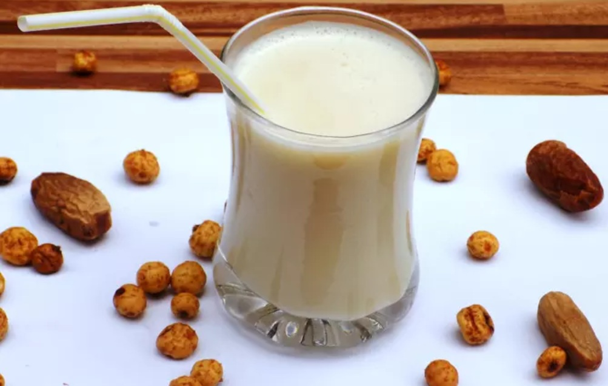

# Kunu

*Northern Nigeria's staple millet drink: white millet soaked, blended with ginger, cloves and a touch of chilli, strained, sweetened lightly, served chilled in a calabash bowl or tall glass. Cooling, lightly fizzy, nourishing, the everyday drink of Kano, Sokoto and Maiduguri.*

**Serves:** 4 to 6 glasses (makes 1.5 litres)

**Prep Time:** 15 minutes (plus 8 hours millet soak)

**Cook Time:** 10 minutes

## Overview
Kunu is the drink of Northern Nigeria, particularly Hausa and Fulani culture, where it has been brewed for centuries. The base is white millet (or sometimes guinea corn / sorghum, or rice), soaked overnight to soften and start the fermentation that gives kunu its slight tang. The soaked grains are blended with fresh ginger, cloves and (in some versions) a single bird's-eye chilli or a few black peppercorns for a faint heat, then strained through cloth to give a pale beige liquid. A small amount of sugar or pure honey is stirred in to taste, Northern kunu is traditionally only lightly sweet, contrasting with the heavily-sweet Southern Nigerian zobo. The result is a thin, slightly fizzy, creamy-textured drink with a clean grain flavour and a warm gingery finish, served cold in calabash bowls (kwarya) at markets or in glass bottles at homes. Kunu is also considered a "completing food": it's nutritious enough to count as a meal for working travellers, and it's the traditional drink for breaking the Ramadan fast in many Hausa households.

## Ingredients

- 250 g whole millet (white millet, sometimes labelled "kunu millet" at African groceries; sorghum or guinea corn works as a substitute)
- 2 tablespoons rice flour (optional, for body and a slight thickening)
- 1.5 litres cold water (for blending)
- 80 g fresh ginger, peeled and sliced
- 8 whole cloves
- 1 small bird's-eye chilli, deseeded (optional, for traditional faint heat)
- 6 black peppercorns
- 3 to 4 tablespoons sugar (or 2 tablespoons honey), to taste, kunu is properly only lightly sweet
- A pinch of fine salt

### To serve
- Ice cubes
- 4 to 6 tall glasses or small calabash bowls

## Method

### Stage 1 - Soak the millet
1. Rinse the millet under cold water in a sieve until the water runs clear.
1. Place in a large bowl, cover with cold water by at least 5 cm, and leave to soak at room temperature for 8 hours (overnight is ideal). The grains will swell and soften.
1. If using rice flour, mix it with 100 ml of cold water to make a smooth slurry; set aside.

### Stage 2 - Blend
1. Drain the soaked millet and rinse once more under cold water.
1. Transfer to a high-powered blender with the ginger, cloves, chilli (if using), peppercorns, and 750 ml of the cold water.
1. Blitz on high for 2 to 3 minutes until you have a thick, milky liquid with no visible grain pieces.
1. Add the remaining 750 ml of water and blitz again to combine.

### Stage 3 - Strain
1. Set a fine sieve over a large jug, then line it with a clean muslin cloth or nut milk bag.
1. Pour the blended liquid through the cloth and squeeze hard to extract every drop. The pulp left behind can be composted.

### Stage 4 - Cook lightly (optional, for thickness)
1. If using rice flour: pour the strained liquid into a saucepan, add the rice flour slurry, and bring to a gentle simmer over medium heat, stirring constantly. The liquid will thicken slightly to a single-cream consistency. Remove from heat after 2-3 minutes.
1. For the simpler version, skip this step entirely; kunu can be enjoyed thinner without cooking.

### Stage 5 - Sweeten and salt
1. Stir in the salt and sugar (or honey) to taste. Kunu should be lightly sweet, not aggressively sweet; about 3 tablespoons of sugar to 1.5 litres of liquid is the Northern Nigerian norm. Taste and add 1 tablespoon more if it feels flat.

### Stage 6 - Chill and serve
1. Cool to room temperature, then refrigerate at least 2 hours.
1. Stir well before serving (the millet starch settles).
1. Pour into chilled glasses over a few ice cubes; serve immediately.

## Notes
- **The soak is essential.** Skipping or shortening the soak gives a gritty, grain-flavoured drink. 8 hours minimum; 12 to 24 hours gives more depth and a faint pleasant tang from natural fermentation.
- **Strain through cloth.** A sieve alone leaves fine grain particles. Cloth (muslin or a nut-milk bag) gives the smooth pale-beige consistency the drink should have.
- **Light sweetness.** Don't over-sweeten kunu thinking it should be like zobo. The Northern Nigerian palate prefers it cleaner. You can always add more sugar at the glass; you can't take it out.
- **The chilli is a Northern touch.** Adds faint background warmth without making the drink obviously hot. If you skip it, the drink is still good but lacks that distinctive Northern character.

## Variations
- **Kunu aya (tiger-nut version).** Replace half the millet with 100 g of soaked tiger nuts. Common in some Northern households; gives a creamier, slightly sweeter base. Different from Spanish horchata de chufa despite the shared ingredient.
- **Kunu zaki ("sweet kunu").** With more sugar (5-6 tablespoons), heavier rice flour, served warm. The dessert kunu, sometimes garnished with crushed peanuts.
- **Kunu gyada (peanut kunu).** Add 100 g of roasted peanuts to the blender stage. Thicker, richer, more meal-like; popular in Plateau State.
- **Sorghum kunu (kunu dawa).** Replace the millet with guinea corn / sorghum. Darker colour, slightly different flavour; common in the Sahel.

## Storage
- Refrigerate up to 3 days. After day 2 the natural fermentation accelerates and the drink gets noticeably tangier (some prefer it that way; others find it sour).
- Stir well before each pour; the starch always settles.
- Don't freeze; the texture is wrecked.
