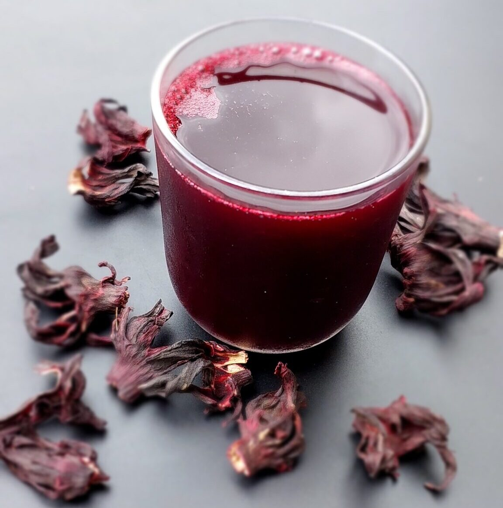

# Zobo

*Nigeria's national hibiscus drink: dried hibiscus petals simmered with ginger, cloves, pineapple skin and a stick of cinnamon, sweetened to taste, served deeply chilled in tall glasses with a slice of pineapple on the rim. Deep magenta, tart-sweet, slightly tangy, the soft drink that handles a hot Lagos afternoon.*

**Serves:** 6 to 8 tall glasses (makes 1.5 litres)

**Prep Time:** 5 minutes

**Cook Time:** 30 minutes (plus chilling)

## Overview
Zobo (called "zoborodo" in full, from the Hausa word for hibiscus) is the everyday Nigerian soft drink, sold cold in plastic bottles by every street vendor, served in tall glass jugs at parties and weddings, and made at home weekly in fridges across Lagos, Abuja, Kano and Port Harcourt. The base is dried red hibiscus calyces (also known as sorrel, roselle or zobo leaves — the same flower that makes Egyptian karkadeh, Mexican agua de Jamaica, and Caribbean sorrel, prepared distinctly in each tradition). The Nigerian version uses generous quantities of ginger, plus pineapple skin (or fresh pineapple), cloves and sometimes cinnamon or uziza leaves. It's simmered hard for half an hour to extract every bit of colour and flavour, then strained, sweetened (usually heavily), and chilled. The colour is a deep magenta-purple, the taste tart and slightly cranberry-like with a strong ginger finish. Health-conscious modern preparations skip the sugar and use stevia; old-school party zobo is sweet to the point of being almost-syrupy.

## Ingredients

- 100 g dried hibiscus calyces (zobo leaves) — from any African or Caribbean grocery, or health food shop
- 2 litres cold water
- 80 g fresh ginger, sliced thin (skin on is fine)
- 6 whole cloves
- 1 cinnamon stick (optional)
- The skin and core of 1 fresh pineapple OR 200 g pineapple chunks (the skin is the traditional choice; it adds depth without sweetness)
- 200 g caster sugar (or more, to taste; for the proper Nigerian sweetness use 250 g)
- 1 tablespoon fresh lemon juice (brightens the colour)

### To serve
- Plenty of ice cubes
- A small slice of fresh pineapple per glass
- 6 to 8 tall glasses, chilled
- Optional: a sprig of fresh mint per glass

## Method

### Stage 1 - Boil
1. Rinse the hibiscus calyces briefly under cold water to remove dust.
1. Put them in a large saucepan with the 2 litres of cold water, the sliced ginger, the cloves and the cinnamon stick (if using).
1. Add the pineapple skin / chunks.
1. Bring to the boil, then reduce to a strong simmer for 30 minutes, covered. The kitchen will smell tart, gingery and warm; the water will be a deep blood-red.

### Stage 2 - Strain
1. Strain through a fine sieve into a large jug or pitcher, pressing the solids hard to extract every drop. Discard the spent solids.
1. The strained liquid should be a deep clear ruby-magenta.

### Stage 3 - Sweeten
1. While still warm, stir in 200 g of caster sugar until completely dissolved.
1. Stir in the lemon juice (this brightens both the colour and the flavour).
1. Taste: it should be tart with a clear sweet finish. Add another 30-50 g sugar if it tastes too sharp; Nigerians like it sweet.

### Stage 4 - Chill
1. Cool to room temperature, then refrigerate at least 3 hours (overnight is better; the flavour deepens).

### Stage 5 - Serve
1. Pour over ice into tall chilled glasses.
1. Garnish each with a slice of fresh pineapple clipped on the rim and (optionally) a sprig of mint.
1. Serve immediately while deeply cold.

## Notes
- **Pineapple skin or chunks.** Either works. The skin is traditional and economic (using what would otherwise be waste); chunks give a sweeter, more pineapple-forward drink. Lagos street vendors typically use skin.
- **Sweet by Nigerian standards.** Party zobo is properly sweet, almost a syrup-style sweetness. If you're cutting sugar, start at 150 g and adjust. Below 100 g zobo tastes thin.
- **Strong ginger is the Nigerian signature.** Don't underdo it. 80 g of ginger gives a clear ginger kick that distinguishes zobo from Caribbean sorrel or Egyptian karkadeh.
- **Lemon at the end.** The squeeze of fresh lemon transforms the colour (deepens it from dull red to vivid magenta) and adds a bright lift. Don't skip.

## Variations
- **Spiced zobo.** Add 2 uziza leaves (West African pepper leaves), or 4 cloves and 2 cinnamon sticks, for a more aromatic version.
- **Zobo and pineapple juice.** Blend equal parts strained zobo with fresh pineapple juice for a sweeter, more tropical drink.
- **Cucumber zobo.** Add 100 g sliced cucumber to the brewing pot, or to the chilled jug for an hour before serving. Cooling, hydrating.
- **Adult zobo.** A 30 ml shot of vodka or white rum added per glass converts zobo into a cocktail. Common at Lagos house parties.

## Storage
- Strained sweetened zobo keeps 1 week in the fridge in a sealed jug. The flavour stays bright for 3-4 days then slowly fades.
- Don't freeze; the texture stays fine but the bright colour fades on thawing.
