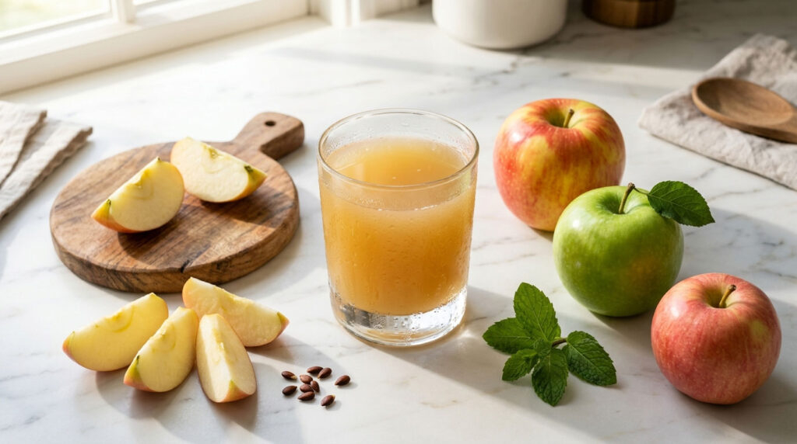

# Eplemost (Norwegian Apple Must)

*Norway's fresh apple juice: pressed apples filtered just enough to keep the cloudy body and natural sweetness, no added sugar, no concentrate. The bottled summer-and-autumn drink Norwegians keep in the door of the fridge.*

**Serves:** Makes about 1.5 L (6-8 glasses)

**Prep Time:** 30 minutes

**Cook Time:** 10 minutes (for pasteurised version)

## Overview
Eplemost ("apple must") is the Norwegian cold-pressed apple juice tradition - fresh apples pressed and filtered just enough to keep a slightly cloudy, deeply appley liquid, without added sugar or water. Many Norwegian farmers' shops sell their own eplemost in glass bottles in autumn; many home cooks press their own from garden apples after a heavy crop. The home version uses a juicer or a blender-and-sieve method; the flavour is dramatically better than anything from a supermarket carton because no concentrate is involved and no clarifying filtration strips out the body. A mix of varieties gives the best balance - sweet eating apples plus tart cookers. Drunk cold in summer, gently warmed with a cinnamon stick in winter as a non-alcoholic alternative to gløgg.

## Ingredients
- 2 kg mixed apples (a mix of sweet eating apples like Gala or Braeburn, plus tart cookers like Bramley)
- Optional: 1 tbsp lemon juice (to keep the colour bright)

### For a pasteurised long-keeping version
- A clean 1.5 L bottle, sterilised

### Optional flavour additions (one or two)
- 2 sprigs fresh mint
- A few thin slices of fresh ginger
- 1 cinnamon stick (for winter warm version)
- 2 cloves
- A pinch of salt (brings the apple flavour forward)

## Method

### Stage 1 - Prep the apples
1. Wash the apples well; don't peel (the skin adds colour and flavour).
2. Quarter and core; bruise sections may go in (they're fine for juice).

### Stage 2 - Juice
**Method A - juicer (best):**
1. Feed the apple chunks through a centrifugal or masticating juicer in batches.
2. Catch the juice in a jug; collect the pulp separately (use for compost or apple cake).
3. The fresh juice is opaque-cloudy and starts to brown within minutes from oxidation.

**Method B - blender and sieve (no juicer):**
1. Blend the apple chunks with 200 ml water in batches until completely puréed.
2. Line a sieve with muslin or a clean tea towel set over a deep bowl.
3. Tip the purée in; let drip 30 minutes.
4. Gather the cloth into a bundle; squeeze hard to extract as much juice as possible.
5. Discard the pulp.

### Stage 3 - Stabilise
1. Add the lemon juice to the fresh juice (slows oxidation and keeps the colour).
2. Add a small pinch of salt; it sharpens the apple flavour.

### Stage 4a - Drink fresh (within 3 days)
1. Refrigerate in a clean sealed bottle.
2. Drink chilled within 3 days; shake before pouring (the pulp settles).

### Stage 4b - Pasteurise for longer keeping
1. Pour the juice into a clean saucepan.
2. Heat to 75°C (use a thermometer); hold at this temperature for 5 minutes.
3. Pour while hot into a sterilised bottle; seal immediately.
4. Cool to room temperature; refrigerate.
5. Pasteurised eplemost keeps refrigerated 3 months unopened.

### Stage 5 - Serve cold
1. Pour over ice into a tall glass.
2. A slice of fresh apple on the rim; a sprig of mint.
3. Best with the lid given a good shake first to redistribute pulp.

### Stage 6 - Serve warm (winter version)
1. Pour 250 ml per mug into a small saucepan.
2. Add a cinnamon stick and 2 cloves per mug.
3. Heat over medium-low until steaming (do not boil - boiling cooks out the freshness).
4. Pour into mugs; drink hot.

## Notes
- **Mix of apples:** A single variety eplemost is one-note. The classic Norwegian mix is 70% sweet eating apples + 30% tart cookers, which gives both sweetness and the appley bite that defines a good eplemost.
- **Skin on:** The skin contributes colour and a slight floral note. Wash the apples well rather than peel.
- **Don't boil:** Cooking the juice destroys the fresh apple character. Warm only to drinking temperature; pasteurisation goes to 75°C, not boiling.

## Serving
- The cold autumn drink at apple-harvest time. Bring a bottle to a picnic. Warm with cinnamon as the children's gløgg at Christmas markets. With a piece of eplekake as an apple-on-apple afternoon snack.

## Storage
- Fresh: refrigerates 3 days.
- Pasteurised: refrigerates 3 months unopened; once opened, 1 week.
- Freezes 6 months in ice cube trays; thaw cubes as needed for small servings.
