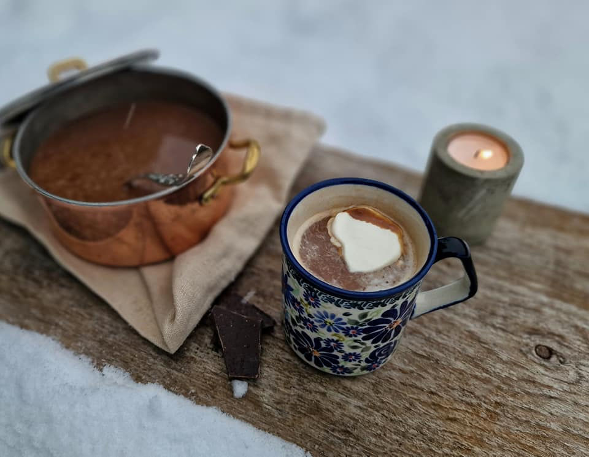

# Norwegian Hot Chocolate (Varm Sjokolade)

*Norway's winter cup: a thick rich hot chocolate made with dark chocolate, milk and a generous knob of butter for silkiness. Topped with a thick crown of fresh whipped cream. The drink after coming in from the cold.*

**Serves:** 4 mugs

**Prep Time:** 5 minutes

**Cook Time:** 10 minutes

## Overview
Norwegian winter is long and cold, and the Norwegian answer is a thick rich hot chocolate (varm sjokolade) consumed at every winter occasion: après-ski, after sledding, at Christmas markets, at the school kafeteria on grey Tuesday afternoons. The Norwegian version is richer than most: real dark chocolate melted into hot milk, with a small piece of butter stirred in for a silky mouthfeel, and a thick crown of softly whipped cream on top - cream that's barely sweetened so it contrasts with the deep dark chocolate underneath. The optional dusting of cocoa or grating of dark chocolate over the cream finishes it. A small mug is enough; the drink is dense.

## Ingredients
- 200 g good-quality dark chocolate (60-70% cocoa), chopped fine
- 600 ml whole milk
- 200 ml double cream
- 30 g unsalted butter
- 1 tbsp soft brown sugar (adjust to taste)
- 1 tsp vanilla extract
- A pinch of fine salt
- A pinch of ground cardamom (optional - the Scandinavian touch)

### To top
- 200 ml double cream, very cold
- 1 tbsp icing sugar
- 0.5 tsp vanilla extract
- Grated dark chocolate or cocoa powder for dusting

## Method

### Stage 1 - Whip the cream topping
1. In a chilled bowl, whip the cream with the icing sugar and vanilla to soft peaks.
2. Refrigerate while you make the chocolate.

### Stage 2 - Heat the milk
1. Combine the milk and cream in a heavy saucepan.
2. Add the brown sugar and salt.
3. Heat over medium-low heat, whisking, until just below a simmer (steaming, small bubbles at the edge).

### Stage 3 - Add the chocolate
1. Reduce heat to low.
2. Tip in the chopped chocolate and the butter.
3. Whisk continuously 2-3 minutes until the chocolate has melted, the butter is incorporated, and the mixture is smooth and uniformly dark.
4. Don't boil - it can grain.

### Stage 4 - Finish
1. Stir in the vanilla and cardamom (if using).
2. Taste; adjust sugar.

### Stage 5 - Serve
1. Pour into warm mugs.
2. Top generously with the cold whipped cream (it floats on top).
3. Dust with grated dark chocolate or cocoa.
4. Serve immediately with a long spoon for stirring.

## Notes
- **Butter for silkiness:** A small knob of butter is the Norwegian touch - it gives the drink an extra layer of silky body that pure milk-and-chocolate doesn't quite reach.
- **Cold cream on hot chocolate:** The temperature contrast is part of the pleasure. Whip the cream just to soft peaks - stiff cream sits on top stubbornly; soft cream slowly mixes in.
- **Don't boil:** Boiling damages the chocolate texture. Keep at a steaming simmer, no rolling boil.

## Serving
- Serve after coming in from a cold winter day - skating, skiing, walking. Or as a dessert after a meal of fish or soup. With a krumkake or a piece of dark chocolate on the side.

## Storage
- Best fresh.
- The hot chocolate base refrigerates 2 days; reheat gently, whisking.
- The whipped cream refrigerates 1 day before going soft.
