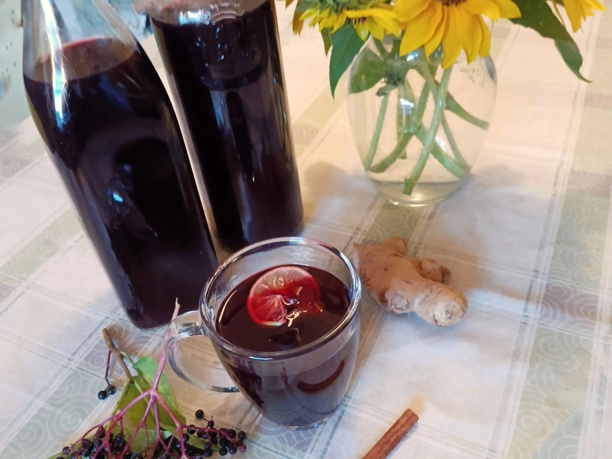

# Solbær-Toddy (Norwegian Blackcurrant Hot Drink)

*Norway's hot blackcurrant drink: blackcurrant cordial mixed with hot water, served in a mug with a slice of lemon and a cinnamon stick. The non-alcoholic cure for cold fingers after winter skating, the drink Norwegian children get when adults have a hot toddy.*

**Serves:** 4 mugs

**Prep Time:** 5 minutes (plus pre-made cordial)

**Cook Time:** 5 minutes

## Overview
Solbær-toddy ("blackcurrant toddy") is the Norwegian children's-and-adults' hot drink for cold winter occasions: blackcurrant cordial (solbærsaft - sold concentrated in every Norwegian supermarket, the Norwegian fruit-syrup tradition) mixed with hot water and served in a mug with a slice of lemon, a cinnamon stick, and sometimes a few cloves. It's what gets handed out after ice skating, after a winter walk, at outdoor Christmas markets where the adults are drinking gløgg (mulled wine) and the children get the same warming ritual without the alcohol. The blackcurrant is sharp and deeply fruity; the heat and spice round it into a comfort drink. Make the cordial from scratch (it keeps for months and beats commercial versions for depth of fruit) or buy concentrate from a Scandinavian shop or online.

## Ingredients

### Blackcurrant cordial (makes 1 L; keeps refrigerated 3 months)
- 500 g fresh or frozen blackcurrants (or substitute redcurrants + a splash of blackberry juice)
- 500 ml water
- 400 g caster sugar
- Juice of 1 lemon

### To make 4 mugs of toddy
- 200 ml blackcurrant cordial (about 50 ml per mug)
- 800 ml boiling water
- 4 thin slices of lemon
- 4 cinnamon sticks
- 8 whole cloves (optional)
- A small handful of fresh berries (frozen ok), for garnish (optional)

## Method

### Stage 1 - Make the cordial (ahead)
1. Place the blackcurrants in a heavy saucepan.
2. Add the water; bring to a boil; simmer 15 minutes, mashing the berries with a wooden spoon as they soften.
3. Strain through a fine sieve (or a muslin cloth for a clearer cordial), pressing the pulp firmly. Discard the pulp.
4. Return the strained juice to the pan; add the sugar and lemon juice.
5. Heat gently, stirring, until the sugar is fully dissolved.
6. Simmer 2-3 minutes; the cordial will be a deep purple-black.
7. Cool; bottle in a sterilised bottle; refrigerate.

### Stage 2 - Make the toddy
1. In each mug, place 50 ml of cordial, a slice of lemon, a cinnamon stick and 2 cloves (if using).
2. Pour over 200 ml of boiling water.
3. Stir gently; let infuse for 1 minute.

### Stage 3 - Garnish
1. Drop in a few extra fresh berries if you have them.
2. Serve hot.

### Stage 4 - Adjust
1. Taste; if too sweet, top up with more hot water; if too thin, add another splash of cordial.

## Notes
- **Blackcurrants specifically:** The strong fruity-tart flavour of blackcurrant is what defines solbær-toddy. Red currants are sharper and need more sugar; mixed berry cordials are fine but lose the distinctive blackcurrant note.
- **Cordial as base:** The Scandinavian fruit-cordial tradition (saft) is the platform - blackcurrant, raspberry, elderflower, lingonberry are all cordials sold in Norwegian supermarkets. You can use a quality commercial cordial (Ribena, French sirop de cassis) as a substitute.
- **Lemon and cinnamon are not optional:** They're what turn fruit juice into "toddy". A toddy without the citrus and spice is just hot fruit juice.

## Serving
The non-alcoholic answer to gløgg or vin chaud. Serve at outdoor winter events, after sledding, at Christmas market visits, after a winter walk in the dark. With a piece of pepperkaker (Norwegian gingerbread) on the side.

## Storage
- Cordial refrigerates 3 months in a sterilised sealed bottle.
- Mix per serving; the toddy doesn't keep once made up (the lemon goes bitter).
- Make a big batch of cordial in late summer when blackcurrants are plentiful; freeze in ice cube trays for portion-sized servings through winter.
