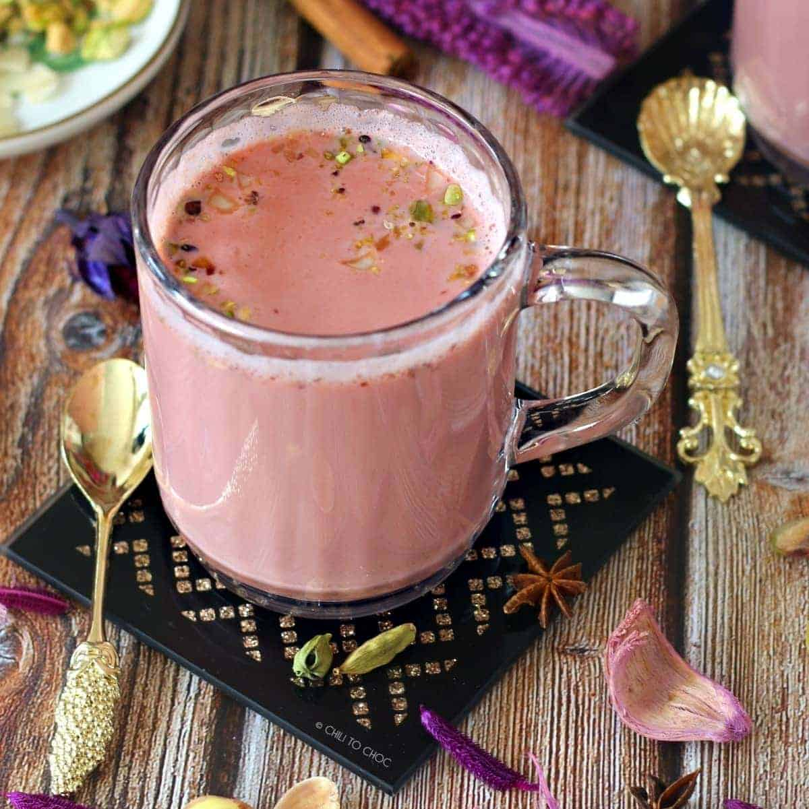

# Kashmiri Chai (Pink Tea)

*The famous pink tea: green tea boiled long and aerated until it turns vivid magenta, then finished with hot milk, cardamom, salt and crushed pistachios on top. The signature drink of Lahore, Peshawar and Kashmir, served at weddings and on cold winter mornings.*

**Serves:** 4 cups

**Prep Time:** 5 minutes

**Cook Time:** 45 minutes

## Overview
Kashmiri chai (also called noon chai or gulabi chai) is a chemistry-driven tea. The vivid pink colour isn't from any added ingredient: it comes from prolonged boiling of green tea leaves with a pinch of baking soda, which oxidises chlorophyll and reveals an underlying pink-purple pigment in the leaves. The brew is aerated by pouring it back and forth from a height between two pots, which deepens both the colour and the body. Hot whole milk is then added in a 50/50 ratio, the drink turns from deep red to a pale strawberry pink, and it's seasoned with cardamom, a pinch of salt and sugar. Served in small cups with crushed pistachios floating on top, sometimes with a swirl of cream, it's the showpiece drink at Pakistani and Kashmiri weddings, the chai aunties make in winter, and the only tea in the world that's a colour you wouldn't believe possible from green leaves alone. Both the Pakistani (Lahori, Peshawari) and Kashmiri versions are similar; small regional differences in salt level and milk quantity exist.

## Ingredients

- 2 tablespoons Kashmiri green tea (special long-leaf green tea sold at South Asian groceries; brand: Tapal or Vahdam)
- 1 litre cold water
- 1 teaspoon baking soda (essential for the colour — sodium bicarbonate, not powder)
- 6 green cardamom pods, lightly crushed
- 1 teaspoon fine salt
- 500 ml whole milk
- 4 to 6 teaspoons white sugar, to taste
- 3 ice cubes (counter-intuitive but traditional — they help with the colour reaction)

### To serve
- 2 tablespoons crushed unsalted pistachios
- A small pinch of ground cardamom
- 4 small heatproof cups

## Method

### Stage 1 - Boil the green tea
1. Put the Kashmiri green tea, baking soda, and 1 litre of cold water into a large pot.
1. Bring to the boil over medium heat. Once it reaches a hard rolling boil, add the cardamom pods and reduce to medium-high heat to keep a strong simmer.
1. Simmer for 30 minutes uncovered. The water will reduce by about a third and turn a deep, almost crimson colour.

### Stage 2 - Add ice and aerate
1. After 30 minutes, drop in the 3 ice cubes (the sudden temperature shock is part of the colour-development trick).
1. Now aerate: using a ladle or by pouring back-and-forth between two pots, lift the liquid from a height of about 30 cm and let it splash back into the pot. Do this 10 to 15 times. The colour will deepen and lighten — going from dark crimson to a brighter ruby red.

### Stage 3 - Strain
1. Strain through a fine sieve into a clean pot, discarding the spent tea leaves and cardamom pods.
1. The brew is now a deep ruby-red concentrate that will turn pink when milk is added.

### Stage 4 - Add milk and salt
1. Return the strained concentrate to medium heat. Add the salt and stir.
1. Pour in the whole milk in a slow steady stream while stirring. The colour will shift dramatically from red to a pale strawberry-pink as the milk hits.
1. Bring back to just below the boil; do not let it boil hard or it will scorch.
1. Stir in sugar to taste; Kashmiri chai is properly slightly sweet but not as aggressively sweet as masala chai.

### Stage 5 - Serve
1. Pour into small cups.
1. Top each with a scattering of crushed pistachios and a tiny pinch of ground cardamom.
1. Optional finishing touch: a small drizzle of malai (clotted cream) on the surface of each cup.

## Notes
- **Baking soda is essential.** Without it, the green tea boils to a normal khaki-brown, not pink. Sodium bicarbonate raises pH which oxidises the chlorophyll and reveals the pink pigment. Use about 1 teaspoon per litre; too much makes the tea taste soapy.
- **Special green tea variety.** Standard Chinese / Japanese green teas don't pink as reliably. Buy Kashmiri or Pakistani green tea labelled for this purpose. Brands: Sabz Chai, Vahdam Kashmiri Green, Tapal Tapal.
- **The aeration matters.** Without aerating, the brew stays dark and muddy. The pour-and-back step is half the colour, half the body.
- **Salt is non-negotiable.** Slightly salty Kashmiri chai is the traditional flavour profile. Don't skip the salt thinking it's optional; the salt balances the slight bitterness of the long-boiled tea.

## Variations
- **Noon chai (Kashmiri-style).** The Kashmiri version emphasises the salty side more. Use 1.5 teaspoons of salt and less sugar; serve with kulcha or sheermal bread for breakfast.
- **Lahori (Pakistani-style).** Sweeter, more milk-heavy. Use 600 ml milk to 400 ml concentrate, double the sugar, served at dessert time or weddings.
- **Without pistachios.** Plain pink chai with just the cardamom dust. Cheaper, equally pink, easier for a crowd.
- **Cold pink chai.** Same brew, served chilled over ice with a swirl of cream. Modern café variation; not traditional but lovely on a hot day.

## Storage
- The strained concentrate (before milk) keeps 3 days in the fridge. Reheat with milk added at serving.
- Once milk is added, drink within 24 hours; the milk separates and the pink colour fades.
- Don't freeze; the colour goes muddy on thawing.
