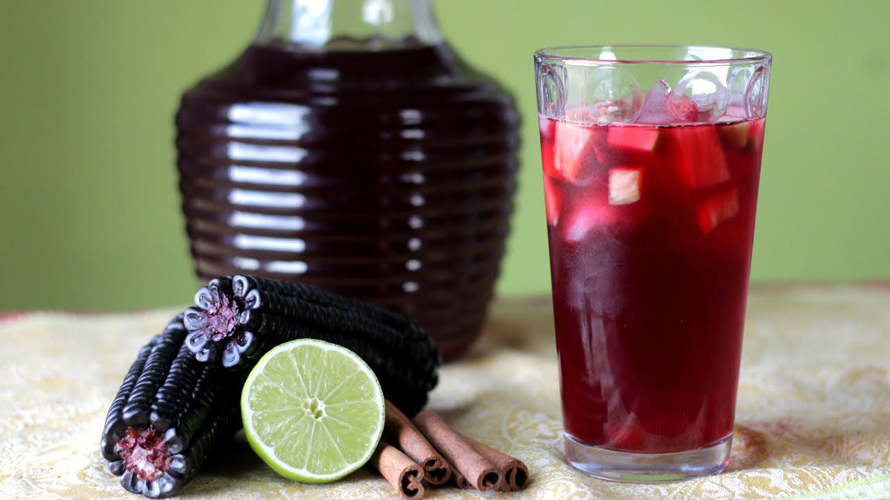

# Chicha Morada (Peruvian Purple-Corn Drink)

*Peru's canonical non-alcoholic table drink: a deep electric-purple infusion made by simmering Andean purple corn (maíz morado, the deep-purple ear of corn unique to the Peruvian highlands) with pineapple skin, chopped apple, cinnamon sticks, cloves, and a fistful of lime juice and sugar - the result is bright purple, fragrant, slightly tart, mildly fruity, and unmistakably Peruvian. Served chilled at every Peruvian household lunch and at every Peruvian restaurant alongside ceviche, lomo saltado, aji de gallina or anticuchos. The non-alcoholic cousin to the fermented chicha de jora; the drink that defines the Peruvian table.*

**Serves:** 8 (makes about 2 litres)

**Prep Time:** 10 minutes

**Cook Time:** 45 minutes (plus 2 hours chilling)

## Overview
Chicha morada is Peru's most identity-defining non-alcoholic drink and the canonical accompaniment to every meal. The construction is built on three Peruvian-specific moves. First, the corn: dried maíz morado (Andean purple corn; sold as whole cobs at Latin American shops, or as a powdered concentrate at some Peruvian groceries). Whole cobs are the canonical option - the deep purple anthocyanin colour leaches into the cooking water during a long slow simmer, producing the unmistakable electric-purple of authentic chicha morada. Substitute (less canonical but workable): 200 g frozen blueberries + 100 g blackberries + 100 ml blackcurrant juice for the colour, though the flavour profile is different. Second, the fruit and spice infusion: the corn cobs simmer with pineapple SKIN (rind only, not the flesh), the cores of 2-3 apples, cinnamon sticks, cloves, and a small piece of orange peel - all of which contribute aroma without bitterness. After 45 minutes, the broth is strained, sweetened with sugar, and the finishing touches added: chopped fresh apple, chopped fresh pineapple, fresh lime juice, and (optional) a few crushed mint leaves or a sliver of fresh ginger. Third, the chill and dilution: the broth is chilled fully (at least 2 hours; overnight is better), then served over ice in tall glasses. Some Peruvian homes dilute the concentrated broth with water (50/50 or 60/40) when serving; others serve it concentrated. The canonical Peruvian table drink - alongside every meal, in every Peruvian household, in every Peruvian restaurant. Three details: USE PURPLE CORN (dried cobs ideal; the colour and flavour are unique - substitutes give an approximation), PINEAPPLE SKIN NOT FLESH IN THE BREW (the rind contributes aroma; the flesh would make it cloudy), and CHILL FULLY BEFORE SERVING (2 hours minimum; overnight is dramatically better).

## Ingredients

### The purple-corn brew
- 1 large dried purple corn cob (maíz morado; about 200 g) OR 200 g dried purple-corn kernels
- 2.5 litres water
- 2 cinnamon sticks
- 6 whole cloves
- 1 strip orange peel (about 5 × 2 cm)
- Pineapple skin from 1 whole fresh pineapple (the outer rind only)
- Cores and skins from 2-3 apples (saves on waste from the fresh apple you'll dice for finishing)
- 1 strip of lemon peel (5 × 2 cm)
- (Optional: 1 strip ginger 3 cm, lightly crushed)

### The sweetening and finishing
- 150-200 g granulated sugar (or to taste; chicha morada is moderately sweet, not aggressively so)
- 100 ml fresh lime juice (about 6 limes; freshly squeezed)
- 1 large green apple (Granny Smith), peeled, cored and chopped into 1 cm dice
- 200 g fresh pineapple flesh, chopped into 1 cm dice (from the same pineapple as the skin)
- 1 small bunch fresh mint, leaves picked (optional, modern variant)

### To serve
- Tall glasses
- Ice cubes
- A slice of fresh lime on the rim (optional)
- A small mint sprig (optional)

## Method

### Stage 1 - Prepare the corn
1. If using a whole corn cob: break or saw it into 3-4 pieces. Don't bother removing kernels - the cob itself holds most of the colour.
2. If using kernels: weigh out 200 g.

### Stage 2 - The long simmer (the colour extraction)
1. Place the corn (cob or kernels) in a large pot.
2. Add the water, cinnamon sticks, cloves, orange peel, pineapple skin, apple cores-and-skins, lemon peel and (optional) ginger.
3. Bring to a gentle boil.
4. Reduce to a low simmer; cook UNCOVERED 35-40 minutes.
5. The liquid should reduce by about 1/4 and become a deep, vivid purple-violet colour.

### Stage 3 - Strain
1. Strain the broth through a fine sieve into a clean large pitcher or pot.
2. Press the spent corn and fruit residues with a wooden spoon to extract every drop.
3. Discard the spent solids.
4. You should have about 2 litres of vivid purple broth.

### Stage 4 - Sweeten
1. While still warm, stir in 150 g of sugar; taste; add more (up to 200 g) if you prefer sweeter.
2. The broth should be moderately sweet, not aggressively so.

### Stage 5 - Cool and chill
1. Let the sweetened broth cool to room temperature (about 30 minutes).
2. Then refrigerate at least 2 hours, ideally overnight.
3. The fully chilled chicha morada is dramatically better than the warm version.

### Stage 6 - Add the fresh fruit and finishing
1. Once chilled, stir in the fresh lime juice.
2. Add the diced fresh apple and fresh pineapple (these go in cold so they stay crisp).
3. Optional: add a small handful of crushed fresh mint leaves.
4. Stir gently.

### Stage 7 - Serve
1. Fill tall glasses with ice cubes.
2. Pour the chilled chicha morada over the ice; the fruit chunks come along.
3. Garnish with a lime wedge on the rim and a sprig of mint.
4. Drink immediately while ice-cold.

## Notes
- **Dried maíz morado is dramatically different from substitutes:** the deep-purple Andean corn has a unique earthy-floral character. Source from a Latin American shop if you can.
- **Pineapple skin in the brew:** the canonical Peruvian addition - the rind gives aroma without the cloudiness that the flesh would. Don't skip.
- **Chill fully:** 2 hours minimum. The drink is dramatically better cold than warm.
- **Lime juice fresh:** never bottled. The bright bracing acidity is critical.
- **Don't over-sweeten:** chicha morada is moderately sweet, not aggressively. Adjust to taste but stop at 200 g sugar for 2 litres.
- **The fresh fruit stays crunchy:** added cold at the end, the apple and pineapple stay crisp - the canonical Peruvian texture.

## Variations
**Chicha morada with chia seeds:** add 2 tablespoons chia seeds to the chilled drink; let stand 20 minutes till the seeds bloom into a gel - the modern Peruvian variant.
**Chicha morada gelatin:** dissolve gelatin (or agar agar for vegan) in the warm broth; pour into glasses; chill - a Peruvian dessert variant.
**Spiked chicha morada (alcoholic):** add 30 ml of Peruvian pisco to each glass before serving - the adult Peruvian summer drink.
**Sangria chicha morada:** add a bottle of dry red wine + diced fruit to the cold chicha - the modern Lima fusion.
**Chicha morada popsicles:** freeze in popsicle moulds with a wedge of fruit - the Peruvian summer street-food.
**Sparkling chicha morada:** top each glass with 30 ml of cold sparkling water - the bubblier variant.
**Smaller batch:** halve all the ingredients for 1 litre instead of 2.

## Serving
At a Peruvian household lunch (the canonical setting; chicha morada is the canonical Peruvian table drink at every meal) · at a Peruvian restaurant alongside ceviche, lomo saltado, aji de gallina or anticuchos · at a Peruvian Independence Day celebration · at a Peruvian wedding · at a Peruvian street stall (chicheras sell chicha morada from glass jugs on every Peruvian street corner) · at home as the canonical Peruvian-themed dinner accompaniment.

## Storage
- The brewed concentrated broth refrigerates 5 days; freezes 3 months.
- The fully-assembled chicha morada (with fresh fruit) is best within 24 hours - the fresh fruit slowly leaks colour.
- The dry purple corn cobs and kernels keep indefinitely in a sealed jar in a dry pantry.
- A "chicha morada concentrate" can be made 2x or 3x strength and refrigerated for up to a week; dilute with water to serve.
- Don't freeze with fresh fruit in - freeze the broth only, add fresh fruit on defrost.
