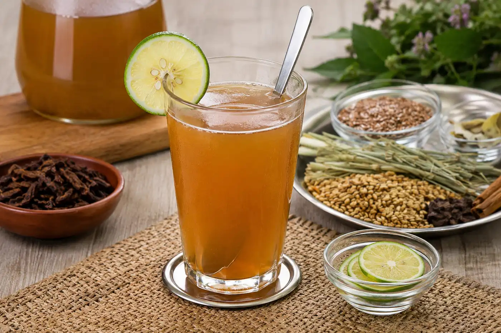

# Emoliente (Peruvian Street-Cart Herbal Hot Drink)

*The Peruvian street-corner sunrise drink: a hot, slightly thick infusion of barley + flax seeds + horsetail + alfalfa + boldo leaves + boiled aloe vera, finished with fresh lime juice and a generous spoon of honey - drunk by Peruvians at dawn for centuries as a digestive, energy, and general-purpose wellness drink. Sold from temporary wheeled carts (emolienterías) on every Peruvian street corner from 5 am till mid-morning; the carriers ladle it from a battered metal pot into small paper or ceramic cups; the drinker stands at the cart for 5 minutes; pays a small amount; goes about the day. The Andean herbal-tea cousin of London's morning espresso, with a much deeper folk-medicine pedigree.*

**Serves:** 4

**Prep Time:** 10 minutes

**Cook Time:** 35 minutes (plus 12 hours of optional flax soaking)

## Overview
Emoliente is one of Peru's most distinctive street drinks - and one of the world's most under-known herbal hot beverages. The construction has roots going back to colonial-era pharmacy traditions (a "emoliente" in old Spanish meant a soothing medicine) and has been a fixture of Peruvian street life since at least the late 19th century. The drink is built on three Peruvian-specific moves. First, the herbal base: barley + horsetail (cola de caballo, the herb Equisetum arvense) + flax seeds (linaza, the small brown seeds) + alfalfa (sometimes) + boldo leaves (the South American leaf, Peumus boldus). The barley is toasted lightly in a dry pan before going into the simmer; the horsetail and alfalfa give a herbal grassy note; the boldo gives a slightly bitter aromatic. Together these create a slightly thick, almost-soupy broth with a unique herbal character. Second, the aloe vera: a piece of fresh aloe vera (the gelatinous flesh of the aloe leaf, cleaned of the bitter outer skin) is added at the end - it gives the drink a slightly slimy, gel-like texture that's part of the canonical identity (and gives emoliente part of its supposed digestive benefits). Outside Peru, fresh aloe is available at some health-food shops; substitute with 2 tablespoons of aloe gel from a jar (look for "internal use" / "food-grade" labels). Third, the finishing acid + sweet: a generous squeeze of fresh lime juice (lime, not lemon) + a generous spoon of honey (or sugar) just before drinking. The lime brightens; the honey balances the slight bitterness of the herbs. Some Peruvian street vendors also add a tablespoon of malt extract for body. Drunk hot, in small paper cups, standing at the cart. Three details: TOAST THE BARLEY FIRST (a dry-pan toast of the pearled barley before the simmer; without this, the broth is thin and grassy), SLOW SIMMER 30 MINUTES (the herbs need time to extract; under 20 minutes gives a weak result), and LIME AND HONEY ARE NON-NEGOTIABLE AT THE END (the herbal broth on its own is unpleasant; the lime-honey is what makes it drinkable).

## Ingredients

### The herbal infusion
- 100 g pearl barley (substitute: half barley, half rolled oats)
- 30 g flax seeds (linaza)
- 4 tablespoons dried horsetail leaves (cola de caballo) - sold at health-food shops or Latin American shops
- 2 tablespoons dried alfalfa leaves (optional but canonical)
- 4 dried boldo leaves OR 2 tablespoons dried boldo (optional but canonical)
- 1 cinnamon stick
- 4 cloves
- 1 strip of orange peel
- 2.5 litres cold water

### The aloe and finishing
- 5 cm piece of fresh aloe vera (gel cleaned from the leaf) OR 2 tablespoons jarred food-grade aloe gel
- 4-6 tablespoons fresh lime juice (about 3-4 limes)
- 4-6 tablespoons honey (or to taste; sugar is the more common Peruvian sweetener)
- (Optional: 1 tablespoon malt extract for body)
- (Optional: a small thin slice of ginger added during the simmer)

### Optional medicinal/herbal additions (the Peruvian street-vendor extras)
- A pinch of muña (Andean mint) - rare outside Peru
- A small pinch of camu camu powder - the Amazon vitamin-C berry

### To serve
- Hot, in small ceramic mugs or paper cups (the canonical street-vendor serving)
- A small dish of extra honey for adjusting sweetness

## Method

### Stage 1 - Soak the flax (optional)
1. (Optional - some Peruvian recipes call for this; others skip.) Place the flax seeds in a small bowl with 200 ml of cold water; let stand 12 hours (overnight). The flax releases its gel-like mucilage into the water; this gel goes into the emoliente for body.
2. If you don't have 12 hours, skip this - the flax goes in dry and releases mucilage during cooking.

### Stage 2 - Toast the barley
1. Heat a heavy frying pan over medium heat (no oil).
2. Add the pearl barley.
3. Toast 4-5 minutes, stirring, till the barley smells nutty and is just starting to darken.
4. Tip out into a heatproof bowl.

### Stage 3 - Build the brew
1. In a large pot, combine the toasted barley, flax seeds (with their soaking water if soaked), horsetail, alfalfa, boldo, cinnamon stick, cloves and orange peel.
2. Add the 2.5 litres of water.
3. Bring to a gentle boil.
4. Reduce to a low simmer; cover loosely.
5. Cook 30-35 minutes - the broth should reduce by about 1/5 and become slightly thick / cloudy from the released mucilage.

### Stage 4 - Strain
1. Strain through a fine sieve into a clean pot.
2. Press the solids gently to extract every drop.
3. Discard the spent herbs and barley (or save the barley to add to soups).

### Stage 5 - Add the aloe
1. Clean the aloe vera: cut the green skin away from a fresh aloe vera leaf, leaving only the clear gel-like flesh.
2. Rinse the gel briefly (washes off the bitter yellow latex from just under the skin).
3. Chop the aloe gel into 5 mm dice (or thinner slices).
4. Add to the strained emoliente; warm gently 2-3 minutes.

### Stage 6 - Serve
1. Pour the hot emoliente into small mugs (about 200 ml each).
2. Each diner adds: 1 tablespoon of fresh lime juice + 1 tablespoon of honey to taste.
3. Stir; drink hot.
4. The first sip is the canonical surprise: slightly slimy from the flax mucilage and aloe; herbal; warmly spiced; lime-bright; honey-sweet.

### Stage 7 - The Peruvian street-vendor variation
1. The street-cart version: the emolientero has the brew in a battered metal pot kept warm on a small charcoal-burner.
2. The customer asks for "emoliente con todo" (with everything) and the vendor adds: extra aloe; an extra spoon of honey; sometimes a drizzle of malt extract.
3. The customer drinks at the cart in 5 minutes, hands back the cup, pays the small amount.

## Notes
- **Pearl barley toasted is essential:** the toasting develops a nutty character that's missing if you use raw barley.
- **Slow simmer 30 minutes:** under 20 minutes and the herbs don't fully extract; over 45 minutes and the broth becomes overly bitter.
- **Aloe vera fresh:** the slightly slimy texture is part of the canonical character. Outside Peru, jarred food-grade aloe gel is the substitute.
- **Lime AND honey:** the herbal broth on its own is unpleasant; the lime-honey finishing is what makes it drinkable.
- **Boldo can be omitted:** it's the hardest herb to source outside Peru. The drink still works without it.
- **Drink hot:** emoliente is a hot drink. Cold emoliente loses its character.

## Variations
**Emoliente sin aloe:** for the aloe-averse - skip the aloe; double the flax for body.
**Emoliente con maca:** add 1 tablespoon of maca powder to the brew - the modern Peruvian energy variant.
**Emoliente con quinoa:** add 30 g cooked quinoa to the strained brew - the modern healthy variant.
**Emoliente with ginger:** double the ginger - the cold-and-flu variant.
**Emoliente con limonada:** mix half emoliente, half cold lemonade - the modern Lima cafe variant.
**Iced emoliente (summer):** chill the strained brew; serve over ice with lime and honey - the modern summer variant.
**Emoliente sin barley (lighter):** swap barley for rolled oats; lighter brew.
**Emoliente con malta:** add 2 tablespoons of malt extract to the warm brew - the deeper, richer variant.

## Serving
At a Peruvian street-cart at dawn (the canonical setting; emoliente vendors set up at 5 am and serve till mid-morning) · in any Peruvian town's main street · at a Peruvian Andean village square · at a Peruvian household as a Sunday-morning digestive · at a Peruvian Christmas Eve dinner as the morning-after recovery drink · at home as the herbal-tea alternative to coffee · paired with a slice of dense Andean bread or a small sweet biscuit.

## Storage
- Refrigerates 5 days. Reheat gently on the stovetop.
- Freezes 3 months in airtight containers.
- The dry herbs (barley, flax, horsetail, alfalfa, boldo) keep indefinitely in sealed jars in a dry pantry.
- A "emoliente concentrate" can be made 2x strength and diluted with hot water on demand.
- The aloe vera leaf keeps refrigerated 2 weeks; once cut, use within a week.
- Don't keep at room temperature for more than 2 hours - the mucilage allows bacterial growth.
