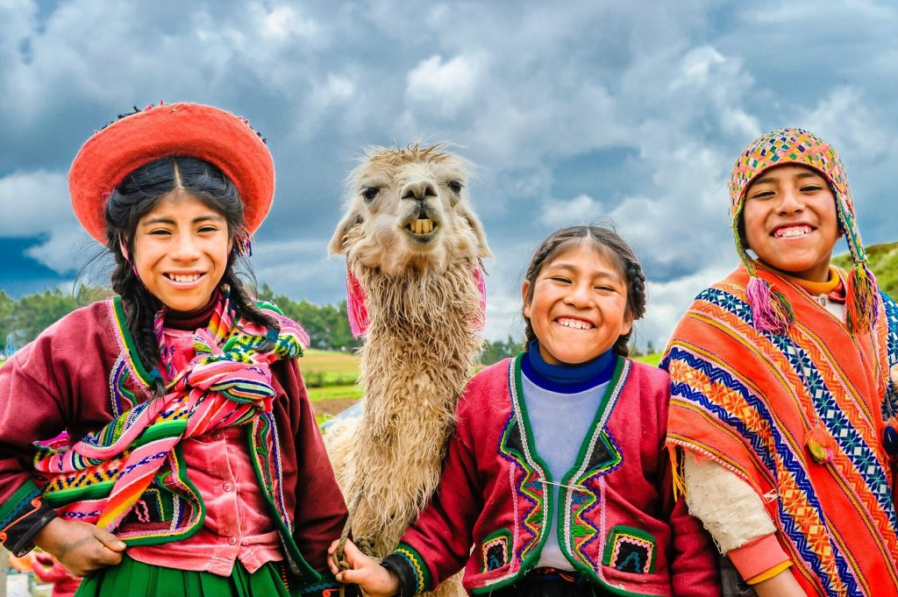

# Drinks of Peru

Peru's drinks reflect the country's three-region geography. The pisco sour is the national cocktail, Peruvian pisco (the grape-based brandy from the Ica and Pisco valleys on the southern coast) shaken with fresh lime juice, sugar syrup, egg white and a small dash of Angostura bitters, frothy and electric-yellow. Chicha morada is the traditional Peruvian table drink, Andean purple corn (maíz morado) simmered with pineapple skin, cinnamon, cloves and quince, sweetened, served chilled at every Peruvian lunch alongside ceviche, lomo saltado or aji de gallina. Emoliente is the street-corner herbal infusion sold from carts at dawn, barley water + horsetail + alfalfa + flax + aloe + lime + honey, drunk by Peruvians at sunrise as both a health drink and a wake-up. Coca tea (mate de coca) is the Andean altitude-sickness staple, drunk in every Cusco hotel lobby. The Amazon contributes camu camu juice (high-vitamin-C jungle berry), aguajina (palm-fruit juice), and chicha de jora (fermented corn beer); the coast contributes Inca Kola (the national bright-yellow soft drink) and Cusqueña and Pilsen Trujillo lagers.
