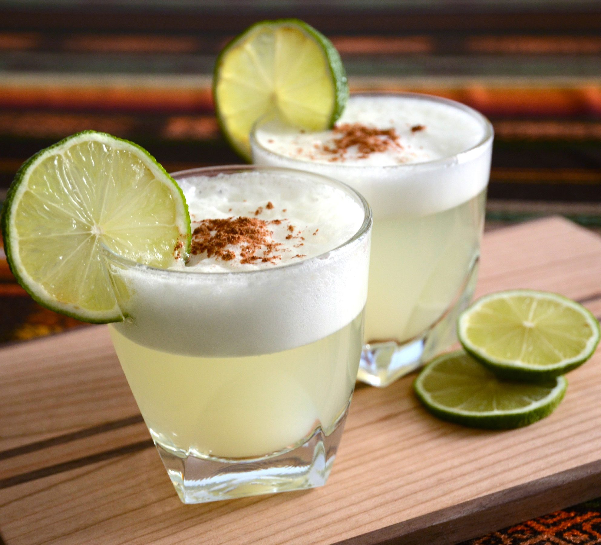

# Pisco Sour (Peru's National Cocktail)

*Peru's national cocktail: Peruvian pisco shaken hard with lime juice, sugar syrup and egg white, double-strained into a chilled coupe, topped with a foamy head and finished with Angostura bitters.*

**Serves:** 2

**Prep Time:** 8 minutes

**Cook Time:** None

## Overview
The pisco sour is Peru's most iconic drink and one of the world's most-cited South American cocktails. The most-credited origin is the Morris Bar in Lima around 1920, where American bartender Victor "Gringo" Morris adapted the gin sour template to Peruvian pisco; the drink has been Peru's calling card ever since (declared the national cocktail in 1988; National Pisco Sour Day is the first Saturday of February). Use Peruvian pisco specifically, not Chilean (both countries claim the spirit but the styles are distinct); made from Quebranta, Italia, Torontel, Moscatel, Albilla or Mollar grapes, with no oak aging and no water added before bottling. Key limes are best if you can get them, for the more aromatic thin-skinned profile. A whole egg white per drink shaken hard creates the traditional foamy head; many Peruvian bartenders do a double shake: thirty seconds without ice to whip the egg white, then twenty with ice to chill. Angostura bitters dot the foam, then drag with a toothpick into swirls or hearts.

## Ingredients

### Per drink (multiply for more)
- 60 ml Peruvian pisco (Quebranta, Italia, Torontel, Acholado, or Mosto Verde, look for "Peruvian Pisco" on the label; common brands include Pisco Portón, Macchu Pisco, Pisco Barsol, Capurro)
- 25 ml fresh lime juice (about 2 small key limes, or 1.5 regular limes)
- 20 ml simple syrup (1:1 sugar:water; recipe below)
- 1 large egg white
- 3-4 large ice cubes (for shaking)
- 2-3 dashes Angostura bitters (for the top)

### Simple syrup (makes 200 ml, enough for 10 drinks)
- 100 g caster sugar
- 100 ml water
- (Combine in a small saucepan; warm till the sugar dissolves; cool. Refrigerates 2 weeks.)

### Equipment
- A cocktail shaker (Boston shaker or 3-piece)
- A jigger or measuring spoon
- A fine sieve (Hawthorne strainer + a fine tea-strainer for double-strain)
- A chilled coupe glass OR sour glass (chill in the freezer 30 minutes before serving)

### Optional garnish
- A wedge of lime on the rim (skip, the pisco sour is rarely garnished this way; the bitters art IS the garnish)

## Method

### Stage 1 - Prep the glasses and the syrup
1. Place 2 coupe glasses in the freezer 30 minutes ahead.
2. Make the simple syrup if not already made: combine sugar and water in a saucepan; warm till dissolved; cool; pour into a clean jar.

### Stage 2 - Build the drink in the shaker
1. In a cocktail shaker (with NO ice yet), combine:
   - 120 ml Peruvian pisco (60 ml × 2)
   - 50 ml fresh lime juice (25 ml × 2)
   - 40 ml simple syrup (20 ml × 2)
   - 2 egg whites

### Stage 3 - The dry shake
1. Seal the shaker.
2. Shake HARD for 30 seconds (a vigorous shake; the dry-shake whips the egg whites without diluting the drink yet).
3. The mixture inside should be developing a thick frothy texture.

### Stage 4 - The wet shake
1. Open the shaker.
2. Add 6-8 large ice cubes.
3. Seal and shake HARD again for 20 seconds.
4. The shaker should be ice-cold to the touch.

### Stage 5 - Double-strain into the glasses
1. Take the 2 coupe glasses from the freezer.
2. Strain the cocktail through a Hawthorne strainer AND a fine tea-strainer (the double-strain catches any small ice chips and tiny egg-protein bits) into each glass.
3. Divide evenly between the 2 glasses.
4. The drink should fill each glass with a thick foamy head rising 1-2 cm above the rim.

### Stage 6 - The bitters art (traditional Peruvian finishing)
1. Hold the bottle of Angostura bitters above each drink.
2. Drop 3-4 dashes onto the foam in a pattern (a straight line, a small triangle, a few dots).
3. Drag a wooden toothpick (or a thin straw) through the dots to create swirls, hearts, or feathers.
4. Don't over-decorate - 10 seconds of bitters art is enough.

### Stage 7 - Serve immediately
1. Hand the drinks to the diners.
2. The first sip should hit: the foamy egg-white head, then the bracing lime-sweet pisco beneath.
3. Drink within 5-10 minutes, the foam slowly collapses; the drink loses its character.

## Notes
- **Peruvian pisco only:** the recipe was invented in Lima with Peruvian pisco. Chilean pisco (sweeter, often oak-aged) gives a different drink. The Quebranta grape is the most-used variety; Italia gives a more aromatic version; Acholado (a blend) gives a balanced one.
- **Dry-shake the egg white:** 30 seconds without ice fully whips the egg white. Without this step, the foam is thin.
- **Fresh lime juice only:** never bottled. The aromatic oils are critical.
- **Double-strain:** through a Hawthorne strainer AND a fine tea-strainer. Catches ice chips and protein bits for a smooth pour.
- **Angostura bitters art is the finishing touch:** 3-4 dashes; drag a toothpick through. The decoration IS the traditional garnish.
- **Drink immediately:** the foam slowly collapses; the drink is at its peak for 5 minutes.
- **Egg white safety:** the citric acid in the lime juice and the alcohol in the pisco effectively pasteurise the egg white; pasteurised egg whites (from cartons) also work for the nervous.

## Variations
**Chilcano:** a different classic Peruvian cocktail, pisco + ginger ale + lime + bitters in a tall glass. Easier, less theatrical.
**Maracuyá sour:** swap a small amount of the lime juice for passion fruit purée, the modern Lima variant.
**Lúcuma sour:** add 1 tablespoon of lúcuma purée (a Peruvian Andean fruit): the modern tropical variant.
**Aguaymanto sour:** add 1 tablespoon of aguaymanto (golden berry / Cape gooseberry) purée, the bright fruit variant.
**Pisco sour without egg white:** for the egg-averse, just pisco + lime + syrup + ice; less foamy but still excellent.
**Capitán:** Peruvian cocktail of pisco + sweet vermouth + bitters; the more spirit-forward variant.
**Pisco punch (San Francisco origin):** pisco + pineapple syrup + lime + gum syrup, the 19th-century San Francisco bar classic that helped spread pisco internationally.
**Frozen pisco sour (modern Lima):** blend the ingredients with crushed ice; serve in a coupe with the bitters art, the slushy variant.
**Champagne pisco sour (modern, brunch):** top the finished pisco sour with a small splash of dry champagne or sparkling wine.

## Serving
At a Lima bar at evening (the traditional setting) · at a Peruvian Independence Day (28 July) celebration · at National Pisco Sour Day (first Saturday of February) · at a Lima criolla restaurant before dinner · at a Peruvian wedding cocktail hour · at a Peruvian-themed restaurant worldwide · at home as the pre-dinner Peruvian aperitif · paired with ceviche, tequeños, or salty Andean snacks.

## Storage
- Make and drink fresh. Pisco sours don't store.
- The pisco itself keeps indefinitely sealed.
- The simple syrup refrigerates 2 weeks.
- A "pisco sour pre-mix" of pisco + lime + syrup (no egg, no shake) can be made up to 6 hours ahead and refrigerated; add egg white and shake to order.
- Egg whites refrigerate 4 days; freeze 6 months.
- The Angostura bitters bottle keeps indefinitely.
