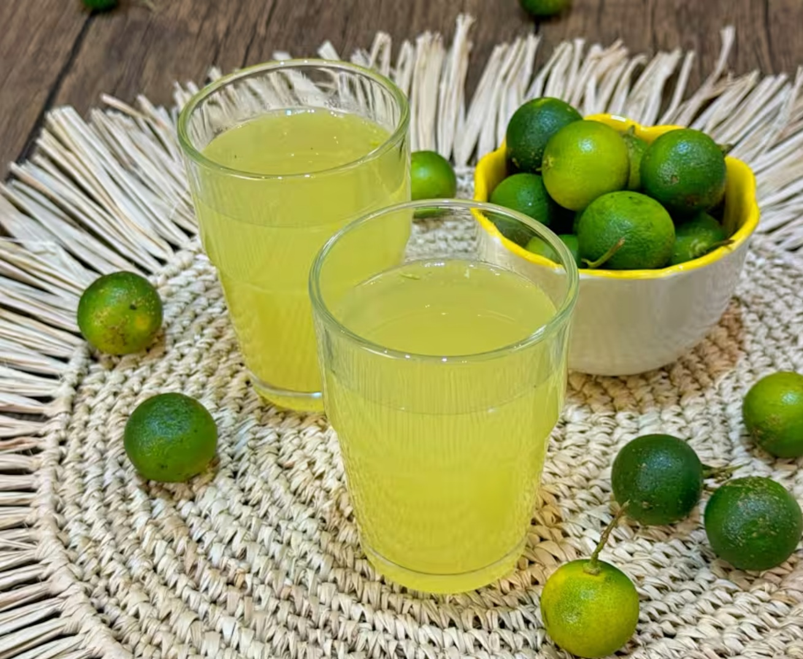

# Calamansi Juice

*The Filipino citrus refresher: a generous squeeze of calamansi (Philippine lime) over ice with sugar and cold water, drunk at every meal and roadside stop.*

**Serves:** 4

**Prep Time:** 5 minutes

**Cook Time:** 3 minutes

## Overview
Calamansi is the small green-skinned, orange-fleshed Filipino citrus that's somewhere between a lime, a lemon and a mandarin in flavour. Calamansi juice is the simplest possible drink: the juice squeezed fresh, dissolved sugar, cold water, ice. Sold from glass pitchers at every Filipino karinderya (small canteen), at jollibee chains, and squeezed straight to order at street stalls. Calamansi is hard to find fresh in the UK but the frozen concentrate (in small green jars at any Asian grocer) and bottled calamansi juice are widely available and good substitutes.

## Ingredients

- 200 ml fresh calamansi juice (from about 30 calamansi; OR substitute 6 tablespoons frozen calamansi concentrate, OR 150 ml bottled calamansi juice)
- 100 g caster sugar
- 100 ml hot water
- 1 litre cold water
- Plenty of ice cubes

### To serve
- Lime wedges or calamansi halves
- A pinch of salt (optional, brings out the citrus)

## Method

1. Dissolve the sugar in the hot water in a small saucepan over low heat; cool slightly.
1. Combine the cooled syrup, calamansi juice and cold water in a large jug; stir well.
1. Taste and adjust sweetness.
1. Pour over ice in tall glasses; garnish with a slice of calamansi or lime.

## Notes
- **Fresh calamansi is rare in the UK.** Filipino groceries occasionally have them; the frozen and bottled versions are everyday substitutes.
- **A pinch of salt sharpens the citrus.** Tiny amount; it shouldn't taste salty.

## Storage
- Refrigerate up to 24 hours; the juice oxidises and goes dull beyond that.
