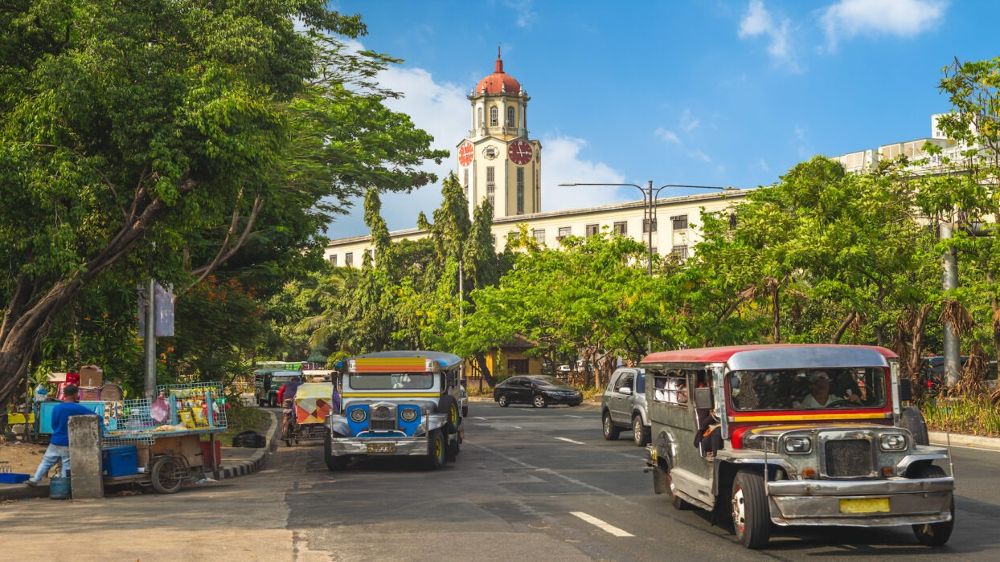

# Drinks of Philippines

Calamansi juice squeezed over everything, sago at gulaman (the layered cooler of tapioca pearls, agar jelly and brown-sugar syrup) sold at every street stall, tsokolate ah (thick chocolate batirol whisked with a wooden molinillo), kapeng barako from the Batangas hills, and palamig in any colour you like.
