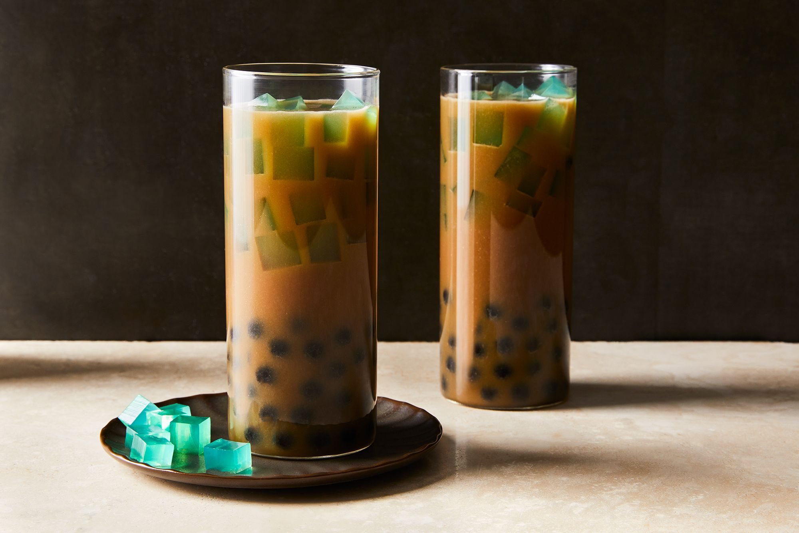

# Sago at Gulaman

*Sweet brown-sugar water poured over tapioca pearls (sago) and chewy strips of agar jelly (gulaman): the Filipino summer street drink also known as "samalamig", scooped from a giant clear jar at every Manila corner.*

**Serves:** 6

**Prep Time:** 15 minutes

**Cook Time:** 20 minutes

## Overview
Sago at gulaman is the Filipino answer to bubble tea, but with a different texture profile: small soft tapioca pearls (sago) and chunky cubes of brown agar jelly (gulaman) suspended in a sweet caramelised brown-sugar syrup with water, vanilla and pandan. Sold from huge clear plastic jars at street stalls, beaches and on the side of Manila roads in the heat, scooped over ice into tall plastic cups. Sweet, refreshing, gently jelly-like in the cup. The Filipino-Chinese influence is visible in the tapioca; the gulaman (agar) is a Filipino addition.

## Ingredients

### Sago (tapioca pearls)
- 100 g small tapioca pearls
- 800 ml water (for cooking)

### Gulaman (agar jelly)
- 25 g agar agar powder (or 2 sachets of unflavoured gelatine; agar is the traditional choice)
- 600 ml water
- 50 g brown sugar
- 1 teaspoon vanilla extract

### Syrup
- 250 g dark brown sugar (muscovado preferred)
- 500 ml water
- 1 pandan leaf (5 cm; tied in a knot)
- 1 teaspoon vanilla extract

### To serve
- Plenty of ice cubes
- 1.5 litres cold water (for diluting)

## Method

### Stage 1 - Cook the sago
1. Bring 800 ml water to a boil; tip in the tapioca pearls. Cook 12 to 15 minutes, stirring occasionally to prevent sticking. The pearls turn translucent.
1. Drain through a fine sieve, rinse briefly under cold water, set aside in a bowl of cold water.

### Stage 2 - Make the gulaman
1. Combine the 600 ml water, agar agar, 50 g brown sugar and 1 tsp vanilla in a saucepan.
1. Bring to a boil over medium heat, whisking constantly, then simmer 2 minutes.
1. Pour into a shallow tray (about 1 cm deep); let cool to room temperature, then refrigerate 30 minutes to set.
1. Cut the set agar into 1.5 cm cubes.

### Stage 3 - Make the syrup
1. Combine the 250 g dark brown sugar, 500 ml water, pandan and vanilla in a saucepan.
1. Simmer 8 to 10 minutes; the syrup should reduce slightly and turn glossy dark brown.
1. Cool to room temperature; remove the pandan.

### Stage 4 - Assemble
1. In a large pitcher or beverage dispenser, combine the syrup with the 1.5 litres of cold water; stir.
1. Add the drained sago pearls and the agar cubes; stir.
1. Refrigerate at least 1 hour.

### Stage 5 - Serve
1. Fill tall glasses with ice; ladle the drink over, making sure each glass gets pearls and jelly cubes.

## Notes
- **Agar over gelatine.** Agar sets firmer and stays solid at room temperature; the gelatine version melts on a hot day. Agar is the traditional choice.
- **Tapioca cooking time varies.** Some pearls are larger and need longer; check by biting one - fully translucent with no white centre means done.
- **Dark muscovado for the syrup.** Plain brown sugar works but the muscovado depth is what makes the drink taste of more than sugar water.

## Storage
- Refrigerate up to 3 days. The sago goes slightly tougher overnight but stays edible.
