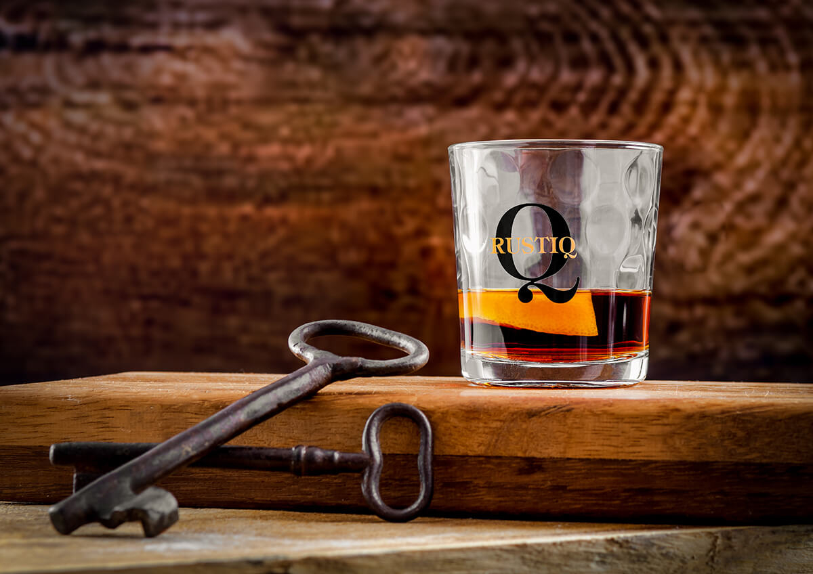

# Pelin

*Romanian wormwood wine: young white wine infused with the bitter green herb pelin (Artemisia absinthium) for forty days, drunk on Trifon Day (February 1st) as the vine-pruner's spring tonic.*

**Serves:** Makes 1 L

**Prep Time:** 10 minutes

**Cook Time:** None (40 days infuse)

## Overview
Pelin is the Romanian country wormwood wine, a herbal preparation of bitter Artemisia steeped in young white wine, drunk traditionally on February 1st (Trifon, the patron of vine-growers) and through the following weeks as a spring tonic. Pelin is the same Artemisia absinthium that gives absinthe its name and bitterness; the Romanian tradition steeps it not in spirit but in light young wine, picking up the herb's bitter green and the wine's freshness. A digestif before a heavy meal, a tonic after winter, and an ingredient in the village home-pharmacy of every Carpathian village. The bitter is real; the bottle is small; the toast is to the coming spring and a long vine year.

## Ingredients

### For 1 L pelin
- 1 L dry white wine (young, low-tannin, light, Fetească Albă or a Pinot Grigio works)
- 15 g dried wormwood (Artemisia absinthium) leaves and flowering tops (or 40 g fresh)
- 5 g dried Artemisia pontica (Roman wormwood, milder, if you have it) (optional)
- 3 sprigs fresh thyme
- 1 small sprig fresh sage
- A few crushed coriander seeds
- Optional: 1 tbsp honey (for a softer tonic)

### Per serving
- 50 ml chilled pelin
- A small wine glass

## Method

### Stage 1 - Prepare the herbs
1. Tear or crumble the wormwood lightly to release the volatile oils.
2. Combine all herbs in a sterilised 1.5 L glass jar.

### Stage 2 - Add the wine
1. Pour the wine over the herbs.
2. Stir gently; press the herbs under the wine.
3. Seal the jar tight.

### Stage 3 - Infuse
1. Store in a cool dark cupboard.
2. Shake gently once a day for the first week, then every few days.
3. Infuse 30 to 40 days total. The wine will go pale green-gold; the bitter is real but not overpowering.
4. Taste from day 25 onwards; pull the herbs once the bitter is to your liking.

### Stage 4 - Strain
1. Pour through a fine sieve lined with muslin into a clean jug.
2. Press the herbs lightly; do not crush (bitterness goes up sharply).
3. Stir in the honey if using.
4. Funnel into a clean bottle; seal tight.

### Stage 5 - Mature and serve
1. Rest the bottle a week before drinking; the bitter softens.
2. Serve chilled in a small wine glass.
3. Drink before food as a digestif, or by the small glass as a spring tonic.
4. The traditional Trifon Day pour is one glass on February 1st with a toast to the vines.

## Notes
- **Wormwood sourcing:** dried Artemisia absinthium is sold at Romanian markets in spring and at most herbalists; the fresh herb dries in 5 days hung in a bunch.
- **Bitter dose:** 15 g per litre is the country standard; first-timers can start at 10 g.
- **Do not crush the herbs:** lightly broken is enough; crushed gives a sharper bitter.
- **Use young wine:** old oxidised wine spoils the infusion; pick a fresh light bottle.
- **The taste:** bitter, herby, slightly resinous; an acquired taste worth acquiring.

## Variations
- **With mugwort (pelinariță):** half wormwood, half mugwort, a milder country version.
- **With pine tips:** 30 g fresh young pine shoots, a Carpathian forest version.
- **Sweet pelin:** double the honey and add a vanilla pod, a city version.
- **With orange peel:** strip of bitter orange peel during infusion, the Banat style.
- **Pelin de mai (May wormwood):** infused in May with fresh herb, drunk through summer.

## Serving
- Chilled in a small wine glass · before food as a digestif · on Trifon Day (February 1st) · as a spring tonic by the small glass · as the rural welcome from a country host in March.

## Storage
- Bottled pelin keeps 1 year cool and dark; the bitter mellows over time.
- Refrigerate after opening; consume within 6 months.
- The colour darkens over time; the bitter softens.
