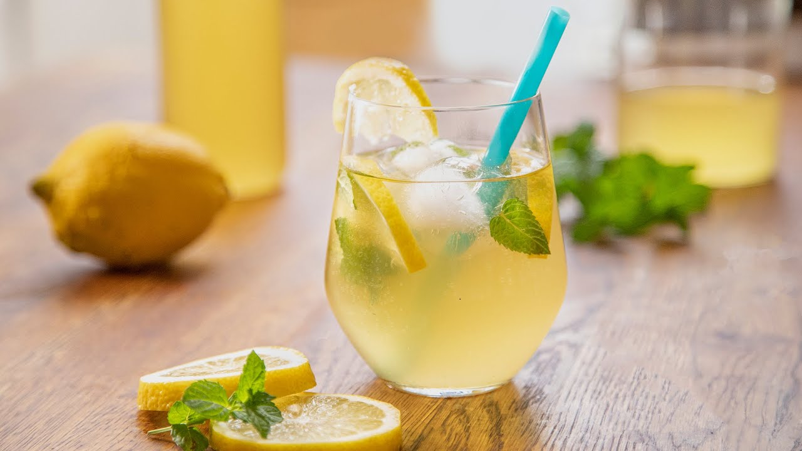

# Socată (Romanian Fermented Elderflower Drink)

*Romania's lightly sparkling elderflower lemonade: fresh elderflower heads, lemon and sugar fermented three days in a warm room into a softly fizzy, gently floral cooler; the seasonal May-and-June drink at every Romanian street stall.*

**Serves:** 3 litres (about 12 glasses)

**Prep Time:** 20 minutes

**Cook Time:** None (plus 3-4 days fermentation)

## Overview
Socată (from "soc", the Romanian word for elderflower) is Romania's everyday fermented summer drink, made from May to early July when wild elderflower bushes (Sambucus nigra) bloom along every Romanian roadside. The construction is a wild-fermentation: fresh elderflower heads, lemon, sugar and water are combined in a large jar and left in a warm room for three to four days. Yeasts naturally present on the elderflower petals (the same wild yeasts that ferment grapes and apples) drive a gentle fermentation that produces a softly sparkling drink with about 0.5-1% ABV — enough fizz to feel celebratory but light enough that children drink it too. The finished socată is pale gold, lightly tart, faintly muscat-floral on the nose. Romanian street vendors sell it from glass barrels in May; the bottle on the family fridge shelf is one of the rhythms of Romanian summer.

## Ingredients

### For 3 litres
- 12-15 fresh elderflower heads (gathered the same morning; bright yellow stamens, no brown petals)
- 3 litres just-cooled boiled water (or filtered cold water)
- 300 g caster sugar
- 2 lemons (sliced; unwaxed if possible, or scrub waxed lemons well)
- 1 tablespoon raisins (optional; boosts the natural yeast)

### To serve
- Ice
- A wedge of lemon
- A few mint leaves (optional)
- Tall glasses

## Method

### Stage 1 - Pick the flowers
1. Forage 12-15 elderflower heads on a warm sunny morning (the flowers carry their wild yeasts on the petals).
2. Choose heads where the tiny flowers are fully open and bright yellow at the stamen; avoid any with brown petals or aphids.
3. Don't wash the flowers (the washing strips the wild yeast).
4. Shake them upside down gently to dislodge any small insects.

### Stage 2 - Build the brew
1. In a large 4-litre glass jar (or food-grade plastic bucket), combine the sugar and 500 ml of just-boiled water.
2. Stir till the sugar dissolves.
3. Top up with the remaining 2.5 litres of cool water (the brew must be no warmer than blood temperature; hot water kills the wild yeast).
4. Add the lemon slices.
5. Add the raisins if using.
6. Drop in the elderflower heads (stem-up), pressing down till submerged.

### Stage 3 - Ferment
1. Cover the jar with a clean tea towel or muslin (not a lid; the gas needs to escape).
2. Secure with a rubber band or string.
3. Leave at room temperature 18-22°C for 3-4 days.
4. Day 1: nothing visible.
5. Day 2: small bubbles start clinging to the elderflower petals; faint fizz.
6. Day 3: active fermentation, the elderflower heads rise and fall, the surface develops a pale foam.
7. Day 4: the drink is gently sparkling, the sugar has fermented down, the elderflowers are spent.

### Stage 4 - Strain and bottle
1. Strain the socată through a clean muslin or coffee filter into a clean jug.
2. Discard the elderflower heads, lemon slices and raisins.
3. Transfer the strained socată into clean 1-litre plastic or glass bottles (leave 5 cm headspace; the fermentation continues slowly in the bottle).
4. Cap loosely (a plastic bottle "burping" releases pressure safely; glass bottles need to be released daily).
5. Refrigerate.

### Stage 5 - Serve
1. Refrigerate at least 4 hours before serving (cold socată is much better).
2. Pour over ice in tall glasses.
3. Garnish with a wedge of lemon and a sprig of mint.
4. The drink will continue to ferment slowly in the bottle; consume within 7-10 days.

## Notes
- **Pick on a sunny day, not after rain:** rain washes off the wild yeast.
- **Don't wash the flowers:** the wild yeast on the petals drives the fermentation.
- **Warm room, not hot:** 18-22°C is ideal. Below 16°C the fermentation stalls; above 28°C it spoils.
- **Plastic bottle for safety:** glass bottles can explode if the fermentation runs hot and unsupervised. Plastic bottles bulge before they break; release the cap daily.
- **3-4 days, no longer:** by day 5 the drink turns vinegary as acid bacteria take over.

## Variations
**Socată cu lămâie verde:** swap the lemons for limes; a brighter, more tropical-leaning version.
**Cu mere:** add 2 sliced apples to the jar (boosts the natural yeast).
**Cu lavandă:** add a small sprig of lavender; the Transylvanian variant.
**Sparkling socată cocktail:** mix 100 ml socată with 30 ml țuică and a splash of soda; the Romanian aperitivo.
**Sugar-free with stevia:** the wild fermentation needs sugar to start; use 50 g sugar (for the yeast) and add stevia to taste at the bottling stage.

## Serving
At a Romanian street-stall on a hot June afternoon · with sarmale at a Sunday lunch · with mici and salată at a Romanian garden barbecue · as a children's celebration drink at name-day parties · alongside a slice of cozonac · over a long lunch at a Transylvanian farm guesthouse.

## Storage
- Keeps 7-10 days in the fridge in plastic bottles; release the cap daily to vent the pressure.
- Don't store in glass at room temperature (the pressure can break the bottle).
- Don't freeze (the fermentation continues during freezing and the bottle bursts).
- After day 10 the drink turns vinegary; use it as a wild-yeast vinegar for salad dressings.
