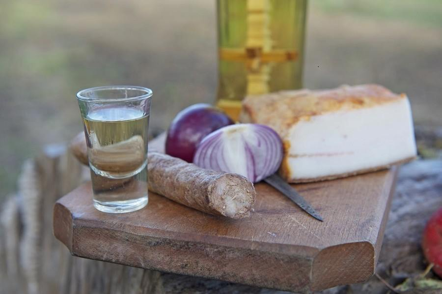

# Țuică

*The Romanian national spirit: plum brandy distilled clear from autumn plums fermented in barrels, served chilled in shot glasses as the welcoming pour at every rural household. The winter version warms the spirit with honey, pepper, and clove.*

**Serves:** 1 (50 ml) cold, or 1 (200 ml) hot

**Prep Time:** 1 minute cold, 10 minutes hot

**Cook Time:** None cold, 5 minutes hot

## Overview
Țuică is the spirit Romania pours when a guest arrives at the door, the small ice-cold glass set down before the bread, the pickles, the conversation. It is single-distilled plum brandy, made in autumn from the ripe purple plums of every rural orchard, fermented in barrels for six weeks and then distilled in copper stills (cazane) that are still set up in farmyards across Maramureș, Bihor, and Vâlcea. Țuică sits at 25 to 30% alcohol; the twice-distilled version is called pălincă (or horincă in the north) and runs at 50 to 55%. Drunk cold and neat as an aperitif; in winter, warmed gently with honey, black pepper, and a clove for țuică fiartă, the Romanian hot punch that thaws a hunting morning.

## Ingredients

### For the cold serve (per glass)
- 50 ml țuică (chilled overnight in the freezer)
- A small thick-walled shot glass, chilled
- Optional: a strip of smoked bacon or a pickled chilli to chase

### For țuică fiartă (hot mulled, serves 4)
- 600 ml țuică
- 4 tbsp honey
- 1 tsp whole black peppercorns
- 6 whole cloves
- 2 cinnamon sticks
- Strip of orange peel
- Strip of lemon peel
- 1 bay leaf

## Method

### Stage 1 - The cold serve
1. Chill the bottle in the freezer overnight (the high alcohol prevents it freezing solid).
2. Set out small thick-walled shot glasses.
3. Pour 50 ml into each glass straight from the freezer; the alcohol will be syrupy and very cold.
4. Serve at once, before the meal, with a slice of smoked bacon (slană), country bread, and pickles on the board.
5. The traditional toast is Noroc (luck) or Sănătate (health).

### Stage 2 - The hot serve (țuică fiartă)
1. Pour the țuică into a heavy saucepan.
2. Add the honey, peppercorns, cloves, cinnamon sticks, citrus peels, and bay.
3. Warm gently over a low heat to about 70°C; do not let it boil (the alcohol burns off).
4. Hold at 70°C for 3 to 4 minutes for the spices to infuse.
5. Ladle hot into thick-walled mugs through a fine strainer.
6. Serve at once, the windows steaming.

## Notes
- **Single vs double distilled:** țuică (single) is the everyday drink at 25 to 30%; pălincă (double) is the celebration drink at 50 to 55%, served the same way but in even smaller glasses.
- **The plum:** Bistrița plums are the classic variety; the bitter-sweet stone gives the flavour.
- **Cold and small:** the glass must be small (30 to 50 ml) and the spirit must be cold; never warm.
- **The food chaser:** a slice of smoked bacon or pickled chilli is the standard chaser to the cold pour.
- **Do not boil:** in țuică fiartă, never let the pot boil or all the alcohol is gone.

## Variations
- **Pălincă serve:** the same cold-and-small format with stronger spirit; usually one glass before the meal only.
- **Țuică with honey only (țuică cu miere):** stir a teaspoon of honey into the warm spirit, no other spices.
- **With slivovitz substitute:** if Romanian țuică is hard to find, Serbian slivovitz or Czech slivovice are the closest relatives.
- **With grape rachiu:** the southern Romanian grape brandy equivalent, lighter and floral.
- **Iced fruit țuică (modern):** poured over ice with a slice of orange, a city aperitif.

## Serving
- Cold and neat · in a small thick-walled glass · before the meal · with smoked bacon and bread · the host's welcome at any rural Romanian threshold · hot in winter mugs from a snowy doorstep.

## Storage
- Sealed bottle: indefinite at room temperature.
- Chilled bottle: weeks in the freezer.
- Mulled țuică: best the moment it is made; do not store.
