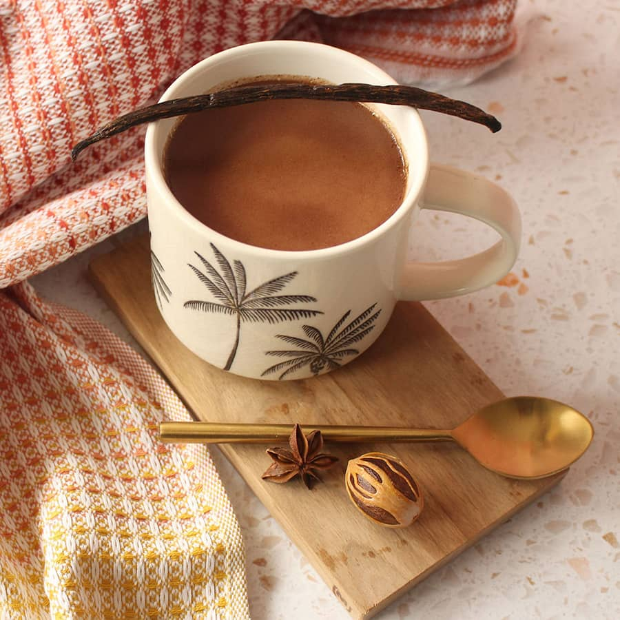

# Cocoa Tea

*Saint Lucian cocoa tea: a stick of cocoa simmered in milk and water with cinnamon, nutmeg, bay leaf and sugar. The traditional morning drink that pre-dates the chocolate bar by centuries.*

**Serves:** 4 mugs

**Prep Time:** 5 minutes

**Cook Time:** 15 minutes

## Overview
Cocoa tea is the original chocolate drink - cocoa beans roasted, ground and rolled into hard sticks (cocoa sticks or "boules") that get grated into boiling water and milk, simmered with cinnamon, nutmeg, bay leaf and sugar. It's served as a hot drink in the morning, ideally with green-fig-and-saltfish alongside, and it has nothing in common with the powdered cocoa drink that the rest of the world calls hot chocolate. Real cocoa tea is darker, more bitter, slightly oily on the surface, with the unmistakable depth that only proper cocoa solids give. Saint Lucia produces some of the world's best cocoa; the local sticks are the gold standard.

## Ingredients
- 1 cocoa tea stick (about 30 g, sold at Caribbean shops as cocoa balls or cocoa sticks)
  - **Substitute:** 30 g 100% unsweetened cocoa nibs PLUS 30 g 70%+ dark chocolate, or 6 tbsp unsweetened cocoa powder
- 600 ml whole milk
- 200 ml water
- 1 cinnamon stick (5 cm)
- 1 bay leaf
- 1/2 tsp freshly grated nutmeg
- 1/4 tsp ground clove (or 2 whole cloves)
- 4 tbsp brown sugar (or to taste)
- Pinch of salt
- 1 tbsp condensed milk per serving (optional, Saint Lucian sweet preference)

## Method

### Stage 1 - Grate the cocoa
1. Grate the cocoa stick coarsely on a box grater into a saucepan.
   - If using cocoa nibs: crush coarsely; add as-is.
   - If using cocoa powder: whisk into the water before heating to prevent lumps.

### Stage 2 - Build the brew
1. Pour the water over the grated cocoa.
2. Add the cinnamon stick, bay leaf, nutmeg, clove and salt.
3. Bring to a simmer over medium heat; cook 8-10 minutes, stirring occasionally. The cocoa releases its oils and colour into the water.

### Stage 3 - Add milk and sugar
1. Pour in the milk; add the brown sugar.
2. Stir; bring back to a gentle simmer.
3. Cook 3-4 minutes until heated through and the sugar has dissolved.
4. **Do not boil hard** - the milk can scorch and split.

### Stage 4 - Strain and serve
1. Strain through a fine sieve into mugs (the cocoa solids settle to the bottom; the grated stick particles are larger).
2. If using, stir 1 tbsp condensed milk into each mug.
3. Grate a little extra nutmeg over the top.

## Notes
- **Cocoa stick:** Genuine cocoa sticks are unsweetened, oil-rich, and somewhat hard to find outside Caribbean specialty shops. The combination of cocoa nibs + dark chocolate gives the closest substitute. Plain cocoa powder works but lacks the body.
- **The bay leaf and salt:** Small additions, big effect. The bay adds an almost-savoury note that lifts the chocolate; salt sharpens the sweetness. Skip neither.
- **Condensed milk:** The Saint Lucian local preference. A tablespoon in the mug adds creaminess and a malty sweetness. Optional.

## Serving
- Serve very hot in mugs, ideally with green-fig-and-saltfish at breakfast or with cassava pone in the afternoon. The drink is rich; a small mug (200 ml) is enough.

## Storage
- Drink the same day. Cooled cocoa tea can be refrigerated 24 hours; reheat gently without boiling.
- Freezing not recommended.
