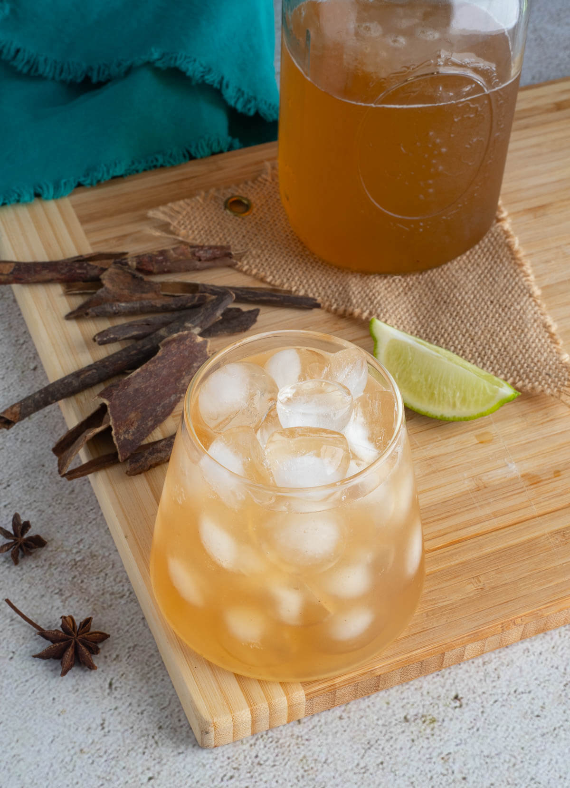

# Mauby

*Saint Lucian mauby: the bark of the mauby tree steeped with cinnamon, cloves and orange peel, sweetened heavy and served ice-cold. The bittersweet Caribbean cooler poured from coolers at every roadside stand.*

**Serves:** Makes 2 litres

**Prep Time:** 10 minutes (plus 24 hr rest)

**Cook Time:** 25 minutes

## Overview
Mauby is the universal non-alcoholic Caribbean cold drink, sold from coolers and plastic bottles at every roadside stand from Trinidad to the Bahamas. It is brewed from the bark of the mauby tree (Colubrina elliptica), boiled with whole spices and orange peel, sweetened with cane sugar, then steeped, strained, diluted and served cold over ice. The flavour is unmistakable: a deep bittersweet root-beer-meets-quinine bite, with cinnamon and clove holding the spice. Lucian mauby tends slightly sweeter than the Trinidadian style; both leave a long bitter finish that quenches in the heat better than any soda. Mauby bark is sold in dried curls at any Caribbean shop and most online spice suppliers.

## Ingredients
- 60 g dried mauby bark (about a generous handful of curls)
- 2 litres water (for the brew)
- 1 cinnamon stick (10 cm)
- 6 whole cloves
- 4 whole allspice berries
- 4 strips of orange peel (about 3 cm each, no white pith)
- 2 strips of lime peel
- 1 bay leaf
- 1 piece star anise (optional)
- 350 g cane sugar (or to taste)
- Additional 1-2 litres cold water for diluting
- Plenty of ice for serving

## Method

### Stage 1 - Brew the bark
1. Rinse the mauby bark briefly under cold water to remove any dust.
2. Place in a large pan with the 2 litres of water, cinnamon stick, cloves, allspice, orange peel, lime peel, bay leaf and star anise (if using).
3. Bring to a boil over high heat; reduce to a steady simmer.
4. Simmer 20-25 minutes. The water turns deep mahogany brown; the kitchen smells of warm spice. Do not over-simmer or the brew turns aggressively bitter.

### Stage 2 - Sweeten and steep
1. Turn off the heat; stir in the sugar until dissolved.
2. Cover the pan; let the brew steep 30 minutes at room temperature, then chill in the fridge.
3. Best left 24 hours refrigerated, covered, for the bitter compounds to mellow into the sweetness.

### Stage 3 - Strain and bottle
1. Strain through a fine sieve into a jug or bottles.
2. Taste the concentrate; it should be intense, bittersweet, slightly thick.

### Stage 4 - Serve
1. To serve, dilute the concentrate with cold water to taste, usually 1 part concentrate to 1 part water (or up to 1 to 2 if you prefer it gentler).
2. Pour over plenty of ice in tall glasses.
3. Garnish with a slice of lime if you like.

## Notes
- **The 24-hour rest:** Important. Fresh-brewed mauby tastes harsh and one-note bitter; an overnight rest in the fridge lets the spice and sugar mingle into the proper bittersweet balance.
- **The bitterness is the point:** Mauby is meant to be bitter behind the sweetness. If yours tastes only sweet, brew the bark longer; if too bitter, dilute more aggressively at the glass.
- **Mauby bark source:** Caribbean shops carry the dried bark in plastic bags; online spice suppliers stock it under "mauby bark" or "Colubrina elliptica." Bottled mauby syrup is sold but it is rarely as good as the home brew.

## Variations
- **Mauby cocktail:** A splash of dark rum and a squeeze of lime over ice with the diluted mauby - the late-afternoon Lucian sundowner.
- **Mauby-ginger:** Add a 10 cm piece of fresh ginger, sliced, to the brewing pan.
- **Mauby-tamarind:** Stir in 2 tbsp tamarind pulp at the steep stage for a sour edge.
- **Light mauby:** Halve the sugar and add a tablespoon of honey at the end for a less-sweet finish.
- **Mauby float:** Pour cold mauby over a scoop of vanilla ice cream for a Lucian children's treat.

## Serving
- Serve very cold over plenty of ice · in tall glasses · alongside floats, codfish cakes or any Lucian midday snack · a slice of lime to garnish

## Storage
- The concentrate keeps 2 weeks refrigerated in a sealed bottle
- The diluted, sweetened mauby keeps 5 days refrigerated
- Do not freeze (the spice notes go flat)

