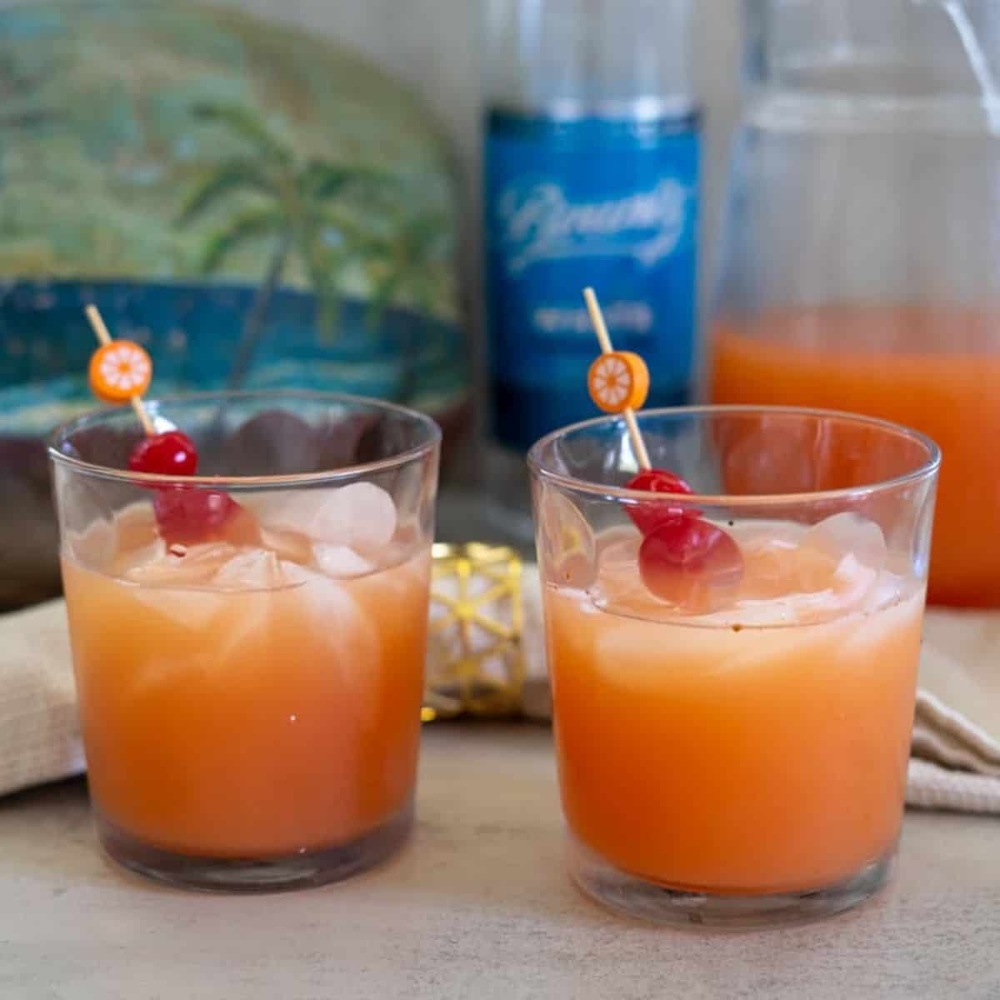

# Lucian Rum Punch

*Saint Lucian rum punch: dark rum, lime, sugar syrup and a generous grating of nutmeg, shaken cold and served over crushed ice. The end-of-meal cocktail at every beachside bar from Castries to Soufrière.*

**Serves:** 4 tall glasses

**Prep Time:** 10 minutes

**Cook Time:** None

## Overview
Rum punch is the universal Caribbean cocktail; each island has its variant of the same simple architecture. The Lucian formula follows the old rhyme: "one of sour, two of sweet, three of strong, four of weak" - meaning one part lime, two parts sugar syrup, three parts rum, four parts water or fruit juice, all shaken with ice. The freshly grated nutmeg on top is the universal Lucian-Bajan signature. A pinch of Angostura bitters is the proper finish. Served in tall glasses over crushed ice with a slice of lime, drunk slowly while watching the sunset.

## Ingredients

### Sugar syrup (make ahead)
- 200 g caster sugar
- 200 ml water

### Per cocktail (the 1-2-3-4 ratio, scaled to 4 servings)
- 60 ml fresh lime juice (about 3 limes)
- 120 ml sugar syrup (from above; about half a batch)
- 180 ml dark Caribbean rum (Mount Gay, Chairman's Reserve from Saint Lucia, or any dark rum)
- 240 ml cold water (or pineapple/orange juice for a fruitier version)
- A few dashes of Angostura bitters
- Whole nutmeg for grating
- Plenty of crushed ice
- Lime slices and orange wedges to garnish
- Optional: a teaspoon of pomegranate or grenadine syrup for the "swizzle" red layer

## Method

### Stage 1 - Make the sugar syrup
1. Combine sugar and water in a small pan; heat over medium, stirring, until the sugar dissolves.
2. Bring to a gentle simmer 30 seconds; turn off the heat.
3. Cool to room temperature. Store in a clean jar refrigerated up to 1 month.

### Stage 2 - Build the punch
1. In a large cocktail shaker or jug, combine the lime juice, sugar syrup, rum and water.
2. Stir to combine.
3. Taste; the punch should be strong and slightly tart - adjust with more lime if too sweet, more sugar syrup if too sharp.
4. Add 3-4 dashes of Angostura bitters; stir.

### Stage 3 - Serve
1. Fill tall glasses with crushed ice (the smaller pieces dilute the punch slightly as it's drunk, which is the point).
2. Pour the punch over.
3. Grate fresh nutmeg generously over the top of each glass.
4. Garnish with a slice of lime and an orange wedge.
5. For the swizzle layer: trickle a teaspoon of pomegranate syrup down the side of the glass; it sinks to the bottom as a separate red layer.

## Notes
- **The 1-2-3-4 ratio:** Universal across the Caribbean. Adjust to taste, but stick close to this proportions.
- **The rum:** Caribbean dark rum is essential - the molasses notes are the foundation. Mount Gay (Barbados), Appleton (Jamaica), Chairman's Reserve (Saint Lucia local) all work. Avoid light/white rum - the cocktail loses depth.
- **Fresh nutmeg grating:** The signature finish. Pre-ground nutmeg doesn't compare.

## Serving
Serve cold in tall glasses, with a lime slice and an orange wedge floating on top. Best in the late afternoon as the sun sets.

## Storage
- The pre-mixed punch (without the ice and nutmeg) refrigerates 3 days. Stir well before serving; add ice and nutmeg fresh to each glass.
- Sugar syrup keeps 1 month refrigerated.
