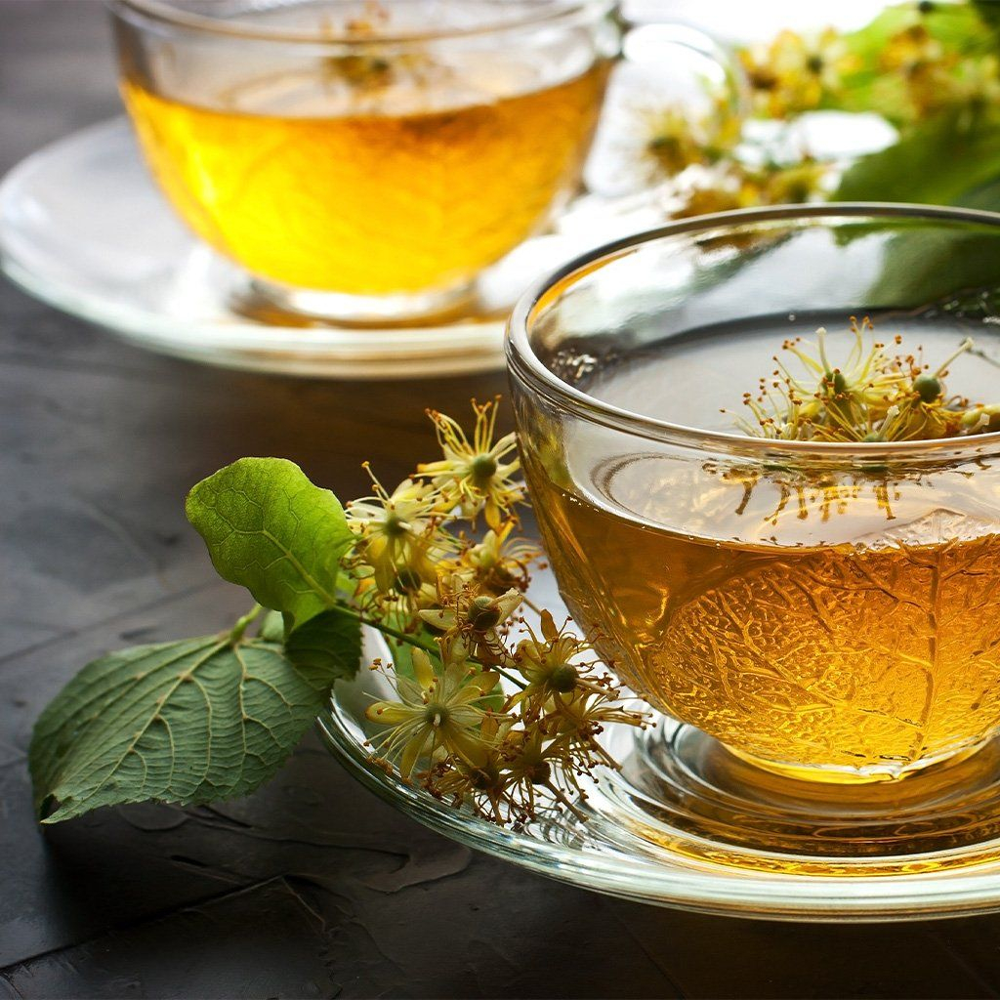

# Tilia

*The San Marinese lime-flower tea: dried tilia (linden) blossoms steeped in hot water, the calming evening cup of the lower-mountain villages.*

**Serves:** 1 mug (300 ml)

**Prep Time:** 1 minute

**Cook Time:** 5 minutes

## Overview
The lime tree (Tilia cordata, "tiglio" in Italian) blooms in late May and early June across the lower slopes of the Republic, and for a few weeks the air around the villages carries a honey-citrus scent. Villagers traditionally pick the flowers, dry them on cane racks for three weeks, and store the lot in glass jars for the year. The infusion is the evening cup: gentle, perfumed, lightly sweet on its own, drunk after dinner to wind the day down. It is also a household remedy for a sore throat or a restless night, the kind of tea a San Marinese grandmother makes without thinking.

## Ingredients

### Per mug
- 2 tsp dried lime (linden) flowers, loose (or 1 teabag)
- 300 ml just-off-the-boil water (around 90°C)
- A small spoon of honey (optional)
- A thin slice of lemon (optional)

## Method

### Stage 1 - Heat the water
1. Bring fresh water to a boil, then let it stand for 30 seconds; lime-flower tea is delicate and boiling water scalds the perfume out.

### Stage 2 - Steep
1. Put the dried flowers in a teapot or a mug with an infuser.
2. Pour the hot water over.
3. Cover (a saucer over the mug works) and steep for 5 minutes; the colour should be a clear pale gold.

### Stage 3 - Pour and finish
1. Strain into the mug, or lift out the infuser.
2. Stir in honey if using; add a slice of lemon if the lemon is for you.
3. Sip slowly. The taste is honeyed, with a faint citrus and a soothing aftertaste.

## Notes
- **Dried flowers.** Good lime-flower tea uses whole dried blossoms and their pale yellow bracts, not ground tea-dust. Health-food shops and Italian herbalists carry the loose form.
- **Water just off the boil.** Linden is more like green tea than black for water temperature; too hot and the flavour goes bitter.
- **No milk.** Lime-flower tea is always taken clear; milk muddies the perfume.

## Serving
After dinner in a quiet kitchen, in a clear glass mug to see the colour. A small biscuit on the saucer if you must.

## Storage
- Dried lime flowers keep 12 months in an airtight jar away from light.
- Brewed tea is best drunk fresh; it goes flat within an hour.
