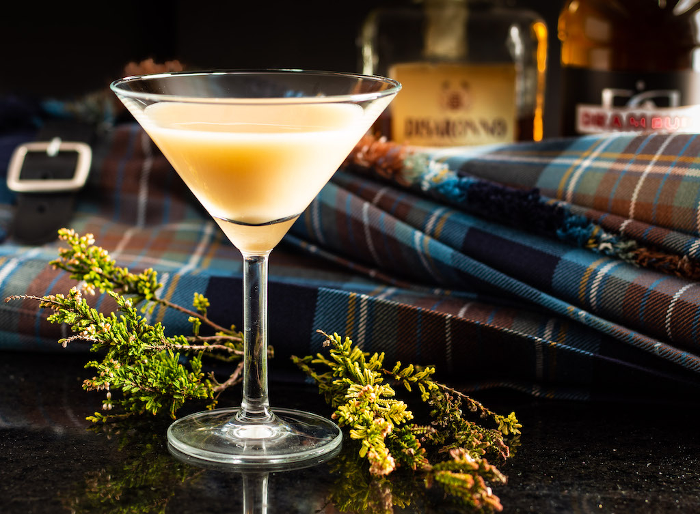

# Atholl Brose

*Scotland's most ancient whisky drink: oatmeal-soaked liquid mixed with heather honey, single-malt Scotch and double cream, served chilled in a small glass.*

**Serves:** 4

**Prep Time:** 5 minutes (plus 4 hours oat soaking)

**Cook Time:** None

## Overview
Atholl Brose ("brose" being the Scottish word for any oatmeal-based porridge or drink; "Atholl" referring to the Earl of Atholl) is Scotland's most ancient and most distinctively Scottish whisky-based drink. The origin story: in 1475, the Earl of Atholl was tasked with capturing the rebel Iain MacDonald, Lord of the Isles, who was hiding in a Highland glen. The Earl learned that MacDonald drank from a particular spring, had the spring drained and refilled with oats, water, honey and whisky, and waited. MacDonald drank, found the brew so unimaginably delicious he kept drinking, and was drunk enough by evening that the Earl's men could capture him: the original Highland "drink-yourself-into-trouble" libation. Medium oatmeal soaks in cold water for several hours; the milky liquid that forms gets strained off and mixed with heather honey (the canonical Scottish floral sweetener) and a generous slug of single-malt Scotch whisky. Double cream goes in at the end for the modern richer version. The finished drink is pale-golden, creamy, faintly oaty, sweet-but-warming. Served in small thick glasses at Burns Night supper alongside cranachan, or as the closing drink of an evening at a Highland country house.

## Ingredients

### Atholl Brose (the traditional version)
- 100 g medium oatmeal (also called "fine pinhead oatmeal"; Scott's Porage Oats are too rolled - use Hamlyn's or Scotts Steel Cut)
- 600 ml cold water
- 6 tablespoons heather honey (or any good runny honey)
- 250 ml single-malt Scotch whisky (Highland or Speyside; not Islay - too peated)
- 4 small thick whisky glasses or small tumblers

### Atholl Brose (the rich modern version)
- All of the above PLUS:
- 200 ml double cream (whipped to soft peaks)
- An extra tablespoon of honey (optional)
- A pinch of freshly grated nutmeg (for the top)

### Optional flourish (modern)
- A few toasted oats sprinkled over each glass
- A thin twist of lemon zest

## Method

### Stage 1 - Soak the oats
1. Place the medium oatmeal in a bowl.
2. Pour the cold water over.
3. Stir to combine.
4. Cover with a cloth and leave at room temperature for 4-8 hours (or overnight in the fridge).
5. The oats will swell; a milky cream-coloured liquid will form on top and infuse the mixture.

### Stage 2 - Strain
1. Pour the oat mixture through a fine sieve into a clean bowl.
2. Press the oats firmly with the back of a spoon to extract every last drop of the milky liquid.
3. You'll get about 400-500 ml of milky oat-cream.
4. Reserve the oats (use for porridge the next morning, or discard).

### Stage 3 - Sweeten and spike
1. In a clean jug, combine the oat milky liquid with the heather honey.
2. Stir well till the honey is fully dissolved.
3. Add the Scotch whisky.
4. Stir thoroughly.

### Stage 4a - The traditional version (no cream)
1. Pour into 4 small thick whisky glasses.
2. Sprinkle a few toasted oats over (optional).
3. Serve chilled.

### Stage 4b - The rich modern version (with cream)
1. Stir the cream gently into the oat-honey-whisky mixture (or whip the cream to soft peaks and fold in for a more textured drink).
2. Pour into glasses.
3. Sprinkle with grated nutmeg.
4. Serve immediately (the cream separates over time).

### Stage 5 - Serve
1. Serve in small thick whisky glasses (50 ml per person; the drink is rich and warming).
2. Pass alongside Highland shortbread or a piece of Dundee cake.
3. Drink slowly; the drink is meant to be savoured.

## Notes
- **Medium oatmeal:** the cut matters. Too fine (rolled oats) and the milky liquid is gummy; too coarse (pinhead alone) and the milky liquid is weak.
- **Heather honey is the Scottish standard:** any runny honey works, but heather has the floral edge that distinguishes Scottish Atholl Brose.
- **Highland or Speyside whisky:** not Islay. The peat overwhelms the delicate oats and honey.
- **Drink fresh:** the modern cream version separates within an hour. Make and drink.
- **Don't discard the oats:** make porridge the next morning with the soaked oats; they're already partially cooked and very tender.

## Variations
**Traditional Atholl Brose (no cream):** as above without the cream. Lighter, more whisky-forward.
**Rich Atholl Brose (with cream):** as above with the double cream. The "after-dinner Atholl Brose" - richer, more dessert-like.
**Crannachan-cross Atholl Brose:** stir in 2 tablespoons fresh raspberries (lightly crushed) - the Atholl-Brose-meets-cranachan variant.
**Whisky-free version:** swap the Scotch for an additional 100 ml apple juice + an extra tablespoon of honey. Children-and-non-drinkers version.
**Honey-and-cream-only:** skip the whisky for a non-alcoholic but still authentic Highland version.
**With added oatcake crumbs:** crumble a toasted oatcake into each glass for extra texture.
**Atholl Brose as a sauce:** thicker (less water, more cream) - pour over Christmas pudding or steamed pudding.

## Serving
At a Burns Night supper as an after-dinner drink alongside or instead of cranachan (the canonical setting) · at a Scottish wedding reception's "tartan" cocktail bar · at a Highland hunting-lodge dinner · at a Scottish New Year's Day brunch · at a Hogmanay first-footing visit · as a Scottish home Christmas-Day toast · at the end of a long Highland country-house weekend.

## Storage
- The oat-honey-whisky base (without cream) keeps in a sealed jar in the fridge 2 weeks; the honey and whisky preserve it.
- Once cream is added, drink within 2 hours; the cream separates after that.
- Don't freeze (the texture suffers).
- Make the base in advance; add the cream just before serving.
- The strained-and-soaked oats refrigerate 2 days; use for porridge or oat-cookies.
