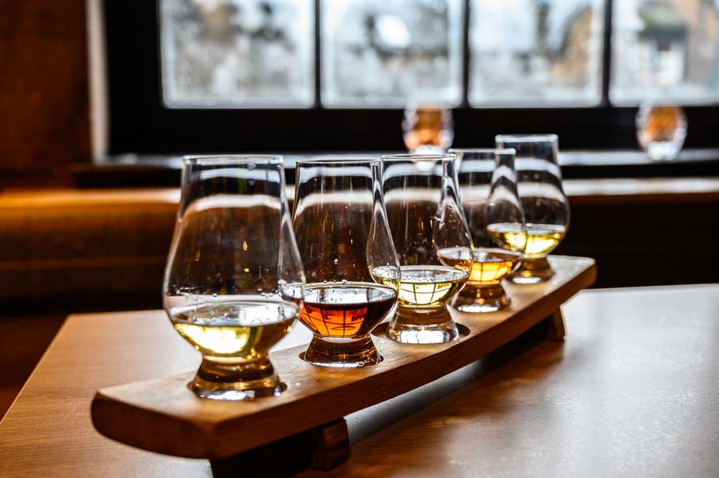

# Single Malt Scotch Whisky Tasting

*Scotland's national spirit: single-malt Scotch tasted slowly in a Glencairn glass with a small jug of cool spring water alongside: the traditional end to any serious Scottish dinner.*

**Serves:** 4-6 (a 3-whisky flight)

**Prep Time:** 10 minutes

**Cook Time:** None

## Overview
Single-malt Scotch whisky is Scotland's most famous and most valuable export, a spirit with a £6 billion+ annual export market and over 130 active distilleries across the country. The tasting ritual elevates the spirit from after-dinner drink to experience: three malts from three different regions, poured into three Glencairn glasses (the tulip-shaped tasting glass designed in Scotland), served at room temperature with a small jug of cool spring water alongside. A few drops of water "opens" the whisky, releasing additional aromatic compounds. The five Scotch regions give five distinct characters: Highland (often heather-honey-sweet and slightly smoky), Lowland (gentle, floral, citrus), Speyside (Scotland's whisky heartland; honey, apple, dried fruit), Islay (heavily peated; iodine, smoke, brine) and Campbeltown (briny, smoky, slightly oily). A traditional flight runs Speyside (entry), Highland (middle), Islay (climax). The host explains each whisky's region, age and character; guests swirl, inhale, taste neat, add a drop of water, taste again.

## Ingredients

### A 3-whisky flight (traditional)
- **Speyside (entry):** 30 ml Glenlivet 12yo (light, honeyed, apple-y) OR Glenfiddich 12yo (pear, honey, vanilla) OR Macallan 12yo (sherry-aged, raisin, oak)
- **Highland (middle):** 30 ml Dalmore 12yo (orange, chocolate, oak) OR Glenmorangie Original 10yo (gentle, citrus, floral) OR Old Pulteney 12yo (coastal Highland; salty, malty)
- **Islay (climax):** 30 ml Laphroaig 10yo (intensely smoky, iodine, brine) OR Lagavulin 16yo (peaty, sherry-rich, complex) OR Ardbeg 10yo (peaty, citrus, dry)

### Equipment
- 4-6 Glencairn glasses (or small tulip wine glasses; never a tumbler, too wide-mouthed for tasting)
- A small jug of cool spring water (Highland Spring, Strathmore, or any non-chlorinated water; tap water with a heavy chlorine taste will mask the whisky)
- A small water dropper or pipette (gives precise water control)
- A small plate of plain oatcakes (palate cleanser between whiskies; the Scottish tasting tradition)
- A small glass of still water for palate-cleansing sips

### Optional tasting accompaniments
- Dark chocolate (80%+; pairs beautifully with peated Islay malts)
- Plain shortbread (the traditional Scottish whisky biscuit)
- A small piece of Scottish smoked salmon (pairs surprisingly well with smoky Islay)
- A small wedge of mature Scottish Cheddar
- Heather honey on a teaspoon (sweet pairing with peated whisky)

## Method

### Stage 1 - Prepare
1. Pour 30 ml of each whisky into a labelled Glencairn glass (or write the name on a small card next to each).
2. Place the glasses in tasting order: Speyside on the left, Highland in the middle, Islay on the right (light to heavy, gentle to peated).
3. Set a small jug of cool spring water and a dropper alongside.
4. Set the oatcakes and still-water glass at each guest's place.
5. Make sure the room is at a comfortable 18-22°C, too cold and the aromas are dampened; too hot and the alcohol is sharp.

### Stage 2 - The visual examination
1. Hold each glass up to the light.
2. Note the colour: Speyside is often pale gold to amber; Highland varies; Islay can be deeper if sherry-cask aged.
3. Note the legs (the streaks running down the inside of the glass after swirling): slower legs indicate a heavier body.

### Stage 3 - The first nose
1. Bring the glass to your nose; inhale gently through nose AND mouth simultaneously (the Scottish whisky tasting technique).
2. Don't inhale deeply, that's painful with high-proof whisky.
3. Note the initial aromas: vanilla, honey, peat smoke, citrus, sherry, oak, malt.
4. The Speyside should be sweet and fruity; the Highland often heather-and-honey; the Islay assaultive with peat and iodine.

### Stage 4 - The first sip (neat)
1. Take a small sip.
2. Hold on the tongue for a few seconds before swallowing.
3. Note the taste: where on the tongue is it most pronounced? Sweet front, bitter back? Peat at the back of the throat?
4. Note the finish (the aftertaste lingering after swallowing): does it warm, smoke, peat, or sweet linger?

### Stage 5 - Add a drop of water
1. With the dropper, add 2-4 drops of cool spring water to the whisky.
2. Swirl very gently.
3. Wait 10 seconds for the water to integrate.

### Stage 6 - The second nose
1. Re-inhale; note how the aromas have changed.
2. The water "opens" the whisky, additional aromatic compounds become detectable.
3. The Speyside might reveal more fruit; the Highland might show more honey; the Islay might soften slightly and reveal sweet notes beneath the peat.

### Stage 7 - The second sip
1. Take another small sip.
2. Note how the taste has changed.
3. The water typically softens harsh alcohol, brings forward sweet notes, and lengthens the finish.

### Stage 8 - Cleanse and move on
1. Take a sip of still water; chew an oatcake.
2. Wait 30-60 seconds.
3. Move to the next whisky in the flight.
4. The whole tasting takes 45-60 minutes for 3 whiskies, slow, conversational, the Scottish hosting tradition at its most refined.

## Notes
- **Glencairn glass:** the tulip shape concentrates aromas to the nose. Tumblers (the wide low glasses) are wrong for tasting.
- **Room temperature, never ice:** ice dampens aromas and dilutes the whisky uncontrollably. Use a few drops of water if needed.
- **Cool spring water, not tap:** chlorine in tap water masks the whisky's subtleties. Use bottled spring water.
- **A few drops is enough:** 2-4 drops of water opens the whisky beautifully. More dilutes it.
- **Inhale gently:** high-proof whisky burns the nose if you inhale deeply. Soft inhalation through nose and mouth simultaneously is the technique.
- **Spit if you must:** at a formal tasting, spitting (into a designated spittoon) is acceptable. Most Scottish home tastings, however, are convivial, swallow and enjoy.

## Variations
- **Single-distillery vertical:** taste three different ages of the same distillery (e.g. Glenfiddich 12yo / 15yo / 18yo): see how time in oak develops the spirit.
- **Regional flight by character:** three Islay malts (Laphroaig / Lagavulin / Ardbeg) to compare peat profiles. Or three Speysides for the sherry-vs-bourbon-cask difference.
- **Cask-finish flight:** taste three whiskies finished in different casks (sherry / bourbon / Port / wine): illuminates the cask's influence.
- **Old vs new style:** taste a pre-1980s style (Talisker 10) vs a modern style (Talisker 25) - illustrates how house styles evolve.
- **Blended-vs-single-malt:** taste a Johnnie Walker Blue (blended) against the Glenfiddich 15 (single malt): see why blends and singles are different categories.
- **Vintage flight:** taste three special-release vintage bottlings, for the serious connoisseur (expensive).

## Serving
- At a Scottish dinner-party finale (the traditional setting) · at a Highland country-house hosting weekend · at a Scottish wedding's after-dinner whisky room · at a Burns Night supper as the dram-and-talk session · at a Hogmanay home gathering · at a Scottish business dinner as the closing ritual · at a Scottish distillery tour tasting room.

## Storage
- Open Scotch whisky bottles last 1-2 years if stored upright (the high alcohol prevents the cork from leaking).
- Once a bottle is below half full, transfer to a smaller bottle (reduces oxidation in the headspace).
- Store at room temperature; not in direct sunlight; not in a hot kitchen.
- Don't refrigerate (changes the texture; pointless).
- The Glencairn glass should be hand-washed (no dishwasher detergent; it masks aromas).
