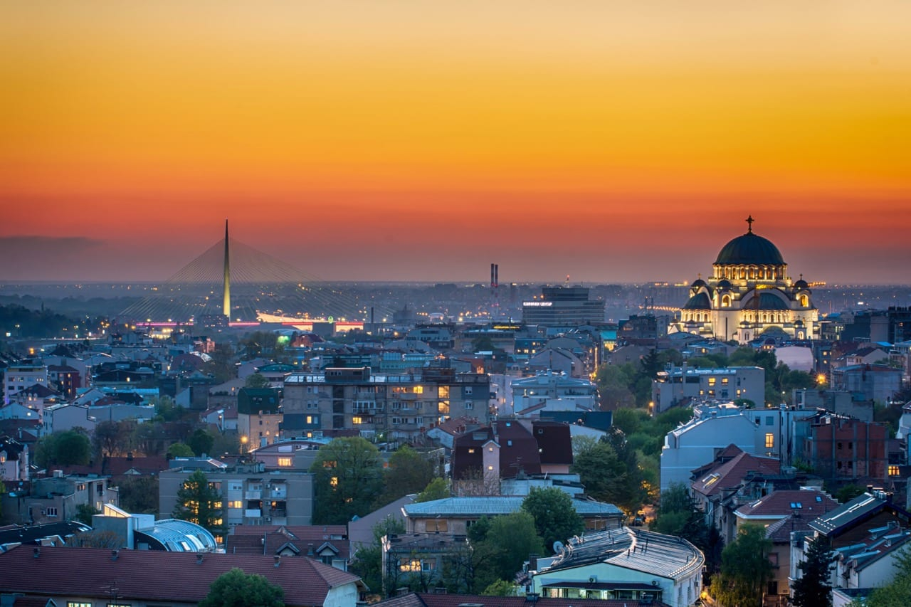

# Drinks of Serbia

The Serbian drinks table starts and ends with rakija. The clear fruit brandy (most often plum, šljivovica) opens every meal with a toast of živeli, sits beside slatko spoon-preserves when a guest arrives, and warms winter evenings as šumadijski čaj, gently heated rakija with sugar and honey. Slatka rakija, caramelised and spiced, pours at weddings and christenings. Coffee comes after, served Turkish-style in small cups, never to rush the table.
