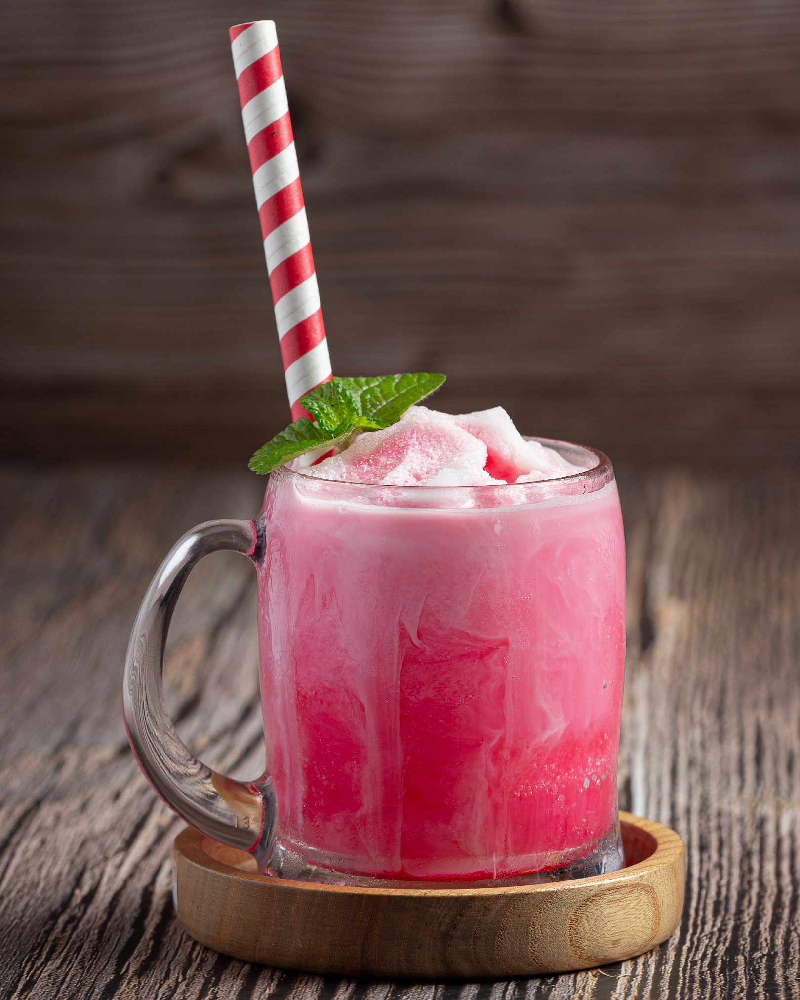

# Bandung

*Singapore-Malay rose milk drink: cold milk sweetened with rose syrup, sometimes with evaporated milk for extra creaminess, served over crushed ice. The vivid-pink, gently fragrant cooler at every Malay celebration and hawker stall in Singapore.*

**Serves:** 4 tall glasses

**Prep Time:** 5 minutes

**Cook Time:** None

## Overview
Bandung is the Malay drink that turns up at every wedding, Eid celebration, and Singapore hawker stall - a vivid pink milk-and-rose-syrup beverage that's gently fragrant rather than perfumey, sweet but not cloying, and refreshing over plenty of crushed ice. The name comes from the city in Indonesia though the drink is more closely associated with Malay-Singapore tradition. The classic formula is rose syrup (the Indian Rooh Afza brand is the gold standard) plus evaporated milk and cold water; some versions add basil seeds or lychees. Served in tall glasses with the rose syrup poured first so it sits at the bottom and creates a graduated pink-to-paler effect as it mixes.

## Ingredients
- 8 tbsp rose syrup (Rooh Afza is the classic, or any quality rose syrup)
- 400 ml evaporated milk (the tinned kind, not condensed)
- 400 ml cold water (or sparkling water for fizzy version)
- 4 tbsp sweetened condensed milk (optional, for extra sweetness)
- Plenty of crushed ice
- Optional: 2 tbsp basil seeds (selasih), soaked in 100 ml water 15 minutes to swell
- Optional: 4 lychees in syrup, halved, to garnish

## Method

### Stage 1 - Set up the glasses
1. Fill 4 tall glasses with crushed ice.

### Stage 2 - Pour the syrup
1. Spoon 2 tbsp rose syrup into the bottom of each glass. Don't stir.

### Stage 3 - Add the milk
1. Combine the evaporated milk, cold water and condensed milk (if using) in a jug. Stir to mix.
2. Pour the milk mixture gently over the rose syrup in each glass - it sits on top initially, then mixes through naturally as it filters down through the ice.

### Stage 4 - Garnish and serve
1. If using basil seeds, spoon 1 tbsp (with their soaking water) onto each glass.
2. Top with a halved lychee on a cocktail stick.
3. Stir briefly with a long spoon to combine before drinking, or let the drinker mix it.

## Notes
- **Rose syrup brand:** Rooh Afza (Indian) is the most common, deep red and intensely rose-scented. Monin rose or any commercial rose syrup works; avoid bright artificial-pink supermarket syrups - they lack the rose character.
- **Evaporated, not condensed (as the base):** Evaporated milk is unsweetened; condensed is sweetened. The base wants evaporated for body, then condensed (small amount) for sweetness. Reverse them and the drink is cloying.
- **Basil seeds:** Selasih seeds (basil seeds) swell into translucent jellies when soaked. They add texture - optional but traditional in the celebratory version.

## Serving
- Serve very cold in tall glasses with a long spoon for stirring. At Singapore weddings, bandung is served in pitchers alongside the meal.

## Storage
- Make per serving. The drink doesn't pre-mix well - the milk and syrup separate.
- The basil seeds, once soaked, keep refrigerated 2 days.
