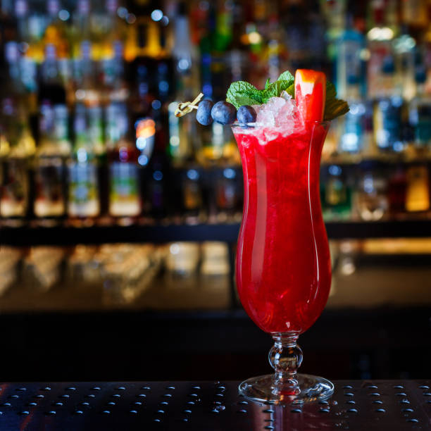

# Singapore Sling

*Singapore's iconic cocktail: gin, cherry brandy, pineapple juice, lime, grenadine and a splash of Cointreau, shaken cold and served tall in a hurricane glass with a pineapple slice and a cherry. Invented at Raffles Hotel circa 1915.*

**Serves:** 1 cocktail

**Prep Time:** 5 minutes

**Cook Time:** None

## Overview
The Singapore Sling was invented at the Long Bar in Raffles Hotel around 1915 by Hainanese bartender Ngiam Tong Boon, and the original recipe is contested (the proper one disappeared with the bartender; the modern Raffles version is a reconstruction). The cocktail evolved through several phases - early versions were more spirit-forward; modern versions lean tropical and sweet. The standard recipe today: gin as the base, cherry brandy for the pink colour and fruit note, fresh pineapple juice for body, a small amount of Bénédictine and Cointreau for herbal-citrus complexity, lime and grenadine for balance, and a dash of bitters. Shaken hard, strained over crushed ice into a tall hurricane glass, garnished with a slice of pineapple and a maraschino cherry.

## Ingredients
- 45 ml London dry gin
- 15 ml Cherry Heering (cherry brandy)
- 7.5 ml Bénédictine (sub Drambuie or omit)
- 7.5 ml Cointreau (or triple sec)
- 120 ml fresh pineapple juice (not from concentrate)
- 15 ml fresh lime juice
- 10 ml grenadine (the real pomegranate kind, not the bright red syrup)
- 2-3 dashes Angostura bitters
- Plenty of crushed ice
- Pineapple wedge and a maraschino cherry to garnish
- A long stirring stick (or umbrella, for fun)

## Method

### Stage 1 - Build in a shaker
1. Fill a cocktail shaker with ice.
2. Add gin, cherry brandy, Bénédictine, Cointreau, pineapple juice, lime juice, grenadine and bitters.
3. Shake hard for 15 seconds - long enough to chill thoroughly and bring out a slight foam from the pineapple juice.

### Stage 2 - Serve
1. Fill a tall hurricane glass (or any tall narrow glass) with crushed ice.
2. Strain the cocktail over the ice.
3. Garnish with a pineapple wedge and a cherry on a stick.
4. Add a long stirring spoon or straw.

## Notes
- **Fresh pineapple juice:** Essential for the body and foam. The carton stuff doesn't have the same creaminess; the foam top is what makes the Sling visually distinct.
- **Cherry Heering vs cheap cherry brandy:** The original calls for Heering specifically (a Danish cherry liqueur). Substituting cheap cherry brandy gives a sweeter, less complex result. Worth the investment if you make Slings often.
- **Real grenadine:** Most "grenadine" in supermarkets is artificially-coloured corn syrup. Look for a real pomegranate-juice grenadine, or make one yourself by reducing pomegranate juice with sugar.

## Serving
- Serve very cold in a tall glass at the start of an evening. The classic Raffles serving spans a long sip - the ice melts gradually, mellowing the drink as you go. Tiger beer or wine alongside is a Singapore pairing.

## Storage
- Make per serving. The Sling doesn't pre-mix well - the foam dissipates and the colours separate.
