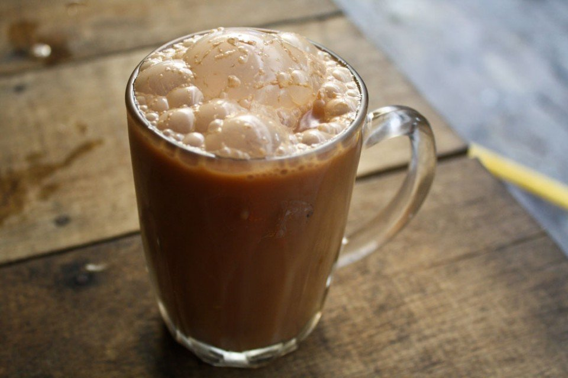

# Teh Tarik

*Singapore-Malay pulled tea: strong black tea sweetened with condensed milk, then "pulled" by pouring back and forth between two pitchers from arm's length to aerate and produce a thick foam top. The hawker-stall and kopitiam morning drink across Singapore.*

**Serves:** 2 small cups

**Prep Time:** 5 minutes

**Cook Time:** 5 minutes

## Overview
Teh tarik ("pulled tea") is the everyday Malay-Singapore tea, brewed thick and dark from a strong Ceylon black tea, sweetened heavily with sweetened condensed milk, and then aerated through the signature pour - the tea is poured from one pitcher to another from arm's length, multiple times, generating a thick frothy foam on the surface and slightly cooling the tea while incorporating air. The result is creamy, sweet, with a hint of caramel from the condensed milk and a frothy head that's the visual signature of the drink. Drunk hot in small glass cups, often with a roti prata or kaya toast.

## Ingredients
- 2 tbsp loose black tea leaves (Ceylon BOP or strong English Breakfast)
- 400 ml just-off-boiling water
- 3-4 tbsp sweetened condensed milk (adjust to taste; Singapore standard is generously sweet)
- 1 tbsp evaporated milk (optional, for added creaminess)
- 2 small heat-resistant pitchers or jugs (for the pulling)

## Method

### Stage 1 - Brew strong tea
1. Place the tea leaves in a small pot or heatproof jug.
2. Pour over the just-off-boiling water.
3. Steep 4-5 minutes - the tea should be very strong, almost stewed by Western tea standards.
4. Strain into a clean pitcher (the "first pitcher").

### Stage 2 - Sweeten
1. Add the sweetened condensed milk (and evaporated milk if using) to the strained tea.
2. Stir thoroughly to dissolve.

### Stage 3 - The pull
1. Hold the first pitcher in one hand at chest height.
2. Hold an empty pitcher in the other hand at waist height.
3. Pour the tea from high to low in a steady stream - aim for a 30-40 cm gap between the spout and the receiving pitcher.
4. As the tea pours, the falling stream aerates and starts to foam.
5. When all the tea has transferred, swap pitchers - the now-empty top one goes back to chest height, the now-full one is the bottom pitcher; pour again from high to low.
6. Repeat 4-6 times. Each pour increases the foam and slightly cools the tea.

### Stage 4 - Serve
1. Pour the final result into 2 small heat-resistant glasses (the traditional vessel).
2. The top should have a thick layer of pale foam.
3. Drink hot, immediately.

## Notes
- **The pull is the dish:** It's not for show. Aerating the tea creates the signature creamy foam and slightly modulates the temperature; without it the drink is just hot sweet tea. With it, it's teh tarik.
- **Practice over the sink:** First attempts will splash. The motion is repetitive once learned; pull high, catch low, swap hands, repeat.
- **The right sweetness:** Singapore teh tarik is sweet by Western tea standards - usually 3-4 tbsp condensed milk for 400 ml tea. Less for a more restrained version; more for the local standard.

## Serving
- Serve in small thick glass cups (the traditional Singapore-Malay kopitiam glass). Roti prata, kaya toast, or curry puff alongside. Drink hot.

## Storage
- Drink the same hour. The foam dissipates after 10-15 minutes; the tea remains drinkable for a couple of hours but loses its character.
- Don't refrigerate or reheat - the texture is the dish, not just the flavour.
