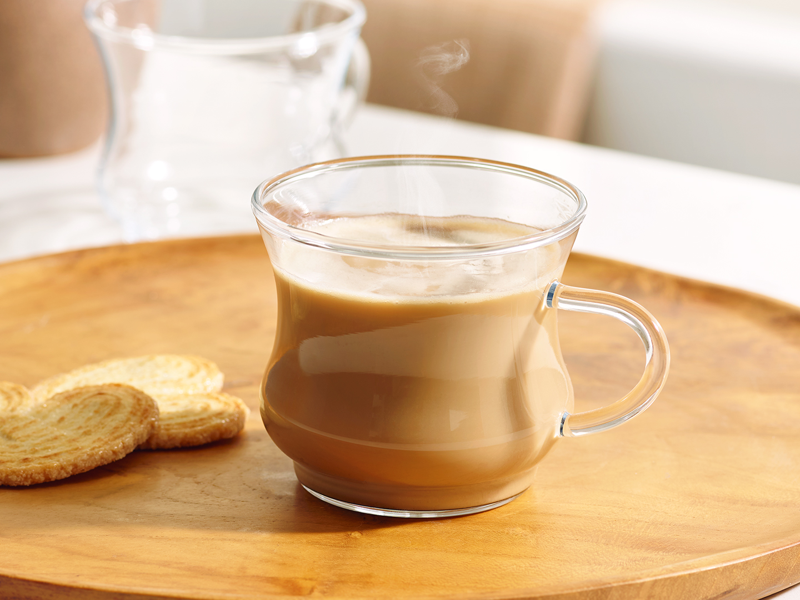

# Café con Leche

*Spain's morning coffee: a short, strong espresso (or a sturdy stovetop moka) topped with hot frothed whole milk, served in a 200 ml glass with a sugar packet on the saucer. The breakfast ritual at every Spanish bar from Madrid to the smallest pueblo.*

**Serves:** 1 glass

**Prep Time:** 2 minutes

**Cook Time:** 5 minutes

## Overview
Café con leche is the Spanish breakfast coffee, and the most important detail is what it isn't: it's not a cappuccino (no thick foam), it's not a latte (no flavoured syrups, less milk, and never served in a tall paper cup), it's not a cortado (which has far less milk). It's a 50/50 blend of strong coffee and hot frothed milk, served in a small thick-walled glass (the vaso de café, about 180-200 ml capacity), with a sachet of sugar on the saucer that you stir in to taste. The coffee base is traditionally made in a stovetop moka pot or pulled as a short Italian-style espresso; weak filter coffee makes a weak café con leche. The milk is whole and just-heated to about 65°C, then briefly frothed for body but not for the dense cap of a cappuccino. At a bar, you order "un café con leche, por favor", and you stand at the counter eating a tostada con tomate while you drink it. The unwritten rule: never order one after noon. Café con leche is a morning drink; afternoon coffees are cortados or solos.

## Ingredients

- 50 ml strong espresso (from a moka pot or proper espresso machine; 1 shot)
- 100 to 120 ml whole milk
- 1 to 2 teaspoons white sugar, to taste (Spanish bars usually serve a 5 g packet)

### To serve
- A small thick-walled glass (180-200 ml; vaso de café) on a saucer
- Optional: a small spoon for stirring

## Method

### Stage 1 - Brew the coffee
1. Pull a single espresso shot (about 50 ml) using whatever method you have: espresso machine, moka pot (about 1 minute on medium heat), or AeroPress (concentrated brew, 1:3 coffee-to-water ratio). The coffee should be dark, strong, and concentrated.
1. Pour straight into the glass.

### Stage 2 - Heat and froth the milk
1. Pour the milk into a small saucepan and warm over medium-low heat until it reaches about 65 to 70°C (hot but not boiling; small bubbles forming at the edge).
1. Off the heat, whisk briefly with a small hand whisk or use a milk frother to create a light layer of microfoam on top. You're aiming for the body of frothed milk, not the dense foam of a cappuccino: about 0.5 cm of light foam, not 2 cm of thick foam.

### Stage 3 - Combine
1. Pour the hot milk over the espresso, holding back the foam slightly with a spoon, then spoon the light foam on top.
1. The glass should now hold about 150-170 ml of liquid: half coffee, half milk, a thin foam cap.

### Stage 4 - Serve
1. Bring to the table on a saucer with a sugar sachet and a spoon. The drinker stirs in the sugar to taste.
1. Serve immediately, hot.

## Notes
- **Real espresso matters.** A weak filter coffee gives a weak, watery café con leche. Use the strongest brew method you have. Moka pot is the most common Spanish home setup.
- **Whole milk only.** Skim milk gives a thin, sad drink; semi-skimmed works but is second-best. Whole milk's fat carries the coffee aromas.
- **Frothed, not foamed.** Don't make it into a cappuccino. The milk should have a thin layer of light foam on top, not a 2 cm cap. Stop frothing as soon as you see fine even bubbles.
- **The glass is the right vessel.** A mug is acceptable but not Spanish. The thick-walled vaso de café holds heat well and is the signal that you're drinking café con leche, not a latte.
- **Order it in the morning only.** Spanish coffee culture is strict on this: café con leche before noon, cortado or solo (espresso) after. Ordering a milky coffee at 4pm gets you looked at.

## Variations
- **Café cortado.** A short espresso "cut" with just 1-2 tablespoons of warm milk in a small glass. The Spanish afternoon coffee.
- **Café manchado.** Inverse: a small glass of warm milk with just a teaspoon of coffee added. Almost all milk.
- **Café bombón.** Espresso served over an equal layer of sweetened condensed milk; the layers stay separate until stirred. A Valencian / Catalan speciality.
- **Sugar-less.** Café con leche purist style. The strong coffee + warm milk balance is meant to be slightly bitter; sugar is optional.

## Storage
- Doesn't store; serve immediately. The foam dissipates within 2 minutes and the coffee loses its punch quickly.
