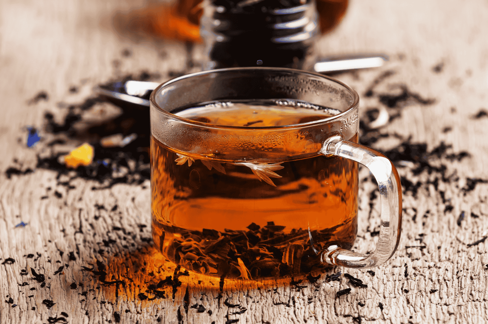

# Ceylon Tea (Plain Tea, Sri Lankan Style)

*The everyday drink of Sri Lanka: Ceylon black tea brewed strong in a small pot, sweetened heavily with white sugar, served in tiny porcelain cups. No milk in the traditional preparation, no spices. The whole point is the tea itself.*

**Serves:** 4 small cups

**Prep Time:** 1 minute

**Cook Time:** 5 minutes

## Overview
Ceylon tea is one of the world's great teas. Grown in the central highlands of Sri Lanka around Nuwara Eliya, Dimbula and Uva, it has a bright, brisk character with notes of citrus and lightly floral aromatics, distinct from Indian Assam (maltier) or Chinese Keemun (smoky). The traditional Sri Lankan preparation honours the leaf: just-boiled water, a generous teaspoon per cup, strict 4-minute steep, no milk, no spice, sweetened generously with white sugar. This is the drink you'll be offered the moment you walk into a Sri Lankan home, served in a small cup with a digestive biscuit on the saucer; the tea is reboiled in the kettle and a fresh cup poured to refill you, often several times in a visit. Choose a single-estate or single-origin Ceylon when you can (Dilmah, Akbar, Bogawantalawa, Mlesna are good brands), or any orange pekoe loose leaf marked "Pure Ceylon". The most important detail is using freshly boiled water - never tepid - and using enough leaf.

## Ingredients

- 4 heaped teaspoons loose-leaf Ceylon black tea (BOP, OP or FOP grade; Dilmah, Akbar, or Mlesna brands) OR 4 Ceylon tea bags
- 600 ml just-boiled water (from a kettle, water at full rolling boil)
- 4 to 6 teaspoons white sugar, to taste
- A small jug of fresh milk (only if going the British-Sri Lankan way; the pure local version skips it)

### To serve
- 4 small porcelain cups or teacups with saucers
- Optional: a small biscuit per cup (Marie biscuits are the local choice)

## Method

### Stage 1 - Warm the pot
1. Pour a small amount of just-boiled water into your teapot. Swirl to warm the porcelain, then tip out.

### Stage 2 - Brew
1. Add the loose-leaf tea (or tea bags) to the warmed pot.
1. Pour over the just-boiled water. Use water that's just stopped boiling, not water that's been sitting around cooling.
1. Stir once gently with a wooden spoon (metal can give a metallic taste with very strong teas), then put the lid on.
1. Steep for 4 minutes. Set a timer; Ceylon goes sharp and tannic past 5 minutes.

### Stage 3 - Strain
1. Strain through a fine sieve into the cups (or remove the tea bags). The brew should be a deep golden-amber, not muddy black.

### Stage 4 - Sweeten
1. Stir 1 to 1.5 teaspoons of sugar into each cup to taste. Sri Lankan tea is properly sweet; that's part of the drink.
1. Serve immediately. The traditional accompaniment is a Marie biscuit or a slice of love cake.

## Notes
- **Boil the water properly.** Tea below 90°C extracts thin and grassy; tea above 95°C extracts the bright snap that Ceylon is known for. Just-off-the-boil is right.
- **Use enough leaf.** One heaped teaspoon per cup is the local measure. Weak tea is sometimes a politeness gesture in the UK but isn't the local habit.
- **No milk in the pure version.** Adding milk to Ceylon is a colonial-era British habit that's adopted in Sri Lankan households too (especially in milky-tea form for breakfast), but the daytime drink at family visits is taken plain. Both are valid; the unmilked version is what most Sri Lankans drink at most times.
- **Single-origin matters.** Blended supermarket "English Breakfast" is mostly Ceylon but cut with Assam and Kenya. For the real taste, get a single-origin or pure-Ceylon brand from a South Asian grocery.

## Variations
- **Milk tea (kiri te).** Brew the same tea then add equal parts hot milk and sugar to the cup. Common at breakfast and in tea-stall culture. Closer to a chai but without spices.
- **Spiced tea.** Add 2 cardamom pods, a clove and a 1 cm piece of fresh ginger to the brew. Local but less common than the pure version.
- **Iced Ceylon.** Brew double-strength, sweeten while hot, chill, pour over ice with a slice of lemon. The colonial Sri Lankan summer drink.
- **Lemon tea.** A wedge of lemon squeezed in instead of milk. Clean, bright, perfectly suited to Ceylon's natural citrus notes.

## Storage
- Brewed tea is best drunk fresh; it gets bitter and stewed within an hour in the pot. Refrigerate brewed tea up to 1 day if making iced tea ahead.
- Loose leaf Ceylon keeps 6 to 12 months in an airtight tin away from light and moisture. Once opened, use within 6 months for best flavour.
