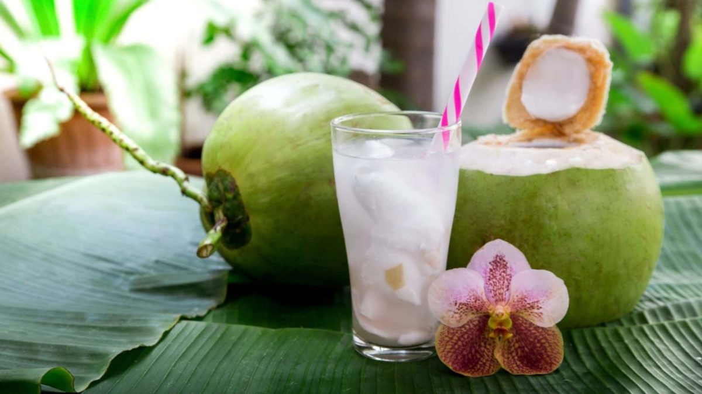

<!-- TODO: hero image undersized, refresh from Pexels or hand-curate -->
# King Coconut Water (Thambili)

*The cold drink you reach for on a humid Colombo afternoon: a freshly-cracked king coconut (thambili), drunk straight from the shell with a straw. Lightly sweet, faintly tangy, electrolyte-rich, the local hangover cure and after-cricket rehydration drink.*

**Serves:** 1 (one king coconut per person)

**Prep Time:** 3 minutes

**Cook Time:** 0 minutes

## Overview
The king coconut, called thambili in Sinhala or "elaneer" in Tamil-Sri Lankan, is a distinct variety from the green coconut found across Southeast Asia. The shell is a brilliant orange-yellow when ripe, the water inside is sweeter and less astringent than green coconut water, and a single king coconut holds about 300 to 500 ml of liquid. Roadside vendors across Sri Lanka stack them in pyramids by the dozen, hack the top off with a curved kitchi knife when you order one, drop in a straw, and you sip it cold under a tree. The traditional add-on: when you've finished the water, the vendor splits the coconut and gives you a sliver of the shell as a scoop to dig out the soft jelly-like flesh. Drinking thambili is half rehydration, half ritual; tourists who try it almost universally adopt it for the rest of their trip. Outside Sri Lanka, find king coconuts at South Asian groceries (look for the orange-yellow shell), or substitute with the freshest green coconut you can find.

## Ingredients

- 1 king coconut (thambili), as fresh as possible (best within 1 to 2 weeks of harvest)

### To open and serve
- A large heavy knife (a cleaver or kitchi knife works; a Western chef's knife is just about adequate)
- A clean tea towel for grip
- A wide straw (paper or metal - single-use plastic feels wrong with this drink)
- Optional: a small spoon to scoop out the soft flesh after drinking

## Method

### Stage 1 - Chill the coconut
1. Refrigerate the king coconut at least 4 hours, or overnight. The water inside is delicious at room temperature too but is at its best deeply chilled.

### Stage 2 - Open the coconut
1. Set the coconut on its side on a sturdy cutting board. Lay a clean tea towel over your non-knife hand and use it to brace the coconut.
1. With a heavy knife, make 3 or 4 firm chopping strikes at the pointed end (the "stem" end) to cut off the top crown. Each strike should remove a slice; after 3 to 4 strikes you'll have an opening big enough for a straw.
1. The water inside should be clear with a faint pale-green tinge; if it looks brown or smells off, the coconut is past its best and shouldn't be drunk.

### Stage 3 - Drink
1. Drop in a straw and drink the water straight from the shell. It should be lightly sweet, faintly tangy, with a clean mineral edge. Cold is best.
1. A king coconut yields about 300 to 500 ml of water, enough to hydrate properly. Drink it slowly; the natural minerals and electrolytes work better at a sip-pace than a gulp.

### Stage 4 - Eat the flesh
1. When you've finished the water, split the coconut in half with another hard knife strike (or have someone else split it for you).
1. Inside is a soft, jelly-like white flesh, much softer than the firm flesh of a mature green coconut. Scoop it out with a small spoon and eat it directly. Some people eat it with a pinch of salt; the unsalted version is also fine.

## Notes
- **Freshness is everything.** A fresh king coconut tastes sweet and clean; a stale one tastes bland or even slightly soapy. Buy from a busy vendor with high turnover.
- **King vs green coconut.** King coconut water is sweeter, less astringent, and slightly more mineral. Green coconut (Thai, Indian, Vietnamese) is grassier and more astringent. They're not interchangeable in terms of taste though they overlap in function.
- **No additives.** The local drink is just the water. No sugar, no ice, no flavourings. Adding anything is a tourist habit and dilutes the point.
- **The "scoop spoon" trick.** Once you've drunk the water and split the coconut, ask the vendor for a sliver of the husk to use as a scoop for the flesh. The husk sliver has a shape that's perfectly designed for this.

## Variations
- **Salted king coconut.** A small pinch of sea salt added to the water once opened. Some prefer it; saltier electrolyte profile.
- **Lime king coconut.** A squeeze of fresh lime juice into the coconut. Brightens the taste, adds vitamin C.
- **King coconut and arrack.** The local-grown-up version: a 30 ml shot of arrack (Sri Lankan coconut spirit) added to the coconut. Becomes a cocktail; very Colombo beach-bar.

## Storage
- An unopened king coconut keeps 1 to 2 weeks at room temperature in a cool dry place, longer in the fridge. The water inside is sealed until you open it.
- Once opened, the water should be drunk within 4 hours (refrigerated) or 1 hour (room temp). Don't store opened coconut water for longer; it ferments quickly in heat.
