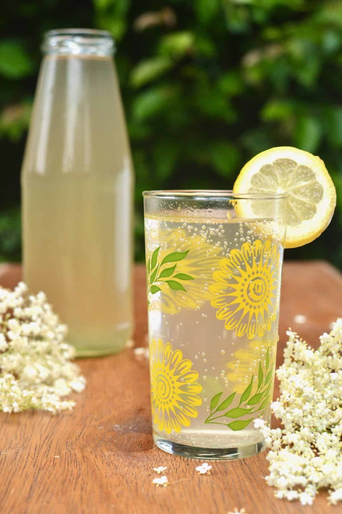

# Fläderblomssaft (Swedish Elderflower Cordial)

*Sweden's summer elderflower cordial: fresh elderflowers steeped with sugar, citric acid, lemon and orange peel into a fragrant pale-gold syrup, then diluted with cold sparkling water. The canonical Swedish drink of May and June when the elderflower bushes flower across the countryside; pours from every Swedish summer-house jug.*

**Serves:** Makes about 1.5 litres syrup (yields ~10 litres of dilute drink)

**Prep Time:** 20 minutes (plus 24-48 hours steeping)

**Cook Time:** 5 minutes (just to dissolve the sugar)

## Overview
Fläderblomssaft (elderflower cordial) is one of Sweden's most cherished homemade drinks and the canonical drink of late May and June, when the cream-coloured elderflower (Sambucus nigra) bushes flower across Swedish countryside, gardens and roadsides. The Swedish tradition has every family with garden access making a batch of saft from the flowers - a few hours of picking, an evening of preparation, then 24-48 hours of steeping, then bottling for the summer ahead. The construction: fresh elderflowers (just-opened, fragrant, picked from bushes not too close to roads) are gently rinsed and packed into a wide bowl with sliced lemons and oranges. Boiling water with sugar and citric acid (the Swedish canonical preservative, also brightens) is poured over; the whole thing steeps for 24-48 hours, gathering the elderflower's distinctive floral-honeysuckle-muscat-grape flavour. Strained, bottled, and diluted with cold sparkling water just before drinking. The result is a pale-gold, intensely fragrant, gently sweet drink that captures Swedish summer in a glass.

## Ingredients

### Elderflower syrup - makes about 1.5 litres
- 25-30 fresh elderflower heads (large fully-opened cream-coloured heads from elderflower bushes; about 200g of flowers)
- 1.2 kg caster sugar
- 1.2 litres water
- 3 large lemons (sliced into rounds)
- 2 oranges (sliced into rounds)
- 40 g citric acid (food-grade; available at chemists or baking supply shops; substitute with juice + zest of 4 extra lemons but shelf life drops to a few weeks)

### Equipment
- A large wide bowl or pot (5+ litres)
- A clean tea towel for covering
- A fine sieve or muslin/cheesecloth
- Sterilised glass bottles or jars (1-litre size, sealable)

### Per glass (dilution)
- 60 ml elderflower syrup
- 250 ml cold sparkling water
- 2-3 ice cubes
- A slice of lemon
- A small mint or basil sprig (optional)

## Method

### Stage 1 - Pick and prep the flowers
1. Pick elderflowers on a dry sunny morning when the blooms are fully open and fragrant.
2. Pick from bushes not too close to roads (the flowers absorb car exhaust).
3. Shake off any insects (gently); don't wash with water (washes away the flavour-rich pollen).
4. Trim off most of the thick stems (the stems impart bitterness); leave the flower clusters intact on small stems.

### Stage 2 - Sugar syrup
1. In a saucepan, combine the sugar, water, and citric acid.
2. Heat gently, stirring, till the sugar fully dissolves (about 4-5 minutes; don't boil hard).
3. Take off the heat.

### Stage 3 - Combine in a large bowl
1. Layer the trimmed elderflower heads, sliced lemons, and sliced oranges in a large clean bowl.
2. Pour the warm sugar syrup over.
3. Press the flowers down gently with a wooden spoon so they're fully submerged.

### Stage 4 - Steep
1. Cover the bowl with a clean tea towel (NOT a tight lid - the flowers need a little air).
2. Leave at cool room temperature for 24-48 hours.
3. Stir gently once a day.
4. After 48 hours the syrup will smell deeply of elderflower; it'll be pale gold with citrus notes.

### Stage 5 - Strain
1. Strain the syrup through a fine sieve lined with muslin or cheesecloth into a clean bowl or jug.
2. Press gently on the solids with the back of a spoon to extract more flavour (don't push hard; bitter notes from the stems come out under hard pressure).
3. Discard the flowers and citrus.

### Stage 6 - Bottle
1. Pour the strained syrup into sterilised glass bottles or jars.
2. Seal tightly.
3. Refrigerate (or pasteurise - heat the sealed bottles in a hot water bath at 80°C for 20 minutes - for longer shelf life).

### Stage 7 - Dilute and serve
1. In each glass, pour 60ml of the syrup.
2. Top up with 250ml of very cold sparkling water.
3. Add 2-3 ice cubes.
4. Garnish with a slice of lemon and a small mint or basil sprig.
5. Serve immediately while cold.

## Notes
- **Just-opened elderflowers:** the flavour is best at this stage. Past-peak flowers taste musty / cat-pee-y; closed buds have no flavour.
- **Don't wash the flowers with water:** removes the flavour-rich pollen. Just shake off insects.
- **Trim the stems:** stems are bitter. Keep just the flower clusters on small stems.
- **Citric acid is the canonical preservative:** food-grade, at chemists or baking shops. Without it, the cordial keeps 2-3 weeks refrigerated; with it, 3-6 months refrigerated or 1 year pasteurised.
- **24-48 hour cold steep:** the flavour develops over time. Hot infusion gives a quicker but less complex result.
- **Strain through muslin:** essential for a clear syrup.

## Variations
**Champagne version:** dilute with chilled champagne / prosecco instead of sparkling water for a Swedish midsummer cocktail.
**With St-Germain replacement use:** if you don't want to make from scratch, dilute St-Germain elderflower liqueur with sparkling water for a quick approximation (alcoholic).
**Ginger-elderflower:** add a thumb of grated fresh ginger to the steep for warmth.
**Rose-and-elderflower:** add a small handful of rose petals to the steep for an extra floral note.
**Pasteurised long-keeping bottles:** heat sealed bottles in a 80°C water bath for 20 minutes to make them shelf-stable for a year.
**Frozen as ice cubes:** freeze syrup in ice cube trays; drop a few cubes into prosecco for an instant cocktail.

## Serving
At Midsommar lunch in the Swedish countryside (the canonical Swedish midsummer drink) · at a Stockholm summer rooftop bar · at a Swedish summer-house weekend · at a Nordic-themed dinner party · at fika in June with cardamom buns.

## Storage
- Refrigerated cordial keeps 3-6 months sealed; 2 weeks once opened.
- Pasteurised bottles keep 1 year unopened in a cool dark place; once opened, refrigerate and use within 1 month.
- Frozen syrup ice cubes keep 6 months.
- The diluted drink doesn't store well; mix fresh.
