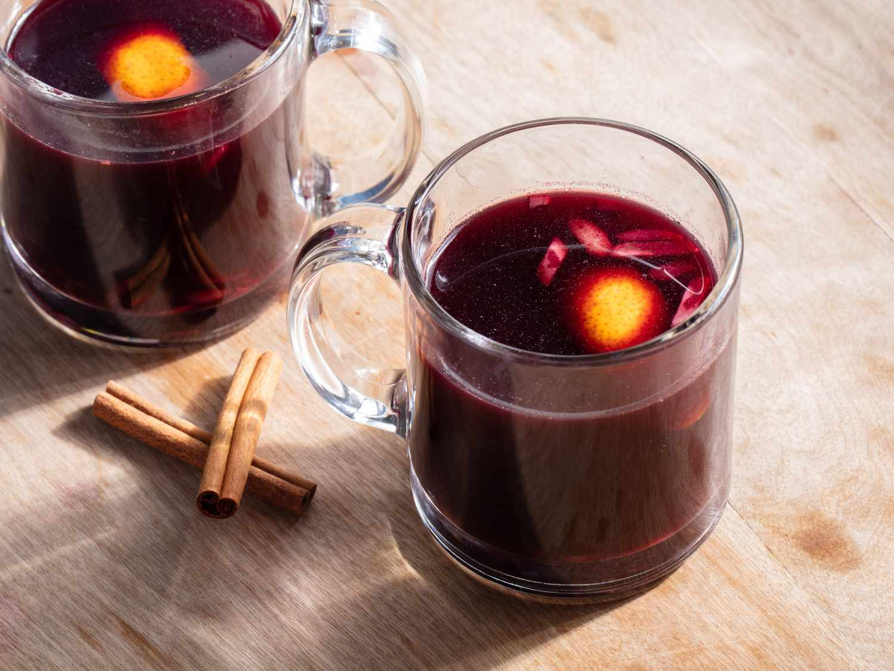

# Glögg (Swedish Mulled Wine)

*Sweden's Christmas mulled wine: red wine simmered with akvavit, sugar, cardamom, cinnamon, cloves, orange peel and raisins, served piping hot in small glasses with whole almonds and plump raisins in the bottom. The defining drink of the Swedish Christmas season; served at every julbord, every Lucia Day breakfast, and every advent gathering from late November to Twelfth Night.*

**Serves:** 8-10

**Prep Time:** 15 minutes (plus 24 hours steeping for the spice infusion if you want depth)

**Cook Time:** 20 minutes

## Overview
Glögg (Swedish for "mulled wine") is one of the most ritualised drinks in Swedish culture and the defining beverage of the Christmas season — from the first Advent Sunday in late November all the way through Twelfth Night in early January. Every Swedish workplace, every neighbourhood gathering, every Lucia Day breakfast (December 13th, when girls in white robes and candle crowns sing at dawn), every julbord, and every Christmas Eve celebration starts with small mugs of hot glögg in everyone's hands. The construction: red wine (a cheap-but-decent cabernet sauvignon or merlot is the canonical base — saving good wine for drinking) is gently warmed with sugar, a quantity of akvavit or vodka (the alcohol kick that makes glögg distinct from non-alcoholic mulled wines), and a bag of warming spices (whole cardamom pods crushed, cinnamon stick, cloves, allspice, fresh ginger slices, orange peel). Some traditional Swedish home cooks add port or sherry for sweetness depth, and grate fresh nutmeg in at the end. The Swedish-specific touch: each cup is served with a tablespoon of plump dark raisins and a few whole blanched almonds dropped in the bottom — eaten with a teaspoon after drinking. Three details: cardamom is the canonical Swedish spice (more than cinnamon), akvavit or vodka boost (canonical), raisins-and-almonds in the cup.

## Ingredients

### Glögg base
- 1.5 litres dry red wine (cabernet sauvignon, merlot, or any robust dry red)
- 300 ml akvavit (Skåne, OP Anderson) OR vodka OR brandy
- 150 ml port or sweet sherry (optional; for depth)
- 150 g caster sugar (or to taste)

### Spice bag
- 1 stick cinnamon
- 10 whole cardamom pods (lightly crushed)
- 10 whole cloves
- 8 allspice berries
- 1 thumb (3 cm) fresh ginger (sliced thin)
- Peel of 1 large orange (no white pith)
- Peel of ½ lemon (optional)
- 1 vanilla pod (split, optional)

### To serve (per glass)
- 1 tablespoon dark raisins (plumped in akvavit overnight if you're keen)
- 1 tablespoon blanched whole almonds (peeled almonds; halved if large)
- 1 teaspoon brown sugar (rim of glass; optional)

### Equipment
- A cheesecloth or muslin bag for the spices
- Small heat-safe mugs or proper glögg glasses (small — about 100ml; you're sipping, not chugging)
- Small teaspoons for the raisins-and-almonds

## Method

### Stage 1 - Optional: pre-infuse the spices (24 hours ahead, for depth)
1. Place all spice-bag ingredients in a saucepan with 250ml of the wine.
2. Bring to a bare simmer; cook 10 minutes.
3. Off heat; cover; let infuse overnight in the fridge.
4. (Skip this step for a quicker glögg — the flavour will be milder.)

### Stage 2 - Combine and warm
1. In a large saucepan, combine the wine (including any infusion liquid), akvavit, port (if using), sugar, and all the spice-bag ingredients (if not pre-infused).
2. Heat slowly over LOW heat (do not boil; boiling burns off the alcohol).
3. Stir occasionally to dissolve the sugar.
4. Bring just to a steam (about 70-75°C, the canonical glögg temperature).
5. Hold at this temperature for 10 minutes for the spices to release into the wine.

### Stage 3 - Plump the raisins (optional)
1. While the glögg infuses, place the raisins in a small bowl.
2. Pour over 4 tablespoons of warm akvavit; let plump 10 minutes.

### Stage 4 - Strain
1. Strain the glögg through a fine sieve to remove the whole spices and peels.
2. Return to the pan; keep warm on the lowest heat.

### Stage 5 - Pour and serve
1. Place 1 tablespoon of plump raisins and 1 tablespoon of blanched almonds in the bottom of each small heat-safe mug or glögg glass.
2. Ladle the warm glögg over.
3. Each guest receives a small teaspoon for fishing out the raisins-and-almonds at the end.

### Stage 6 - The serving ritual
1. Serve with pepparkakor (Swedish gingerbread biscuits) and lussekatter (saffron buns) on the side.
2. Hold the mug with both hands; sip slowly.
3. When you reach the bottom, spoon up the akvavit-soaked raisins and almonds.
4. A round of glögg should last 20-30 minutes.

## Notes
- **Don't boil the glögg:** boiling burns off the alcohol and reduces the spices to bitter. Low heat, just steam.
- **Cardamom is the Swedish signature:** Swedish glögg is more cardamom-forward than German Glühwein.
- **Akvavit / vodka boost is essential:** glögg is meant to be properly alcoholic (12-15% ABV). The boost is canonical.
- **Raisins-and-almonds in the cup:** the Swedish ritual; eat with a teaspoon after drinking.
- **24-hour infusion improves depth:** worth doing if you have time.

## Variations
**Vit glögg (white glögg):** swap red wine for a dry white wine (riesling, gewürztraminer); add a touch of elderflower cordial. A lighter modern variant.
**Bärglögg (berry glögg):** swap half the wine for lingonberry or elderberry juice; a less alcoholic Christmas-market version.
**Children's glögg:** non-alcoholic — swap the wine for cranberry or red grape juice; same spices, same raisins-and-almonds.
**Brewed glögg:** Swedish supermarkets sell pre-mixed bottled glögg ready to warm; quicker but less canonical.
**Glögg-toddy:** with a generous splash of hot water for a milder, less wine-forward version.

## Serving
At every Swedish Christmas event from late November to Twelfth Night · at Lucia Day breakfast (December 13th) · at a julbord starter · at a workplace Christmas party · at a candlelit dinner during Advent · at a small Christmas Eve gathering.

## Storage
- Made glögg refrigerates 2 weeks; reheat gently each time.
- Spice bag can be reused once for a milder second batch.
- The raisins-and-almonds combination keeps in a sealed jar at room temp 2 weeks.
- Glögg only improves over the first few days as the spices marry.
