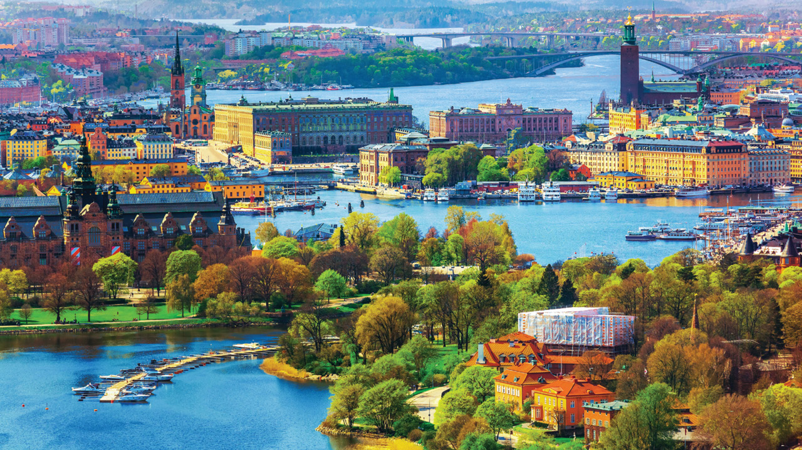

# Swedish Drinks

Sweden's drinking culture covers four traditional traditions: the snaps (akvavit) ritual that punctuates every smörgåsbord and Midsommar feast; the seasonal glögg of Christmas and Lucia Day; the Swedish punsch tradition (almost forgotten, recently revived); and the cordial culture (saft) that's Sweden's non-alcoholic everyday-drink answer to American sodas, every Swedish summer table has a jug of homemade elderflower or lingonberry saft alongside the meal.

The five drinks below cover the traditional range. Each is documented as a standalone drink recipe.
