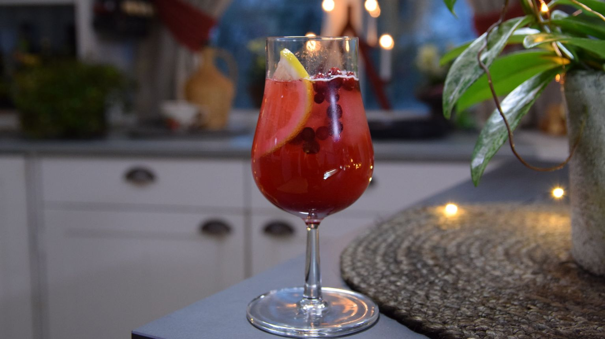

# Lingondricka (Swedish Lingonberry Drink)

*Sweden's tart-sweet lingonberry cordial: fresh or frozen lingonberries simmered with sugar and water into a tangy-sweet syrup, then diluted with cold sparkling water to make the traditional Swedish non-alcoholic table drink. The Swedish summer answer to American sodas; pink, mouth-puckering, and properly cold.*

**Serves:** Makes about 1 litre syrup (yields ~8 litres of dilute drink, about 30 glasses)

**Prep Time:** 10 minutes

**Cook Time:** 20 minutes

## Overview
Lingondricka (literally "lingonberry drink") is one of Sweden's traditional non-alcoholic drinks and a fixture of every Swedish table during summer, Midsommar, and any family meal where kids are present (and adults too - Swedes drink saft, the cordial category, all year). Lingonberries (lingon - the small tart wild berries that grow across Scandinavia and Northern North America, related to American cranberries but smaller, tarter and milder) are simmered with sugar and water into a concentrated syrup (saft, the cordial), then bottled and diluted to taste with cold still or sparkling water just before serving. The result is a vivid pink-red drink that's mouth-puckering tart, gently sweet, and deeply Scandinavian - the same berry that makes the lingonberry preserve served with meatballs, but as a drink.

## Ingredients

### Lingonberry syrup (saft) - makes about 1 litre concentrate
- 1 kg fresh or frozen lingonberries (or substitute with 800g cranberries + 200g raspberries for a similar tart-sweet profile)
- 600 g caster sugar
- 800 ml water
- 1 tablespoon lemon juice (optional; brightens)
- 1 vanilla pod (split; optional)

### Per glass (dilution)
- 60 ml lingonberry syrup
- 250-300 ml very cold sparkling water OR still water
- 2-3 ice cubes
- A small mint sprig or sprig of fresh dill (optional, for the sophisticated version)
- A lemon wheel (optional)

### To serve (the traditional Swedish summer presentation)
- A large clear glass jug (the saft jug)
- Tall glasses
- Plenty of ice
- A wooden spoon for stirring

## Method

### Stage 1 - Cook the berries
1. In a wide saucepan, combine lingonberries, sugar, water, and lemon juice.
2. If using a vanilla pod, add it now.
3. Bring to a gentle simmer over medium heat.
4. Cook 12-15 minutes, stirring occasionally, till the berries have burst and the mixture is bright pink.
5. The liquid should reduce slightly.

### Stage 2 - Strain
1. Pour the cooked berry mixture through a fine sieve set over a clean bowl.
2. Press gently on the solids with the back of a wooden spoon to extract more juice (don't push too hard or the syrup goes cloudy; gentle pressing is right).
3. Discard the pulp (or save for stirring into yogurt or porridge - it's still tasty).

### Stage 3 - Bottle the syrup
1. Pour the strained syrup into a clean sterilised bottle or jar.
2. Cool completely.
3. Refrigerate.
4. The syrup keeps refrigerated 1 month.

### Stage 4 - Dilute and serve
1. In each glass, pour about 60ml of the syrup.
2. Top up with 250-300ml of very cold sparkling water (for a fizzy version) or still water (for the calmer version).
3. Add 2-3 ice cubes.
4. Stir briefly.
5. The drink should be a vivid pink-red with a deep tart-sweet flavour. Adjust the dilution to taste - some Swedes prefer more concentrate (sweeter and tarter); others dilute thinner.

### Stage 5 - Garnish
1. Optional: a small mint sprig or sprig of fresh dill.
2. Or a thin slice of lemon.
3. Serve immediately while very cold.

## Notes
- **Real lingonberries:** the traditional Swedish ingredient. Fresh in Scandinavia in autumn; frozen year-round at IKEA stores worldwide. Substitute fresh cranberries + raspberries works but the flavour is slightly different.
- **Sugar balance:** the traditional Swedish saft is properly sweet. Don't reduce the sugar by more than 20% or it becomes too tart.
- **Serve very cold:** room-temp lingondricka tastes muted.
- **Sparkling vs still:** sparkling is the festive version (Midsommar, parties); still is the everyday version.
- **Don't dilute too thin:** about 1:5 or 1:6 is the traditional concentration. Watery lingondricka is wrong.

## Variations
**Hallonsaft (raspberry cordial):** the same technique with raspberries; Sweden's other big saft tradition.
**Fläderblomssaft (elderflower cordial):** the traditional Swedish summer cordial - see separate recipe.
**With ginger:** add a thumb of grated fresh ginger to the syrup pot for a spicier autumn variant.
**Mulled saft (warm version):** dilute the syrup with hot water + a cinnamon stick + a clove for a winter non-alcoholic mulled drink - particularly good for kids at Christmas.
**Lingondricka cocktail:** combine the syrup with vodka, gin, or akvavit for an alcoholic cocktail variant.
**Lower-sugar version:** swap half the sugar for stevia or erythritol; flavour shifts but works.

## Serving
At Midsommar lunch in the garden (the traditional Swedish midsummer drink, served alongside akvavit for the adults) · at a Swedish summer party as the kids' alternative to alcohol · at a Christmas julbord as the non-alcoholic option · at a fika as a sweet-tart counterpoint to coffee · at a Stockholm restaurant as the local-flavour soft drink.

## Storage
- Lingonberry syrup refrigerates 1 month sealed.
- Pasteurised in jars (heated in a water bath after bottling), the syrup keeps at room temperature 1 year.
- Frozen syrup ice-cubes keep 6 months - perfect for stirring into prosecco or cocktails.
- The diluted drink doesn't store well; mix fresh each time.
