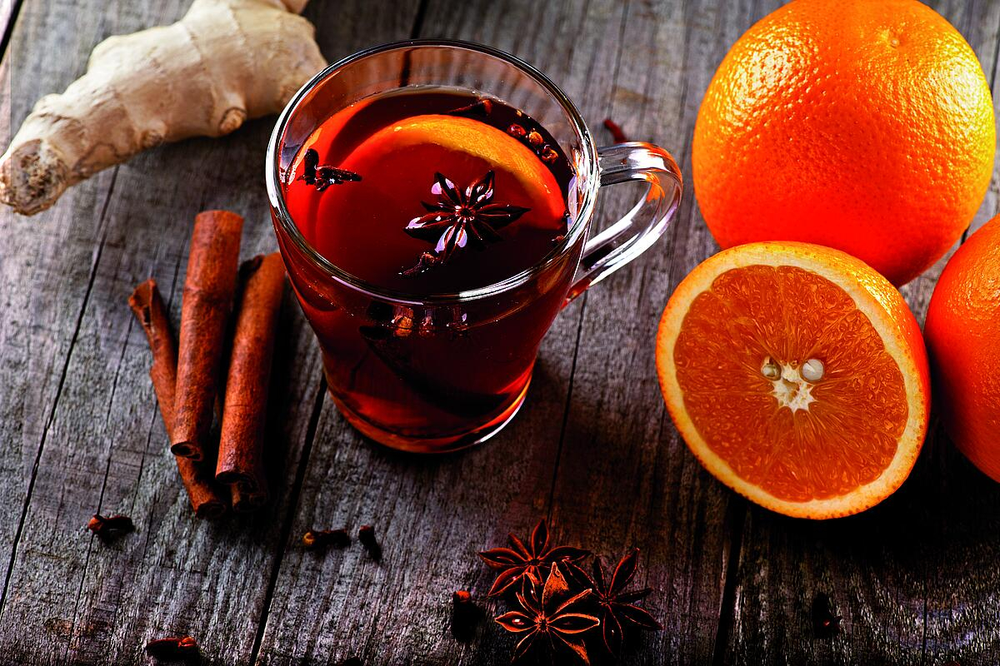

# Swedish Punsch

*Sweden's almost-forgotten 19th-century cocktail: Indonesian arrack rum cut with sugar, citrus and spice, then aged briefly to mellow — a sweet, bright, complex spirit that ruled Swedish drinking culture in the 1800s, was nearly extinguished by Prohibition-era restrictions, and survives today as the post-pea-soup-and-pancakes Thursday-night tradition. Sweden's lost cocktail.*

**Serves:** 6 (small glasses, 60ml each)

**Prep Time:** 15 minutes (plus 1 day to age for proper flavour)

**Cook Time:** None

## Overview
Swedish Punsch is one of the great forgotten spirits of European drinking history and a uniquely Swedish creation: a sweet, complex, citrus-and-arrack-based drink that ruled Swedish dinner culture from the 1700s through to about World War I, when temperance-era restrictions, post-war restructuring of the Swedish state alcohol monopoly, and changing taste fashions almost killed it. Today it survives as a niche but proud Swedish drinking tradition, particularly at university nation dinners and at the canonical Thursday-night tradition of ärtsoppa-och-pannkakor (pea soup followed by pancakes), where Swedish punsch is the canonical after-dinner accompaniment. The construction: Indonesian arrack (Batavia arrack — a sugarcane-and-fermented-rice rum, distilled in Java) is the soul, combined with sugar (a lot of it; punsch is sweet), neutral spirit (or brandy), citric tang (lemon juice + a touch of bitter orange peel), and sometimes a touch of tea, vanilla, or warming spice. The mix is aged a day or two to mellow before bottling. Drunk in small chilled glasses (about 60ml) after dinner or alongside dessert; the canonical Swedish Thursday-night sequence is pea soup → pancakes with jam → small glass of cold punsch with coffee. Three details: BATAVIA ARRACK is the soul (don't substitute with light rum), sweet (don't reduce the sugar — punsch is supposed to be sweet), serve COLD in small glasses.

## Ingredients

- 300 ml Batavia arrack (Indonesian; the canonical Swedish punsch base; substitute with a heavy aged dark rum + 1 tablespoon white vinegar for the slight funk if Batavia arrack is genuinely unavailable, though it won't be the same)
- 200 ml clear vodka OR cognac/brandy
- 300 g caster sugar
- 150 ml water (boiling)
- 100 ml fresh lemon juice (about 3 lemons)
- Peel of 1 lemon (no white pith)
- Peel of 1 bitter orange (Seville orange ideal; or 1 sweet orange + a small piece of grapefruit peel)
- 1 small black tea bag (optional; for depth)
- 1 vanilla pod (split; optional)
- 4 whole cardamom pods (lightly crushed; optional)

### To serve
- Small chilled glasses (60ml — about half the size of a wine glass)
- Or small punsch glasses (vintage Swedish style)
- Strong black coffee in a cup alongside
- Optional: a small piece of pepparkakor (Swedish gingerbread biscuit)

## Method

### Stage 1 - Make the sugar syrup
1. In a saucepan, combine the sugar with the boiling water.
2. Add the lemon peel, orange peel, tea bag (if using), vanilla pod (if using), and crushed cardamom pods (if using).
3. Stir over low heat 3-4 minutes till the sugar fully dissolves.
4. Take off the heat; cool 30 minutes.
5. Strain out the peels, tea bag, vanilla, and cardamom.

### Stage 2 - Combine
1. In a large clean bottle or jug, combine the Batavia arrack, vodka/brandy, sugar syrup, and fresh lemon juice.
2. Stir thoroughly to combine.

### Stage 3 - Age (the canonical step)
1. Seal the bottle.
2. Rest in a cool dark cupboard 24-48 hours.
3. The punsch will mellow and integrate during this rest.
4. (Quick version: skip the rest and serve immediately. The flavour will be brighter and less integrated, but still good.)

### Stage 4 - Strain (optional)
1. If the punsch is cloudy from the citrus peel oils, strain through a fine sieve into a clean bottle.

### Stage 5 - Chill
1. Refrigerate the punsch (or store in a cool place).
2. Before serving, place in the freezer 30 minutes for the canonical ice-cold serving temperature.

### Stage 6 - Serve
1. Pour into small chilled glasses (about 60ml per glass).
2. Serve cold after dinner alongside hot strong black coffee.
3. The canonical Swedish sequence: pea soup → pancakes with lingonberry jam → small glass of cold punsch + coffee.

## Notes
- **Batavia arrack is the soul:** an Indonesian sugarcane-and-rice fermented spirit. Imported into Sweden in volume by the Swedish East India Company in the 1700s. Substitute aged heavy rum if you really can't find it, but accept the result won't be canonical.
- **Sweet:** Swedish punsch is supposed to be sweet. Don't reduce the sugar.
- **Serve cold:** the canonical Swedish presentation. Even slightly room-temp punsch loses its appeal.
- **Age 24-48 hours:** improves significantly.
- **Thursday-night ritual:** the canonical Swedish slot — after ärtsoppa-och-pannkakor.

## Variations
**Cold punsch (the canonical):** as above, served chilled.
**Warm punsch (heated):** in winter, gently warm a punsch + a splash of hot water for a hot toddy version. Don't boil.
**Punsch-rolle (the bakery treat):** a Swedish punsch-flavoured pastry roll filled with green marzipan, dipped in chocolate ends — a sweet adaptation.
**With ice:** modern Stockholm bars serve punsch on the rocks with a citrus twist.
**As a base for cocktails:** Swedish bartenders increasingly use punsch in cocktails — Punsch Sour, Punsch Negroni — for the depth and sweetness.

## Serving
On Thursday nights after ärtsoppa-och-pannkakor (the canonical Swedish weekly ritual; pea soup + pancakes + punsch) · at university nation dinners in Uppsala or Lund (Swedish university culture preserved punsch through the 20th century) · at a Swedish dinner-party finale alongside coffee and small biscuits · at a Nordic cocktail bar as a curiosity.

## Storage
- Made punsch keeps indefinitely in a sealed bottle in a cool dark place; improves with age.
- Don't refrigerate long-term (it gets too thick and viscous); freeze briefly before serving.
- Once opened, the bottle keeps 6 months in a cool place.
