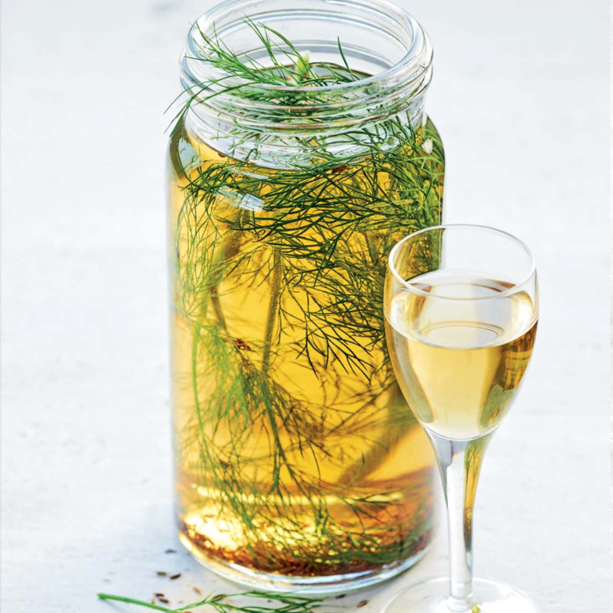

# Snaps / Akvavit (Swedish Caraway Spirit)

*Sweden's national herb-and-caraway-flavoured spirit: a clear potato or grain alcohol infused with caraway seeds, dill, fennel and other Scandinavian herbs, served in tiny ice-cold glasses with the smörgåsbord. Drunk between bites of pickled herring with snapsvisor (snaps songs) sung before each round; the social glue of every traditional Swedish meal.*

**Serves:** 8 (each gets one small shot per round; figure 3-4 rounds per smörgåsbord)

**Prep Time:** 5 minutes (assumes pre-bottled akvavit) OR 1 week (for home infusion)

**Cook Time:** None

## Overview
Snaps (Swedish for "spirit shot") is the umbrella term for the ice-cold flavoured neutral-grain or potato spirit that accompanies every traditional Swedish meal involving cured fish, pickled herring or the smörgåsbord. The most common style is akvavit (literally "water of life") - a clear potato or grain spirit infused with caraway as the dominant flavour, often with dill, fennel, anise, coriander seed, citrus peel, or other Scandinavian herbs and spices. The canonical Swedish brands are Skåne Akvavit (caraway-dill-fennel forward, smooth) and OP Anderson (heavily caraway, oak-aged for darker colour and warmth). Served in tiny straight-sided glasses (about 40ml - the canonical snaps glass), ice-cold from the freezer, with a small piece of pickled herring or gravlax balanced on a slice of crispbread between each sip. The Swedish ritual: a snapsvisa (snaps song - there are hundreds of these short rhyming drinking songs, from the gentle "Helan går" to bawdier variants) is sung by the host or table at the start of each round; the snaps is then downed in one swallow or sipped slowly depending on preference. The ritual repeats throughout the meal, building joviality and slowing the eating pace.

## Ingredients

### Option A: Bottled akvavit (the canonical Swedish way)
- 1 bottle (700 ml) Skåne Akvavit OR OP Anderson Akvavit OR Aalborg Taffel Akvavit (Danish, similar)

### Option B: Home-infused snaps (1-week infusion)
- 700 ml clear neutral vodka (a smooth one - Absolut, Smirnoff Black, or any quality potato vodka)
- 3 tablespoons caraway seeds (whole)
- 1 tablespoon fennel seeds
- 1 tablespoon dill seeds (or 4 fresh dill sprigs)
- 1 teaspoon anise seeds OR 1 star anise pod
- 1 teaspoon coriander seeds
- Peel of 1 lemon (no white pith)
- Peel of ½ orange
- 1 tablespoon caster sugar (optional; balances)

### Equipment
- A glass infusion jar (1 litre, sealable)
- A fine sieve
- A coffee filter (for final straining)
- Small (40ml) straight-sided shot glasses ("snaps glasses")

### To serve (per round)
- 1 piece pickled herring (or gravlax) on a small piece of crispbread or rye bread
- A sprig of fresh dill
- A small pinch of flaky salt

### To serve (the meal alongside)
- A smörgåsbord OR a Midsommar lunch OR a Christmas julbord OR (at minimum) a plate of pickled herring + crispbread + boiled new potatoes + sour cream + chopped chives

## Method

### Stage 1A - Option A: Bottled akvavit
1. Place the unopened bottle in the freezer 24 hours before serving.
2. (Akvavit, with its high alcohol content, won't freeze; it'll just become syrupy-cold and viscous - the canonical "ice-cold from the freezer" Swedish presentation.)
3. Skip to Stage 4.

### Stage 1B - Option B: Home-infused (1-week version)
1. Lightly crush the caraway, fennel, dill, anise, and coriander seeds in a mortar (release the oils without pulverising).
2. Add all the seeds, citrus peels, and sugar (if using) to a 1-litre glass jar.

### Stage 2 - Pour vodka over
1. Pour the bottle of vodka over the spices.
2. Seal the jar tightly.

### Stage 3 - Infuse 1 week
1. Place in a cool dark cupboard for 1 week.
2. Shake the jar gently every 2 days.
3. The vodka will turn pale amber-yellow with hints of green from the herbs.
4. Taste at day 5: if mild, let infuse the full 7 days; if already strong, strain at day 5.

### Stage 4 - Strain and chill
1. Strain the infused vodka through a fine sieve into a clean bottle.
2. For extra clarity, strain a second time through a coffee filter.
3. Seal the bottle.
4. Place in the freezer 24 hours.

### Stage 5 - The serving ritual
1. Place the snaps glasses in the freezer 15 minutes before serving (or fill an ice bucket and rest the glasses on the ice).
2. Pour the ice-cold snaps into each frosted glass to about ¾ full (~30 ml).
3. Lay each glass on a small plate with a piece of pickled herring on crispbread alongside.

### Stage 6 - The snapsvisa (snaps song)
1. The host raises their glass and begins a snapsvisa.
2. The most universal: "Helan går, sjung hopp faderallan lallan lej / Helan går, sjung hopp faderallan lej / Och den som inte helan tar, han heller inte halvan får / Helan går, sjung hopp faderallan lej" (loose translation: "Down it goes, sing whoopee tra-la-la / Down it goes, sing whoopee tra-la / And he who doesn't take the whole one, doesn't get the half one either / Down it goes, sing whoopee tra-la").
3. Everyone joins in.
4. At the end of the song, everyone shouts "Skål!" (cheers) and downs (or sips) the snaps.
5. Eat the pickled herring + crispbread immediately after.

### Stage 7 - Repeat
1. A traditional Swedish meal has 3-4 rounds of snaps spaced through the meal.
2. Each round gets a different snapsvisa (the host or the table comes up with one).
3. Between rounds, eat, drink water or beer, talk, slow down.

## Notes
- **ICE-COLD from the freezer:** non-negotiable. Room-temp akvavit tastes hot and harsh.
- **TINY glasses (40ml):** the snaps glass is small for a reason. You're sipping a flavoured spirit, not chugging vodka.
- **Salt-cured food alongside:** the salt of the herring/gravlax cuts the spirit's burn.
- **The snapsvisa is part of the ritual:** even a brief song or toast. It slows the drinking and builds conviviality.
- **Spaced rounds:** 3-4 rounds across a 2-hour meal is the canonical pace. Don't gulp them in succession.

## Variations
**OP Anderson style:** caraway-heavy, oak-aged. Use OP Anderson Akvavit; warmer flavour.
**Bäska Droppar:** the Swedish bitter wormwood-and-citrus snaps. Acquired taste.
**Brännvin (plain unflavoured):** a clear unflavoured Swedish spirit. Simple.
**Hallonbåtar (raspberry snaps):** infuse the vodka with raspberries + sugar for a sweeter dessert-end snaps.
**Aquavit cocktails (modern):** akvavit in cocktails (Akvavit Martini, Aquavit Sour, Negroni with akvavit) - non-canonical but increasingly popular.

## Serving
At every traditional Swedish meal involving cured fish or the smörgåsbord · at the Christmas julbord · at Midsommar lunch in the garden · at Easter brunch · at a Nordic-themed dinner party.

## Storage
- Bottled akvavit keeps indefinitely.
- Home-infused snaps keeps in a sealed bottle 6 months in a cool dark place; 1 year+ in the freezer.
- Once opened, refrigerate.
- The infusion can be replenished: top up the spent spice jar with fresh vodka and let infuse another week for a milder second batch.
