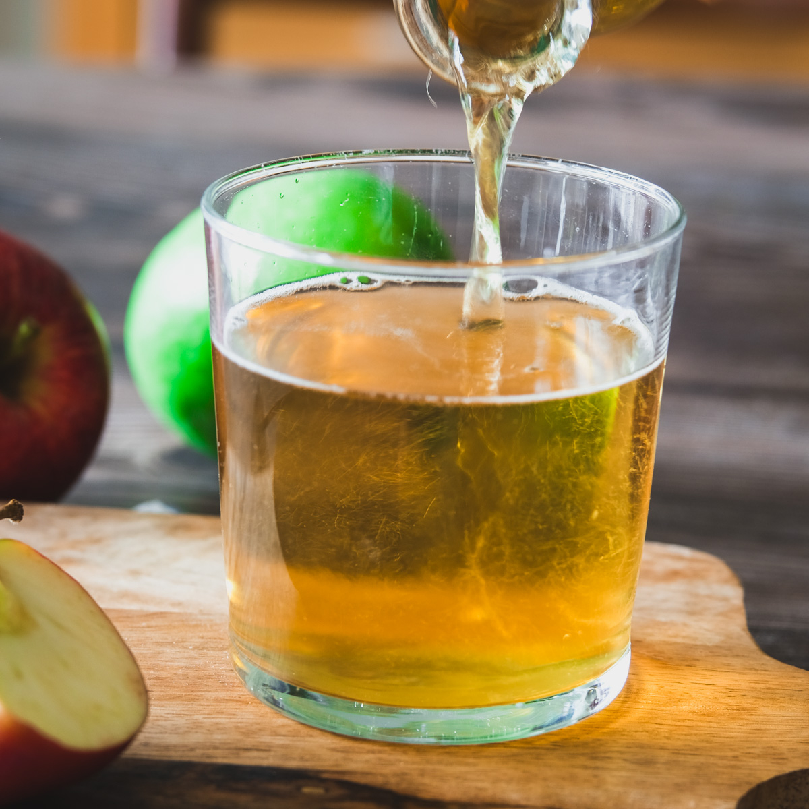

# Apfelschorle

*Cloudy apple juice cut with sparkling water: 50-50, served over ice with a slice of lemon. Switzerland and Germany's universal non-alcoholic drink at every restaurant table.*

**Serves:** 4 tall glasses

**Prep Time:** 2 minutes

**Cook Time:** None

## Overview
Apfelschorle - "apple fizz" in German - is the half-and-half mix of cloudy apple juice with sparkling water that's the standard non-alcoholic drink in Switzerland and Germany. It works for the same reason every spritz works: the sparkling water lightens a juice that would otherwise be cloying, the juice adds body to water that would otherwise be plain. The ratio is sacred at 50-50 (or sometimes 40 juice / 60 water in Switzerland, where it tends slightly drier). The juice is cloudy, unfiltered apple juice (naturtrüb in German) - clear filtered juice is technically possible but loses the appley body. Lemon slice optional but typical. The drink children get when the adults drink wine; the drink adults get when they want something non-alcoholic that isn't sweet soda.

## Ingredients
- 600 ml cloudy unfiltered apple juice (naturtrüb), chilled
- 600 ml sparkling water, chilled
- Plenty of ice cubes
- 1 lemon, sliced into rounds
- A few sprigs of mint (optional)

## Method

### Stage 1 - Chill everything
1. Both the apple juice and the sparkling water should be cold from the fridge.
2. Warm-ingredient Apfelschorle gets watery as the ice melts to bring it to temperature.

### Stage 2 - Fill the glasses
1. Half-fill 4 tall glasses with ice cubes.
2. Pour the apple juice over the ice, filling each glass halfway.
3. Top up to the rim with sparkling water.
4. Stir once with a long spoon to combine; don't over-stir or you knock the fizz out.

### Stage 3 - Garnish
1. Slip a slice of lemon into each glass against the rim.
2. Add a sprig of mint if using.

### Stage 4 - Serve
1. Immediately, while the bubbles are still active.

## Notes
- **Cloudy vs clear apple juice:** Cloudy apple juice (naturtrüb) is the only correct option in Switzerland. The cloudiness comes from suspended apple solids and gives the drink body and depth. Clear filtered juice tastes thin and overly sweet in the same role.
- **The ratio:** 50-50 is the standard. Adjust to taste: more juice for sweeter (children's version), more sparkling water for drier (sports drink version). Don't go below 30 juice / 70 sparkling - it stops tasting like apple.
- **Sparkling water:** A neutral sparkling water (Apollinaris, Gerolsteiner medium, San Pellegrino) is correct. Don't use heavily mineral water that competes with the apple, and don't use tonic water - that's a different drink.

## Serving
Serve with any meal in place of wine; with sausages; at picnics; on hot afternoons; alongside cake at coffee time. The universal non-alcoholic drink.

## Storage
- Make per serving; the fizz dies if pre-mixed.
- The apple juice once opened keeps refrigerated 5 days.
- Sparkling water in an opened bottle keeps fizz 3 days if recapped tightly.
