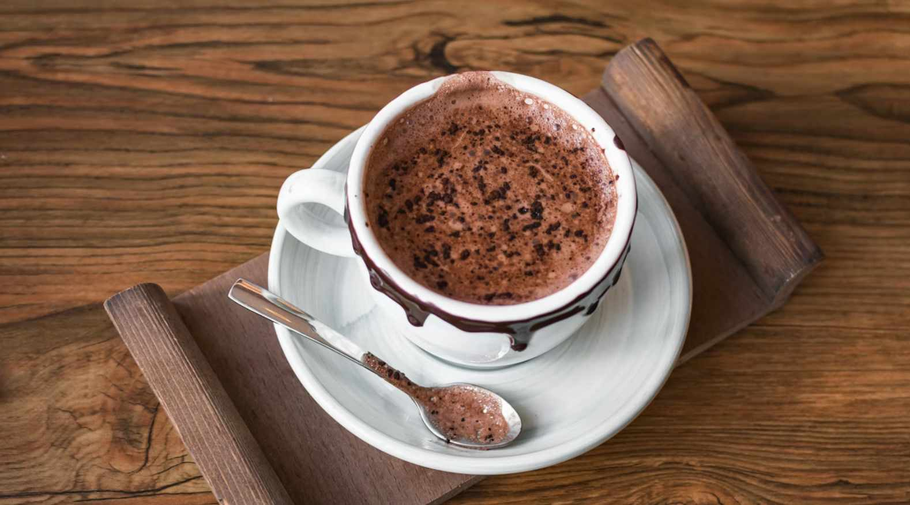

# Swiss Hot Chocolate

*Switzerland's after-ski cup: real dark chocolate melted into hot milk and cream, finished with a dusting of cocoa or a softly whipped cream cap. Nothing like the powder-and-water version.*

**Serves:** 4 mugs

**Prep Time:** 5 minutes

**Cook Time:** 10 minutes

## Overview
Switzerland built the modern chocolate bar, and the Swiss home hot chocolate is essentially a melted chocolate bar in warm milk - not the watery powdered drink served by international chains. The technique is simple: heat milk and a little cream just below a simmer, drop in finely chopped good-quality dark chocolate, whisk until smooth. The result is thick enough to coat the back of a spoon, deeply chocolaty, and warm rather than scalding. A pinch of salt brings the flavour forward; a drizzle of vanilla or a small splash of brandy turns it into an adult drink. Topped with whipped cream and shaved chocolate it's a winter standby in mountain restaurants, served after long days on the snow.

## Ingredients
- 600 ml whole milk
- 200 ml double cream (or 800 ml milk total if avoiding extra cream)
- 200 g good-quality dark chocolate (60-70% cocoa solids), chopped fine
- 2 tbsp caster sugar (adjust to taste, depending on chocolate sweetness)
- 1 tbsp cocoa powder (for deeper colour and flavour)
- 1 tsp vanilla extract
- A pinch of fine salt
- A pinch of ground cinnamon (optional)

### To serve
- Softly whipped cream (whip 150 ml double cream to soft peaks; no sugar needed)
- Cocoa powder for dusting
- Shaved dark chocolate
- Optional: 30 ml Kirsch or rum per mug

## Method

### Stage 1 - Chop the chocolate
1. Use a serrated knife to chop the chocolate into small even pieces - the smaller the better for fast even melting.

### Stage 2 - Heat the milk
1. Combine the milk and cream in a heavy saucepan.
2. Add the cocoa powder, sugar, salt and cinnamon (if using); whisk to combine.
3. Heat over medium-low heat, whisking, until small bubbles form around the edge and the milk is steaming - just below a simmer.

### Stage 3 - Add the chocolate
1. Reduce heat to low.
2. Tip in the chopped chocolate; whisk continuously for 2-3 minutes until fully melted and smooth.
3. Stir in the vanilla.
4. The texture should coat the back of a wooden spoon thickly but still be drinkable. If too thick, loosen with a splash of warm milk; if too thin, whisk in another small piece of chocolate.

### Stage 4 - Taste
1. Taste for sweetness; add more sugar a teaspoon at a time if needed.
2. If using brandy or Kirsch, stir in off the heat now.

### Stage 5 - Serve
1. Pour into warm mugs.
2. Top each with a generous spoon of whipped cream.
3. Dust with cocoa powder or shaved chocolate.
4. Serve immediately with a long spoon.

## Notes
- **Quality chocolate is the entire dish:** A 70% cocoa solid dark bar tastes like a 70% hot chocolate. Bargain chocolate gives a thin, waxy drink. Lindt, Cailler, Callebaut, Valrhona all work; supermarket "cooking chocolate" doesn't.
- **Don't boil:** Just below a simmer is the target. Boiling damages the chocolate's smooth texture - it can grain or separate.
- **Salt:** A pinch is non-optional. It makes the chocolate taste more chocolaty by suppressing bitterness perception.

## Serving
Serve in winter, ideally after coming in from the cold. With a slice of Engadiner Nusstorte or a few Basler Läckerli alongside. Or as a dessert in its own right after a heavy fondue meal.

## Storage
- Best fresh; the cocoa solids separate as it sits.
- Leftover hot chocolate refrigerates 2 days; reheat gently, whisking. The texture won't be quite as silky second time round.
- The base (milk + chocolate, no cream) can be made ahead and reheated; add whipped cream fresh.
