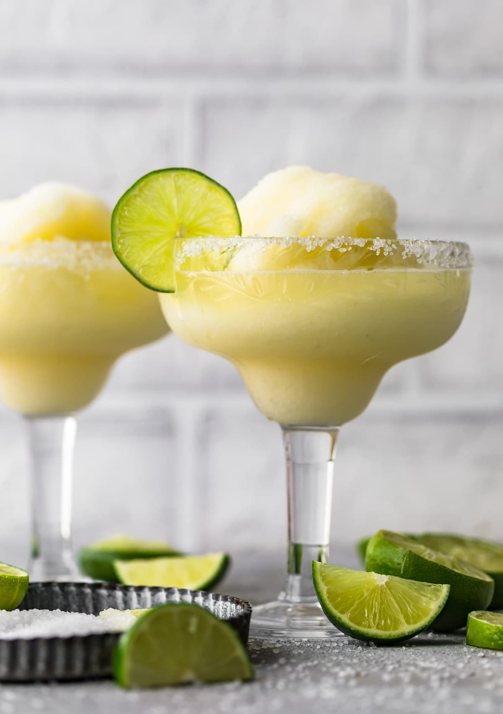

# Frozen Margarita

*The San Antonio invention, 1971: tequila, triple sec, lime and ice blended into a thick green slush, poured from a slushy machine into a salt-rimmed goblet. Mariano's Mexican Restaurant changed the world.*

**Serves:** 2

**Prep Time:** 5 minutes

## Overview
The frozen margarita machine was invented in 1971 by Mariano Martinez at his Mexican restaurant in Dallas. Frustrated by the inconsistent margaritas his bartenders were turning out (some too icy, some watery, some too strong), he adapted a soft-serve ice cream machine to dispense a pre-mixed frozen margarita on demand. The result was an instant Texan classic, and the original machine is now in the Smithsonian.

The home version uses a blender. The recipe is straightforward: tequila, triple sec, fresh lime juice, simple syrup and a generous amount of ice, blended until smooth and slushy. The flavour is essentially the same as a shaken classic margarita, but the texture and the temperature are different: more dessert-like, more drinkable in the heat, more substantial.

The recipe below is the home version. For best results, salt the rim, use fresh lime, and don't skimp on the tequila.

## Ingredients
- 100 ml blanco tequila (100% agave)
- 50 ml Cointreau or triple sec
- 60 ml fresh lime juice (about 3 limes)
- 30 ml simple syrup (or 2 tbsp granulated sugar)
- 1 tsp lime zest (optional)
- 500 g ice cubes (about 4-5 cups)
- Flaky sea salt or kosher salt (for the rim)
- 2 lime wedges (1 for rim, 1 for garnish per glass)

## Method

### Stage 1 - Rim the glasses
1. Cut a small notch in a lime wedge and run it around the rim of each margarita glass to wet the edge.
1. Dip the wet rim into a small plate of salt, turning to coat evenly. Set the glasses aside.

### Stage 2 - Blend
1. Add the tequila, Cointreau, fresh lime juice, simple syrup and lime zest to a high-powered blender.
1. Add the ice on top.
1. Start on low, gradually ramp to high. Blend for 30-45 seconds until smooth, slushy and uniformly thick.
1. The texture should be like a thick smoothie: pourable but holds its shape briefly when scooped.

### Stage 3 - Pour
1. Pour into the salt-rimmed glasses, filling generously.
1. Garnish each with a lime wedge hooked on the rim.
1. Serve with a wide straw.

## Notes
- **A powerful blender matters.** A standard blender struggles with ice; the drink ends up chunky. If yours is underpowered, use crushed ice instead of cubes, or upgrade to a Vitamix.
- **Fresh lime juice, never bottled.** The single biggest difference between a great frozen margarita and a forgettable one.
- **100% agave tequila.** Mixto tequila (the kind that doesn't say 100% agave) carries an undertone of harsh alcohol that gets amplified in the slushy texture; spend the small extra on a real blanco.
- **Cointreau over generic triple sec.** Cointreau has the right balance of orange and weight; cheaper triple secs are too sweet or too acrid.
- **The salt rim is non-negotiable.** A frozen margarita without salt is a slushie. The salt on the lip is what makes each sip taste correct.

## Variations
- **Strawberry margarita:** add 200 g fresh or frozen strawberries to the blend. Reduce ice slightly.
- **Mango margarita:** add 200 g fresh or frozen mango chunks to the blend.
- **Watermelon margarita:** add 300 g cubed watermelon (deseeded). Summer-perfect.
- **Spicy margarita:** muddle 2-3 slices of jalapeño with the lime juice before blending; strain the seeds out if you don't want heat.
- **Top-shelf:** swap the Cointreau for Grand Marnier and add a 30 ml float of Grand Marnier on top after pouring. Mariano's premium move.

## Serving
A frozen margarita is a porch-and-pool drink, the cocktail for a Texas summer. Pairs effortlessly with chips and queso, tacos, fajitas, and the company of others. One is plenty; two is the standard.

## Storage
The drink does not keep; it slumps within 15-20 minutes. Make in batches: the rule of thumb is to make a fresh blender's worth every 30 minutes for a party, rather than holding a large pitcher that goes watery.
