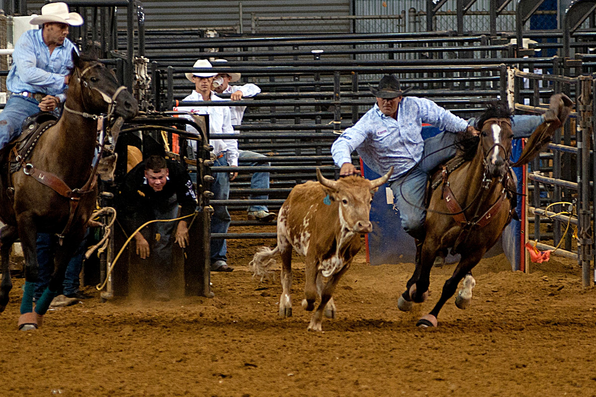

# Drinks of Texan

Tex-Mex and porch-drinking: ranch water (tequila straight from a Topo Chico bottle) in the West Texas heat, the frozen margarita (invented in San Antonio, 1971), micheladas at every taco lunch, sweet tea spiked with bourbon in the rocking-chair hours. Tequila, mezcal and ice in heroic quantities.
