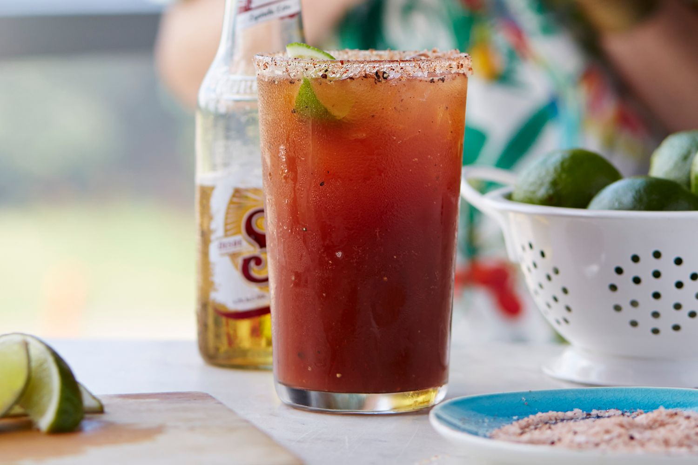

# Michelada

*Tex-Mex beer cocktail: Mexican lager poured over ice with lime, hot sauce, Worcestershire and a salt-and-chilli rim. The morning-after drink and the daytime drink and the lunchtime drink. The Bloody Mary's lighter brother.*

**Serves:** 1

**Prep Time:** 3 minutes

## Overview
The michelada is a Mexican beer cocktail that crossed the border into Texas decades ago and embedded itself in Tex-Mex bar culture. The basics are simple: a Mexican lager (Pacifico, Modelo, Tecate, Corona) poured over ice into a tall glass, with lime juice, hot sauce, Worcestershire sauce, salt and a salt-and-chilli rim. The result is a tangy, salty, slightly spicy long drink, somewhere between a beer and a Bloody Mary, with a low alcohol content that lets you drink it through a long afternoon.

Several variations exist. The "chelada" is just beer, lime and salt (the simplest version). The "michelada cubana" adds tomato or Clamato juice for a fuller, Bloody-Mary-style drink. The base Texan version below sits between the two: lime, hot sauce, Worcestershire, no tomato.

Regional Tex-Mex bars often have a signature michelada that builds on this base; some add soy sauce, others use Clamato exclusively, others add a generous splash of tequila for a "michelada loca". The recipe below is the bracingly fresh classic.

## Ingredients
- 1 bottle Mexican lager (Pacifico, Modelo Especial, Tecate or Corona; 355 ml)
- 30 ml fresh lime juice
- 2 tsp Worcestershire sauce
- 2 tsp Louisiana hot sauce (Crystal, Cholula or Valentina)
- 1 tsp soy sauce (optional, adds depth)
- Pinch of black pepper
- Ice cubes
- 1 lime wedge (for rimming)

### Tajín rim (or salt and chilli mix)
- 1 tbsp Tajín seasoning (or 1 tsp coarse salt + 1 tsp chilli powder + ½ tsp lime zest)

## Method

### Stage 1 - Rim the glass
1. Pour the Tajín or salt-chilli mix onto a small flat plate.
1. Run a lime wedge around the rim of a tall pint glass to wet it.
1. Dip the rim into the Tajín, turning to coat evenly. Set aside.

### Stage 2 - Build the drink
1. Fill the rimmed glass two-thirds with ice cubes.
1. Add the lime juice, Worcestershire sauce, hot sauce, soy sauce (if using) and a pinch of black pepper.
1. Stir briefly with a long spoon to combine.

### Stage 3 - Pour the beer
1. Open the bottle of lager. Pour slowly down the side of the glass to minimise foaming, until the glass is full (about three-quarters of the bottle).
1. Leave the remaining beer in the bottle on the table; it will top up the glass as you drink.

### Stage 4 - Serve
1. Stir very gently once with a straw to lift any settled sauce from the bottom.
1. Serve at once.

## Notes
- **Mexican lager is the right beer.** Crisp, light, slightly malty Mexican lagers are built for this cocktail. American light lagers (Bud, Coors) work but are thinner; pilsners get overpowered; IPAs and craft beers fight the lime and sauce.
- **Tajín or the salt-chilli mix.** Tajín is a Mexican lime-and-chilli salt sold in shaker bottles; it is the easiest way to get the right rim. Homemade equivalent: coarse salt, chilli powder and lime zest in equal parts.
- **Fresh lime, not bottled.** The drink leans heavily on bright citrus; bottled juice flattens the whole thing.
- **Pour slowly.** Carbonation lift is the structural difference between a good michelada and a foamy mess. Pour against the side of the glass.
- **Adjust to taste.** Hot sauce, Worcestershire and salt all scale with personal preference. Two teaspoons of each is the starting point; serious enthusiasts go higher.

## Variations
- **Michelada cubana:** add 60 ml Clamato (clam-and-tomato juice) or tomato juice in stage 2. Fuller, Bloody-Mary-style.
- **Michelada con tequila:** add 30 ml blanco tequila in stage 2. A stronger drink that walks closer to a Bloody Maria.
- **Chelada:** the simplest version. Lime, salt and beer only. No hot sauce, no Worcestershire. A summer afternoon drink.
- **Spicy michelada:** muddle a few slices of jalapeño with the lime juice in stage 2. Adds a fresh green-pepper heat alongside the bottled hot sauce.

## Serving
- A michelada is a daytime drink. Pair with anything Tex-Mex (tacos, queso, fajitas, nachos), or any spicy food generally. The cocktail's low alcohol and long-drink character means it lasts; a single bottle of beer in the glass gives a 30-45 minute cocktail.

## Storage
Build to order. The flavoured mix at the bottom of the glass (lime, Worcestershire, hot sauce) can be prepped in advance and held briefly, but the beer must be opened and poured fresh; the cocktail loses its character as it goes flat.
