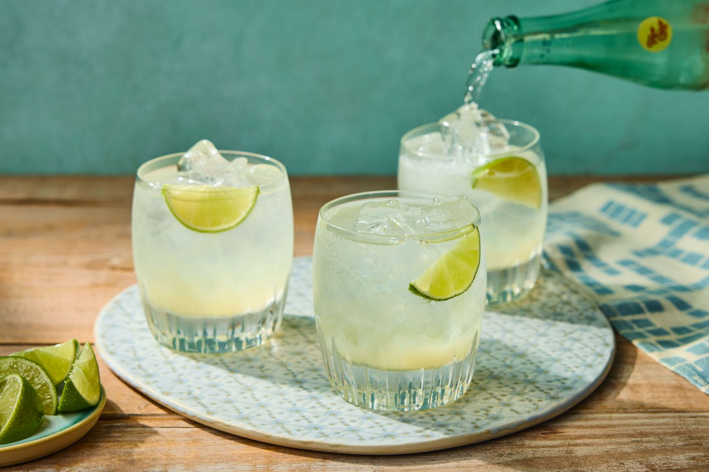

# Ranch Water

*The West Texas highball: tequila, fresh lime, salt and a topped-up bottle of Topo Chico mineral water, drunk straight from the bottle on a porch. Three ingredients, two minutes, the cleanest cocktail in Texas.*

**Serves:** 1

**Prep Time:** 2 minutes

## Overview
Ranch Water is a West Texan invention from the Big Bend region, where the heat of the desert pushed drinkers toward something cold, salty, slightly fizzy and refreshing without the cloying sweetness of a margarita. The drink is essentially a tequila-and-mineral-water highball built around the specific qualities of Topo Chico (a Mexican sparkling mineral water with a distinctive heavy mineral profile and aggressive carbonation; bottled in a clear glass bottle with a long neck). A glug of tequila, a squeeze of lime, a pinch of salt, top up with Topo Chico, drink directly from the bottle.

The minimal recipe means everything depends on the ingredients: a good 100% agave blanco tequila, a fresh-squeezed lime, and Topo Chico itself (other sparkling waters work but the drink is named for and built around Topo Chico). The salt is optional but classic.

## Ingredients
- 60 ml blanco tequila (100% agave; Espolòn, Cazadores, Casamigos, etc.)
- 20 ml fresh lime juice (about ½ lime)
- 1 small pinch flaky sea salt (Maldon or kosher)
- 1 chilled 355 ml bottle Topo Chico mineral water
- 1 lime wedge, to garnish

## Method

### Stage 1 - Open the bottle
1. Take a chilled bottle of Topo Chico from the fridge. Open and take a small swig to make room.

### Stage 2 - Build the drink
1. Pour the tequila directly into the bottle.
1. Squeeze the lime juice in.
1. Add the pinch of salt.
1. Cap the bottle (loosely with your palm) and invert once or twice to combine. The carbonation will lift gently; do not shake.

### Stage 3 - Garnish and serve
1. Hook a lime wedge over the neck of the bottle if you are feeling formal.
1. Drink directly from the bottle. (This is the correct service; a glass is optional.)

## Notes
- **Topo Chico is the recipe.** Other sparkling waters work but produce a different drink. La Croix is too soft; San Pellegrino is too earthy; Schweppes is too sweet. Topo Chico has a particular minerality and a hard, dry carbonation that makes the cocktail what it is.
- **Blanco tequila, not reposado or añejo.** Aged tequilas push the drink toward bourbon-cocktail territory and overpower the mineral water. Blanco is clean and bright.
- **Fresh lime, never bottled.** The lime is half the cocktail; bottled juice flattens it entirely.
- **Drink from the bottle.** This is structural to the experience and to the West Texas authenticity. Pouring into a glass dissipates the carbonation and the drink becomes flat in two minutes.
- **Salt is optional.** A pinch of salt brightens the lime and balances the sweetness of the agave; many drinkers prefer it without. Take a side.

## Variations
- **With grapefruit:** 15 ml fresh grapefruit juice in addition to the lime. A paloma-Ranch-Water hybrid.
- **Spicy ranch water:** muddle a thin slice of jalapeño with the lime juice before adding. Adds a green-pepper heat.
- **Smoky ranch water:** swap the blanco tequila for mezcal. Different drink, equally Texan.

## Serving
A porch drink. Best consumed standing up, in the late afternoon, looking at a horizon. Pairs well with chips and salsa, brisket sandwiches, or just a bag of saltines.

## Storage
Build to order. Topo Chico is best chilled and consumed within 30 minutes of opening; it loses carbonation surprisingly fast.
