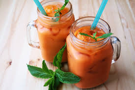

# Cha Yen (Thai Iced Tea)

*Thailand's signature orange-coloured iced tea: strong Ceylon black tea steeped with star anise, cardamom and a touch of food colouring (or pandan), pulled together with condensed and evaporated milk, poured over a tall glass of crushed ice. Sweet, creamy, faintly spiced, sold from every street cart and food court in Bangkok.*

**Serves:** 2 tall glasses

**Prep Time:** 5 minutes

**Cook Time:** 8 minutes (plus 30 minutes to cool the brew)

## Overview
Cha yen (literally "cold tea") is Thailand's national soft drink, and its signature vivid orange colour is the giveaway: the colour comes partly from the strong Ceylon black tea base, partly from added orange food colouring that Thai tea blends include for visual identity, and traditionally from a touch of tamarind for tang. The brewing technique is a long strong steep with a few aromatics (star anise, cardamom, sometimes a single clove or a strip of pandan), strained, sweetened with sugar, then layered at serving over a tall glass of crushed ice with a generous splash of evaporated milk on top and a final drizzle of sweetened condensed milk that swirls slowly through the orange. Drink with a thick straw and stir as you go; the colours marble together as the milk descends. At home the easiest path is a Thai-branded tea like Cha Tra Mue (the Red Cha brand) which already includes the colouring and aromatics, but you can build the same drink from any strong Ceylon plus the spices.

## Ingredients

- 4 tablespoons Thai tea mix (Cha Tra Mue / Red Cha brand) OR 4 tablespoons strong Ceylon black loose-leaf tea + 2 star anise + 4 cardamom pods + 1 clove
- 600 ml boiling water
- 4 tablespoons caster sugar (adjust to taste; Thai street version is very sweet)
- 6 tablespoons evaporated milk
- 4 tablespoons sweetened condensed milk
- Plenty of crushed ice

### To serve
- 2 tall glasses, chilled
- Long-handled spoons

## Method

### Stage 1 - Brew strong
1. Put the Thai tea mix (or the loose Ceylon plus aromatics) into a small heatproof teapot or a saucepan.
1. Pour over the boiling water and let steep for 5 minutes. The brew should turn a deep mahogany; with Thai tea mix it goes a vivid orange-red.
1. Strain through a fine sieve into a jug. Discard the leaves and spices.

### Stage 2 - Sweeten and cool
1. While still hot, stir in the caster sugar until completely dissolved. Taste: the brew should be aggressively sweet (about 1.5 to 2 teaspoons per cup of finished drink). Adjust up if it tastes flat.
1. Cool to room temperature, then refrigerate 30 minutes minimum. Cha yen is built over ice so the brew should not melt the ice instantly.

### Stage 3 - Build the glass
1. Fill each chilled tall glass three-quarters full with crushed ice.
1. Pour the chilled tea over the ice until the glass is about two-thirds full of liquid.
1. Add 3 tablespoons of evaporated milk to each glass; the milk will sink and create a paler cloudy layer at the bottom.
1. Drizzle 2 tablespoons of sweetened condensed milk on top; it sinks slowly, swirling through the orange.

### Stage 4 - Serve
1. Serve immediately with a thick straw and a long spoon. The drinker stirs as they sip to combine the layers.

## Notes
- **Thai tea mix versus DIY.** The Cha Tra Mue brand includes the aromatics, the orange food colouring and a precise tea-strength blend; you'll get the most authentic flavour from it. The DIY route (strong Ceylon + spices) gives a closer but less vividly coloured drink.
- **Sweet by default.** Real Thai street cha yen is very sweet; that's the drink. If you want it less sweet, start at 2 tablespoons sugar per 600 ml brew and increase to taste, but don't go too low or it loses character.
- **Both milks.** Evaporated milk gives body; sweetened condensed gives the visual drizzle and extra sweetness. Together they're the signature. Substituting fresh milk gives a thinner, less interesting drink.
- **Crushed ice over cubes.** The drink is built on a tall mound of crushed ice that slowly melts in as you drink. Cubes sit at the bottom and don't dilute evenly.

## Variations
- **Cha dam yen.** The black version: no milk, just sweetened tea over ice with a squeeze of lime. Lighter, sharper, cleaner.
- **Cha manao.** Sweetened tea with fresh lime juice, no milk. A refresher in hot weather.
- **Hot cha yen.** Same brew + milks, served hot. The cold version is far more common but the hot version exists in cooler northern Thai weather.
- **Pandan-infused.** Add a knotted pandan leaf to the brew alongside the spices for a slightly floral note.

## Storage
- The sweetened tea brew keeps 3 days in a sealed jug in the fridge. Build glasses over ice with milks added at serving; pre-assembled glasses go cloudy and unappealing within 20 minutes.
