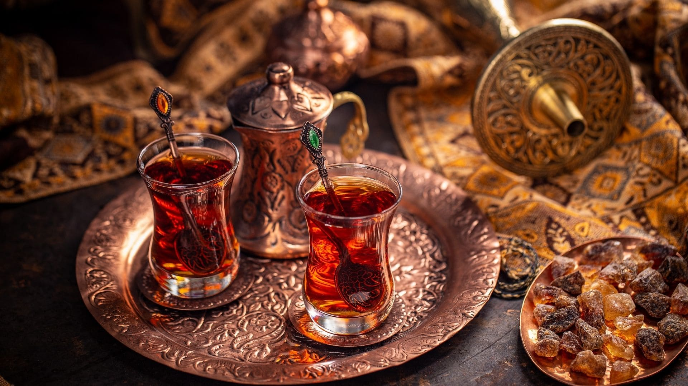

# Drinks of Turkey

Ayran, the savoury yogurt drink served alongside every kebab in the country; Türk kahvesi, the small grainy coffee served with a glass of water and a piece of lokum; çay, the strong black tea poured from a samovar into tulip glasses at every café and ferry terminal.
