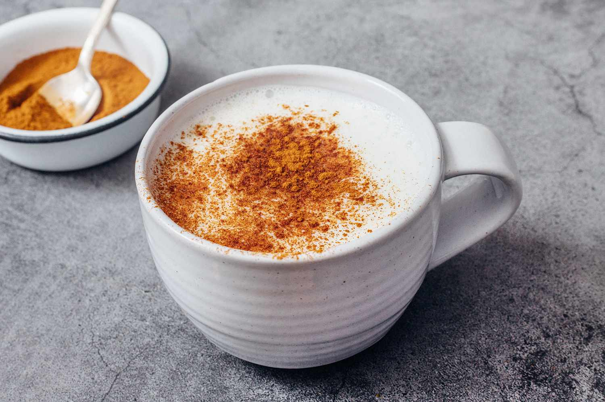

# Salep

*Turkey's winter milk drink: powdered orchid root whisked into hot milk with sugar, thickened to a velvety almost-pudding consistency, finished with a dusting of cinnamon and sometimes crushed pistachios. The drink that warms Istanbul ferry commuters on a January morning.*

**Serves:** 4 mugs

**Prep Time:** 2 minutes

**Cook Time:** 12 minutes

## Overview
Salep is one of the most distinctive winter drinks in the Mediterranean and Levant: a hot, sweet, thickened milk drink whose secret ingredient is sahlab, the powdered dried tuber of certain wild orchid species (Orchis mascula and related). The orchid powder, when whisked into warm milk, releases starches and a unique mucilaginous quality that thickens the drink to a thin-custard consistency that no other thickener can quite replicate. Cinnamon and rose water (or orange blossom) are the standard finishing flavours. Salep is also the historical name for what's now Turkish ice cream (dondurma); the distinctive stretchy quality of dondurma comes from the same orchid starch. Wild orchid harvesting is now restricted in Turkey for conservation reasons, so most modern salep mixes are blends of orchid powder, cornstarch and milk powder, convenient and reliable. The Egyptian and Levantine version (sahlab) is similar; the Turkish version typically leans more milk and less rose.

## Ingredients

- 2 tablespoons sahlab powder (Turkish brands like Hacı Şakir or Garanti; sold at any Turkish / Middle Eastern grocery) OR 2 tablespoons cornflour + 1 tablespoon milk powder + 1 teaspoon vanilla (a substitute when sahlab is unavailable)
- 1 litre whole milk
- 80 g caster sugar (or to taste; salep is moderately sweet)
- 1 teaspoon ground cinnamon (plus extra for dusting)
- 1 teaspoon rose water OR orange blossom water (optional)

### To serve
- 4 small heatproof mugs, warmed
- Ground cinnamon for dusting
- 2 tablespoons crushed pistachios (optional, the Turkish street-vendor finish)
- Optional: a thin slice of grated nutmeg

## Method

### Stage 1 - Make a slurry
1. In a small bowl, whisk the sahlab powder with 100 ml of the cold milk until smooth, no lumps. This step matters; lumps formed now stay forever.

### Stage 2 - Warm the milk
1. Pour the remaining milk into a heavy-bottomed saucepan.
1. Warm over medium-low heat until just steaming, about 60-65°C. Don't let it boil.

### Stage 3 - Combine
1. While whisking the warm milk continuously, pour in the sahlab slurry in a slow steady stream.
1. Add the sugar and continue whisking.

### Stage 4 - Thicken
1. Increase heat to medium and continue whisking. The mixture will gradually thicken, going from milky to a velvety consistency that coats a spoon and falls in slow ribbons when lifted.
1. Salep should be the texture of a thin custard or a slightly thickened cream, not a pudding. About 8-10 minutes of gentle simmering and whisking.
1. Just before serving, whisk in the cinnamon and rose or orange blossom water.

### Stage 5 - Serve
1. Pour into warmed mugs.
1. Dust each generously with ground cinnamon.
1. Scatter crushed pistachios on top if using; a tiny pinch of grated nutmeg also works.
1. Serve immediately, hot.

## Notes
- **Real sahlab vs substitute.** Genuine orchid sahlab powder has a unique stretchy quality that cornflour-based substitutes can't quite match. If you can find real sahlab, use it; if not, cornflour + milk powder + vanilla produces an acceptable approximation.
- **Whisk constantly.** Once the slurry hits the warm milk, lumps form fast. Keep moving until the mixture thickens.
- **Don't boil.** Heat steadily but don't let it reach a full rolling boil. Boiling can break the texture and gives a scorched milky taste.
- **Texture is the trick.** Salep is meant to be drinkable but velvety, thicker than hot chocolate, thinner than a custard. If it gets too thick, whisk in a splash more hot milk; if too thin, simmer a few minutes more.

## Variations
- **Sahlab al sokar.** Heavier sugar (120 g), thicker consistency. The Levantine variant served as dessert.
- **With saffron.** Add a small pinch of saffron strands to the milk while warming. Golden colour, slightly more aromatic.
- **Coconut salep.** Replace half the milk with coconut milk; gives a tropical, slightly different version.
- **Iced salep.** Cool the thickened salep and serve over ice in summer; rare but exists in modern Istanbul cafés.

## Storage
- Best fresh. Keeps 1 day in the fridge; the texture thickens further as it cools, so thin with hot milk on reheating. Reheat gently in a saucepan; don't microwave (it can break the texture).
