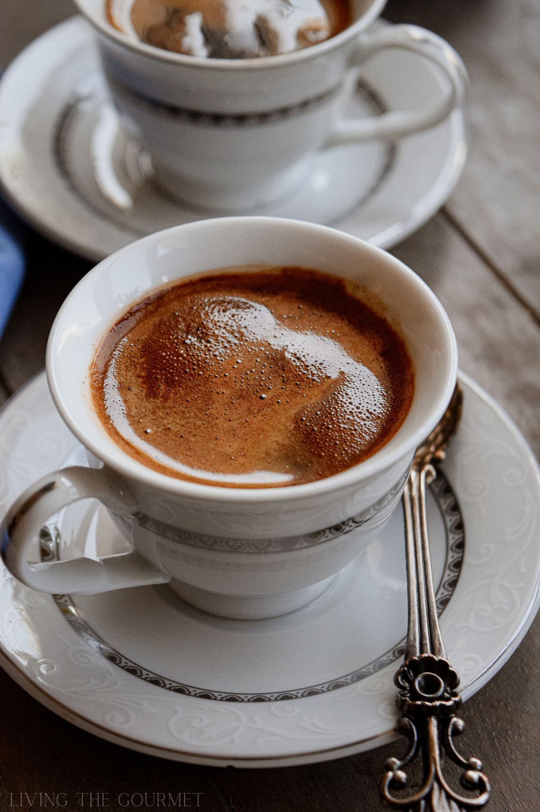

# Türk Kahvesi (Turkish Coffee)

*Finely powdered coffee simmered in a small copper cezve with cold water and sugar, poured grounds-and-all into tiny porcelain cups, served with a glass of cold water and a piece of Turkish delight. UNESCO-listed; the centre of every Turkish social gathering.*

**Serves:** 2 small cups

**Prep Time:** 1 minute

**Cook Time:** 5 minutes

## Overview
Türk kahvesi is the oldest coffee preparation method still widely drunk: invented in Ottoman-era Istanbul in the 16th century, it's been served continuously in Turkish coffee houses for 500 years. UNESCO listed it as an Intangible Cultural Heritage of Humanity in 2013. The technique is simple but precise: very finely powdered coffee (finer than espresso grind, almost like cocoa powder), cold water, and the sugar added at the start rather than at the table, simmered slowly in a small handled copper pot called a cezve (or ibrik). The defining feature is the foam: as the coffee approaches a simmer, a thick brown foam rises to the surface, and the proper pour distributes that foam evenly into each cup. The drink is poured grounds-and-all; the grounds settle at the bottom of the tiny cup, and the Turkish tradition is that after you finish drinking, you turn the cup upside down on its saucer and read the patterns in the grounds for fortune-telling. Served with a small glass of cold water (drink first, to clear the palate) and a piece of lokum (Turkish delight) or a piece of chocolate.

## Ingredients

- 4 teaspoons very finely powdered Turkish coffee (Mehmet Efendi or Kurukahveci brand; ground specifically for cezve preparation - espresso grind is too coarse)
- 200 ml cold water
- Sugar to taste, added at the START (not at the table):
  - Sade: no sugar
  - Az şekerli: 1/2 teaspoon per cup (lightly sweet)
  - Orta şekerli: 1 teaspoon per cup (medium sweet)
  - Çok şekerli: 2 teaspoons per cup (very sweet)
- Optional: a single green cardamom pod, lightly crushed (Arab/Middle Eastern style; not strictly traditional Turkish but common in some regions)

### To serve
- 2 small porcelain fincans (Turkish coffee cups, about 60 ml capacity)
- A small glass of cold water per person
- 2 pieces of lokum (Turkish delight) or chocolate

### Equipment
- A cezve (small copper pot with a long handle, about 250 ml capacity) - essential

## Method

### Stage 1 - Measure
1. Pour the cold water into the cezve.
1. Add the coffee, sugar (per the level chosen above) and cardamom pod if using.
1. Do NOT stir yet. Let the coffee float on top.

### Stage 2 - Heat
1. Place the cezve on the lowest heat. Slow heat is the key.
1. After about 90 seconds, the coffee will start to sink and the mixture will begin to merge. Now stir gently with a small spoon to fully combine.

### Stage 3 - Watch for the foam
1. Continue heating on low. As the temperature rises (about 60-70°C), foam starts forming on the surface. Don't stir from this point on - disturbing the foam ruins the drink.
1. The foam rises slowly. Watch carefully - when it begins to rise close to the rim of the cezve, lift the cezve off the heat immediately. Don't let it boil over.

### Stage 4 - Pour the foam
1. Using a small spoon, distribute a layer of the foam into each cup first. Each cup should have a generous foam cap.
1. Return the cezve to the heat for another 30 seconds - the foam will rise once more.
1. Now pour the rest of the coffee gently down the side of each cup over the foam, so the foam stays on top. The grounds will go in too; this is correct.

### Stage 5 - Settle and serve
1. Let the cups rest for 30 seconds so the grounds settle to the bottom.
1. Serve with the glass of cold water on the side (drink the water first, then the coffee) and a piece of lokum.

## Notes
- **Grind matters.** Turkish coffee grind is the finest grind available - finer than espresso, almost a powder. If you use espresso grind, the texture is wrong and the foam doesn't form properly. Buy pre-ground Turkish coffee (Mehmet Efendi is everywhere) or have it ground specifically for Turkish at a specialty shop.
- **Sugar at the start.** Sugar always goes in at the beginning, never at the table. Asking for sugar after pouring marks you as a tourist.
- **Don't boil.** The coffee should never reach a full hard boil. Once foam rises near the rim, off the heat. Boiling destroys the foam (which is the whole point) and makes the coffee bitter.
- **Don't drink the grounds.** Sip the top two-thirds of the cup; leave the grounds undisturbed at the bottom. After you finish, turn the cup upside down on the saucer for fortune-telling tradition.

## Variations
- **With mastic.** A small piece of mastic (the resin gum from the mastic tree) added at the brewing stage. Eastern Mediterranean variation, slightly pine-resin scented.
- **With cardamom.** As noted; not traditional Turkish but common in the Arabian Gulf and increasingly in modern Turkish kitchens.
- **Cold Turkish coffee.** Made with cold or warm water and shaken instead of brewed; modern Istanbul café trend.
- **Double cezve.** Use a 500 ml cezve to make 4 cups at once; same technique, same proportions.

## Storage
- Doesn't store. Brew fresh; the foam and aroma fade within 5 minutes.
